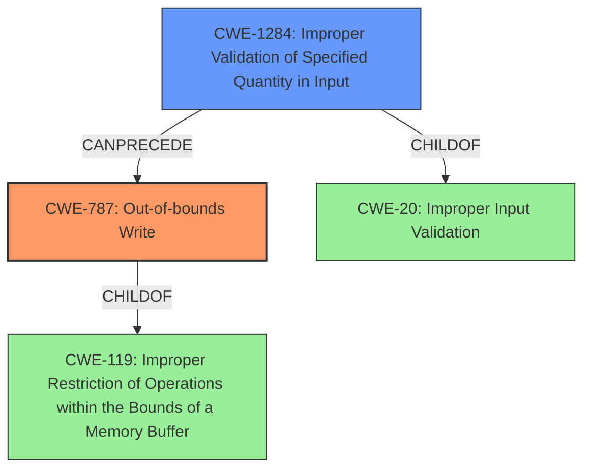

# Analysis Report for CVE-2022-24063

# Vulnerability Analysis Report: CVE-2022-24063

## Description

This vulnerability allows remote attackers to execute arbitrary code on affected installations of Sante DICOM Viewer Pro 13.2.0.21165. User interaction is required to exploit this vulnerability in that the target must visit a malicious page or open a malicious file. The specific flaw exists within the parsing of JP2 files. The issue results from the lack of proper validation of user-supplied data, which can result in a memory corruption condition. An attacker can leverage this vulnerability to execute code in the context of the current process. Was ZDI-CAN-15105.

## Vulnerability Description Key Phrases

**Rootcause:** lack of proper validation of user-supplied data
**Weakness:** memory corruption
**Impact:** execute arbitrary code
**Vector:** malicious page or file
**Attacker:** remote attackers
**Product:** Sante DICOM Viewer Pro
**Version:** 13.2.0.21165
**Component:** parsing of JP2 files

## Analysis (with Relationship Data)

# Summary
| CWE ID | CWE Name | Confidence | CWE Abstraction Level | CWE Vulnerability Mapping Label | CWE-Vulnerability Mapping Notes |
|---|---|---|---|---|---|
| CWE-787 | Out-of-bounds Write | 0.9 | Base | Primary | Allowed |
| CWE-20 | Improper Input Validation | 0.6 | Class | Secondary Candidate | Discouraged |

## Evidence and Confidence

*   **Confidence Score:** 0.8
*   **Evidence Strength:** HIGH

- **Analysis and Justification:**
  - *Explanation:* The vulnerability lies in the parsing of JP2 files within Sante DICOM Viewer Pro, specifically due to the **lack of proper validation of user-supplied data**. This leads to **memory corruption**, allowing remote attackers to execute arbitrary code. CWE-787 (Out-of-bounds Write) is the most appropriate primary CWE because the **memory corruption** caused by improper data validation during file parsing leads to writing data outside the intended buffer. This aligns directly with the description of CWE-787. The retriever results also list CWE-787 as the top candidate with a high score. MITRE mapping guidance for CWE-787 indicates this is ALLOWED because the weakness is writing data past the buffer.
  - Although the description mentions **lack of proper validation of user-supplied data**, which could point to CWE-20 (Improper Input Validation), CWE-787 is more specific and accurately describes the **memory corruption** rootcause. CWE-20 is discouraged when a more specific CWE can be used.

  - *Relationship Analysis:* CWE-787 is a base level CWE and is a child of CWE-119 (Improper Restriction of Operations within the Bounds of a Memory Buffer). CWE-787 can lead to other issues like privilege escalation.

- **Confidence Score:**
  - Confidence: 0.9 (High confidence due to the clear description of memory corruption leading to out-of-bounds write and the high retriever score for CWE-787)

## Criticism of Analysis

Okay, I've reviewed the provided analysis against the full CWE specifications. Here's my critique:

**Overall Assessment:**

The analysis is generally sound, and the primary CWE assignment of CWE-787 (Out-of-bounds Write) is appropriate. The reasoning provided is clear and well-justified.  However, the secondary candidate, CWE-20 (Improper Input Validation), could be refined or potentially replaced with a more specific CWE that is a child of CWE-20.

**Detailed Review:**

**1. CWE-787: Out-of-bounds Write:**

*   **Strengths:**
    *   The core argument for CWE-787 is strong. The description explicitly mentions "memory corruption" resulting from a lack of input validation during JP2 file parsing. This directly leads to writing outside of intended buffer boundaries, which aligns perfectly with the CWE-787 definition.
    *   The analysis correctly points out that CWE-787 is a base-level CWE, which is preferred for root cause analysis.
    *   The analysis correctly notes that CWE-787 is a child of CWE-119, as are buffer overflow and buffer underrun.
    *   The analysis correctly states that MITRE Mapping Guidance indicates "Allowed" because the weakness is writing data past the buffer.
    *   The inclusion of observed examples of CWE-787 and CWE-119 helps in understanding the vulnerability in the Sante DICOM Viewer Pro application.
*   **Suggestions:**
    *   Consider specifying whether it's a heap-based or stack-based out-of-bounds write (CWE-122 or CWE-121). While the information isn't always readily available, if it can be determined from further analysis, it would improve the specificity of the mapping.  This is a variant-level distinction that could be helpful.
    *   The Potential Mitigations of CWE-787 could be mentioned to provide additional context, such as using a language that does not allow the weakness to occur or using automatic buffer overflow detection mechanisms.

**2. CWE-20: Improper Input Validation:**

*   **Strengths:**
    *   The analysis acknowledges the presence of a data validation weakness ("lack of proper validation of user-supplied data").
    *   The analysis correctly points out that the use of CWE-20 is discouraged when a more specific CWE is available.
*   **Weaknesses:**
    *   The specification for CWE-20 specifically states: **Usage: Discouraged, Rationale: CWE-20 is commonly misused in low-information vulnerability reports when lower-level CWEs could be used instead, or when more details about the vulnerability are available [REF-1287].**
    *   The analysis suggests that it is a secondary candidate. However, the "memory corruption" is a *result* of the improper input validation, not the input validation itself. The input validation is the root cause.

*   **Suggestions:**
    *   **Replace CWE-20 with a more specific child CWE**: Instead of using the general CWE-20, consider more precise CWEs related to the *type* of input validation that is missing or incorrect. Based on the retriever results and CWE-20 specifications, potential replacements are:
        *   **CWE-1284: Improper Validation of Specified Quantity in Input:**  This is relevant if the JP2 file contains size or length fields that are not adequately checked.  If the lack of validation leads to an oversized allocation, this is a good candidate.
        *   **CWE-1286: Improper Validation of Syntactic Correctness of Input:**  This is relevant if the structure or format of the JP2 file is not properly validated.  This would be a good candidate if the parser is failing to enforce expected syntax, leading to memory corruption.
        *   **CWE-1287: Improper Validation of Specified Type of Input:** This would be relevant if the data types within the JP2 file are not validated properly. For example, a field that should be an integer is not checked.

**3. Additional Considerations:**

*   **Retriever Results:** The retriever results provide additional insight. CWE-1284 (Improper Validation of Specified Quantity in Input) has a high combined score and is a child of CWE-20. This reinforces the suggestion to use a CWE other than CWE-20.

**Revised Summary Table:**

| CWE ID | CWE Name | Confidence | CWE Abstraction Level | CWE Vulnerability Mapping Label | CWE-Vulnerability Mapping Notes |
|---|---|---|---|---|---|
| CWE-787 | Out-of-bounds Write | 0.9 | Base | Primary | Allowed |
| CWE-1284 or CWE-1286 or CWE-1287 | See Suggestion | 0.6-0.7 | Base | Secondary Candidate | Discouraged |

**Justification for Revision:**

*   **Replaces CWE-20:** The provided analysis describes a vulnerability caused by a *specific type* of input validation failure. Using a more specific CWE that is a child of CWE-20 improves the quality and usability of the analysis.
*   **Maintains CWE-787:** It describes the direct consequence of memory corruption.
*   **The analysis and justification for CWE-787 remains the same.**
*   **Confidence:** The confidence score will depend on which alternate CWE is selected.

**In conclusion,** the analysis is good and the core CWE-787 assignment is correct. Improving the secondary CWE mapping by using a more specific child of CWE-20 provides a more accurate and actionable representation of the vulnerability. If it is a length or quantity issue then I recommend CWE-1284 as the secondary CWE.

## Final Resolution

# Summary
| CWE ID | CWE Name | Confidence | CWE Abstraction Level | CWE Vulnerability Mapping Label | CWE-Vulnerability Mapping Notes |
|---|---|---|---|---|---|
| CWE-787 | Out-of-bounds Write | 0.9 | Base | Primary CWE | Allowed |
| CWE-1284 | Improper Validation of Specified Quantity in Input | 0.7 | Base | Secondary Candidate | Allowed |

## Evidence and Confidence

*   **Confidence Score:** 0.85
*   **Evidence Strength:** HIGH

## Relationship Analysis
The primary CWE is CWE-787 (**Out-of-bounds Write**), which is a base-level CWE and a child of CWE-119 (**Improper Restriction of Operations within the Bounds of a Memory Buffer**). This parent-child relationship indicates that CWE-787 is a more specific type of buffer handling issue. The secondary CWE is CWE-1284 (**Improper Validation of Specified Quantity in Input**), which is also a base-level CWE and a child of CWE-20 (**Improper Input Validation**). The vulnerability chain shows that improper input validation, specifically of a quantity, can lead to an out-of-bounds write.

## Vulnerability Chain
The vulnerability chain starts with **CWE-1284 (Improper Validation of Specified Quantity in Input)**, where the size or length fields within the JP2 file are not adequately checked. This lack of validation leads to a **memory corruption condition**, specifically **CWE-787 (Out-of-bounds Write)**, where data is written outside the intended buffer boundaries. The final impact is that an attacker can leverage this vulnerability to execute arbitrary code in the context of the current process.

## Summary of Analysis
The initial analysis correctly identified CWE-787 (**Out-of-bounds Write**) as the primary weakness. The criticism suggested replacing the secondary candidate, CWE-20 (**Improper Input Validation**), with a more specific CWE. The vulnerability description states "The issue results from the **lack of proper validation of user-supplied data**, which can result in a **memory corruption condition**". Based on the retriever results and the suggestion in the criticism, CWE-1284 (**Improper Validation of Specified Quantity in Input**) is a more accurate secondary CWE because the vulnerability likely involves a failure to validate the size or length fields in the JP2 file, which then leads to the out-of-bounds write. This aligns with MITRE's mapping guidance, which allows the use of CWE-1284. The selected CWEs are at the optimal level of specificity because they accurately describe the root cause (improper quantity validation) and the resulting memory corruption (out-of-bounds write).

*Report generated on 2025-03-18 10:49:39*
