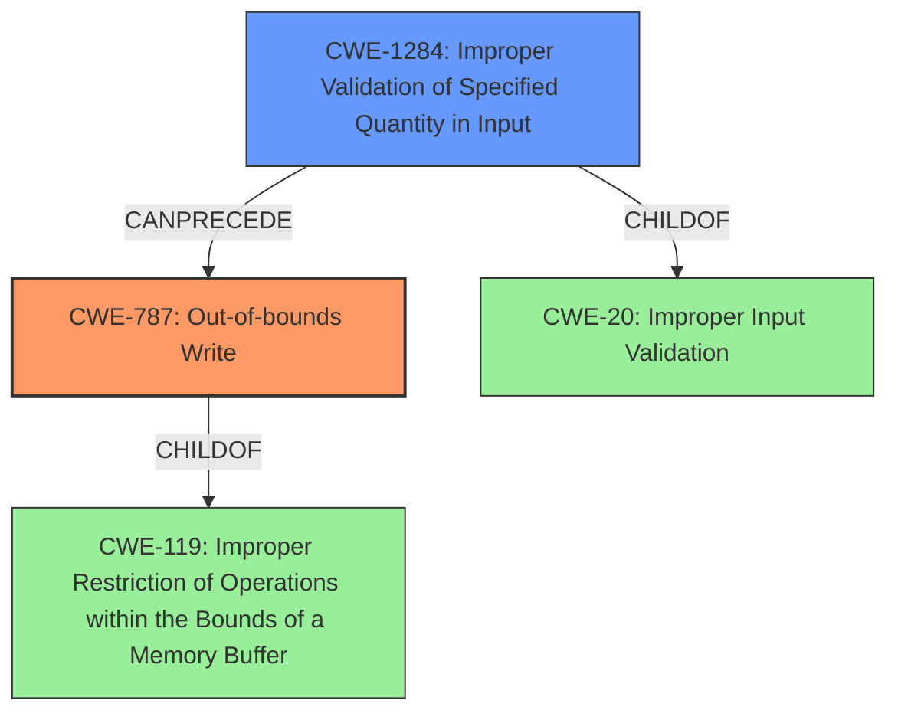

# Final Resolution for CVE-2022-24063

# Summary
| CWE ID | CWE Name | Confidence | CWE Abstraction Level | CWE Vulnerability Mapping Label | CWE-Vulnerability Mapping Notes |
|---|---|---|---|---|---|
| CWE-787 | Out-of-bounds Write | 0.9 | Base | Primary CWE | Allowed |
| CWE-1284 | Improper Validation of Specified Quantity in Input | 0.7 | Base | Secondary Candidate | Allowed |

## Evidence and Confidence

*   **Confidence Score:** 0.85
*   **Evidence Strength:** HIGH

## Relationship Analysis
The primary CWE is CWE-787 (**Out-of-bounds Write**), which is a base-level CWE and a child of CWE-119 (**Improper Restriction of Operations within the Bounds of a Memory Buffer**). This parent-child relationship indicates that CWE-787 is a more specific type of buffer handling issue. The secondary CWE is CWE-1284 (**Improper Validation of Specified Quantity in Input**), which is also a base-level CWE and a child of CWE-20 (**Improper Input Validation**). The vulnerability chain shows that improper input validation, specifically of a quantity, can lead to an out-of-bounds write.

## Vulnerability Chain
The vulnerability chain starts with **CWE-1284 (Improper Validation of Specified Quantity in Input)**, where the size or length fields within the JP2 file are not adequately checked. This lack of validation leads to a **memory corruption condition**, specifically **CWE-787 (Out-of-bounds Write)**, where data is written outside the intended buffer boundaries. The final impact is that an attacker can leverage this vulnerability to execute arbitrary code in the context of the current process.

## Summary of Analysis
The initial analysis correctly identified CWE-787 (**Out-of-bounds Write**) as the primary weakness. The criticism suggested replacing the secondary candidate, CWE-20 (**Improper Input Validation**), with a more specific CWE. The vulnerability description states "The issue results from the **lack of proper validation of user-supplied data**, which can result in a **memory corruption condition**". Based on the retriever results and the suggestion in the criticism, CWE-1284 (**Improper Validation of Specified Quantity in Input**) is a more accurate secondary CWE because the vulnerability likely involves a failure to validate the size or length fields in the JP2 file, which then leads to the out-of-bounds write. This aligns with MITRE's mapping guidance, which allows the use of CWE-1284. The selected CWEs are at the optimal level of specificity because they accurately describe the root cause (improper quantity validation) and the resulting memory corruption (out-of-bounds write).