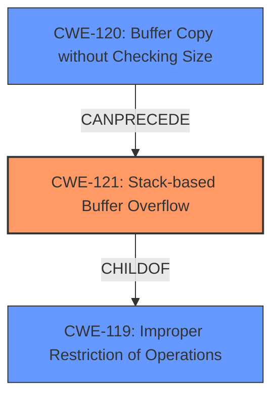

# Analysis Report for CVE-2022-24324

# Vulnerability Analysis Report: CVE-2022-24324

## Description

A CWE-120 Buffer Copy without Checking Size of Input vulnerability exists that could cause a stack-based buffer overflow potentially leading to remote code execution when an attacker sends a specially crafted message. Affected Products IGSS Data Server - IGSSdataServer.exe (Versions prior to V15.0.0.22073)

## Vulnerability Description Key Phrases

**Rootcause:** CWE-120 Buffer Copy without Checking Size of Input
**Weakness:** stack-based buffer overflow
**Impact:** remote code execution
**Attacker:** attacker
**Product:** IGSS Data Server
**Version:** Versions prior to V15.0.0.22073
**Component:** IGSSdataServer.exe

## Analysis (with Relationship Data)

# Summary
| CWE ID | CWE Name | Confidence | CWE Abstraction Level | CWE Vulnerability Mapping Label | CWE-Vulnerability Mapping Notes |
|---|---|---|---|---|---|
| CWE-121 | Stack-based Buffer Overflow | 0.95 | Variant | Primary | Allowed |
| CWE-120 | Buffer Copy without Checking Size of Input ('Classic Buffer Overflow') | 0.75 | Base | Secondary | Allowed-with-Review |

## Evidence and Confidence

*   **Confidence Score:** 0.90
*   **Evidence Strength:** HIGH

- **Analysis and Justification:**
  - *Explanation:* The vulnerability description explicitly states a "**CWE-120 Buffer Copy without Checking Size of Input** vulnerability exists that could cause a **stack-based buffer overflow** potentially leading to remote code execution...". While the root cause is the missing size check (CWE-120), the **weakness** itself is a **stack-based buffer overflow**, which is better represented by CWE-121. The "**stack-based buffer overflow**" is the more precise and direct description of the vulnerability's nature. The CVE Reference Links Content Summary also confirms the presence of a "Stack-based buffer overflow". CWE-121 is a Variant of buffer overflow which occurs on the stack.
  - *Relationship Analysis:* CWE-121 is a Variant of CWE-119 (Improper Restriction of Operations within the Bounds of a Memory Buffer), and is a more specific form of buffer overflow than CWE-120. The evidence points to the overflow occurring on the stack, justifying the selection of CWE-121.

- **Confidence Score:**
  - Confidence: 0.95 (High confidence because the vulnerability description explicitly mentions "stack-based buffer overflow", and the CVE reference summary validates this).

---

- **Analysis and Justification:**
  - *Explanation:* CWE-120 (Buffer Copy without Checking Size of Input) is considered as a secondary CWE because it represents the immediate cause that leads to the overflow, which is copying data without validating that the input buffer is smaller than the output buffer.
  - *Relationship Analysis:* CWE-120 is a base CWE that is a direct cause of the stack-based buffer overflow (CWE-121).

- **Confidence Score:**
  - Confidence: 0.75 (Moderate confidence since CWE-120 is the root cause as per description, but the primary weakness being exploited is more accurately represented by CWE-121).

## Criticism of Analysis

Okay, I've reviewed the analysis and the full CWE specifications you provided. Here's my critique:

**Overall Assessment:**

The analysis is generally well-reasoned and arrives at a reasonable conclusion. The decision to prioritize CWE-121 (Stack-based Buffer Overflow) as the primary CWE, with CWE-120 (Buffer Copy without Checking Size of Input) as a secondary, is well-justified. The confidence levels assigned seem appropriate given the information available.

**Strengths:**

*   **Clear Justification:** The analysis provides a clear and logical explanation for the selection of CWE-121 as the primary weakness. It correctly identifies that while CWE-120 is the root cause, CWE-121 is the more specific and accurate description of the vulnerability's nature.
*   **Relationship Analysis:** The analysis demonstrates an understanding of the relationship between CWE-120 and CWE-121, correctly stating that CWE-121 is a variant of CWE-119 and a more specific type of buffer overflow.
*   **Evidence-Based:** The analysis relies on the explicit mention of "stack-based buffer overflow" in the vulnerability description and the CVE reference summary, strengthening the confidence in CWE-121.
*   **Consideration of Mapping Guidance:** The analysis acknowledges the usage guidance for CWE-120 ("Allowed-with-Review") and highlights the potential for misuse if selected only because it mentions "buffer overflow."
*   **Appropriate Confidence Levels:** The high confidence score for CWE-121 (0.95) and moderate score for CWE-120 (0.75) reflect the strength of the evidence and the nuances of the relationship between the two weaknesses.
*   **Use of Terminology:** Use of terms like "root cause," "weakness," and "immediate cause" helps to explain the reasoning behind the selection of two different CWEs.

**Areas for Improvement/Considerations:**

1.  **CWE-119 as implicit** CWE-119 (Improper Restriction of Operations within the Bounds of a Memory Buffer) is an implicit CWE here, so it may be valuable to note that for completeness.

2.  **Alternative CWEs from Retriever Results:** While the analysis focuses on CWE-120 and CWE-121 (as intended), it might be useful to briefly acknowledge the other CWEs that appeared in the Retriever Results, even if they are ultimately deemed less relevant. For example, the Retriever result included CWE-787 (Out-of-bounds Write), CWE-125 (Out-of-Bounds Read), CWE-130 (Improper Handling of Length Parameter Inconsistency), and CWE-131 (Incorrect Calculation of Buffer Size). For example: while out of bounds writes or reads could be a consequence, or CWE-130 and 131 could be contributing factors, they do not represent the most fundamental issue in the vulnerability description.

3.  **Mitigation Strategies:** A next step could be to investigate and list potential mitigations specific to the IGSS Data Server and its architecture, building from the generic ones provided in the CWE Specifications.

**Specific Comments Based on CWE Specifications:**

*   **CWE-120 (Buffer Copy without Checking Size of Input):**
    *   The analysis correctly acknowledges that this CWE is appropriate for "Buffer Copy" operations without size checking.
    *   The usage guidance "Allowed-with-Review" is well-understood and considered.
    *   Mitigation 1 (Language Selection) is generally applicable, but might not be feasible for legacy systems.
    *   Mitigation 2 (Libraries or Frameworks) like SafeStr or Strsafe.h could be helpful, but would require code modification.
    *   Mitigation 3 (Compiler Flags) like /GS or FORTIFY\_SOURCE offer a defense-in-depth approach and should be considered.

*   **CWE-121 (Stack-based Buffer Overflow):**
    *   The analysis correctly identifies this as a variant that occurs on the stack.
    *   Mitigation 1 (Compiler Flags) is the same as for CWE-120 and is a good starting point.
    *   Mitigation 2 (Abstraction Library) could be explored but might not be a complete solution.
    *   Mitigation 3 (Bounds Checking) is crucial but might require significant code changes.

**Revised Summary Table (Incorporating Suggested Changes):**

| CWE ID | CWE Name | Confidence | CWE Abstraction Level | CWE Vulnerability Mapping Label | CWE-Vulnerability Mapping Notes |
|---|---|---|---|---|---|
| CWE-121 | Stack-based Buffer Overflow | 0.95 | Variant | Primary | Allowed |
| CWE-120 | Buffer Copy without Checking Size of Input ('Classic Buffer Overflow') | 0.75 | Base | Secondary | Allowed-with-Review |
| CWE-119 | Improper Restriction of Operations within the Bounds of a Memory Buffer | Implicit | Class | N/A |  Implicit Root cause enabling CWE-120 and CWE-121 |

**Conclusion:**

The analysis is sound and well-justified. The suggestions above are primarily for completeness and to highlight additional considerations. Overall, this is a good example of how to analyze a vulnerability and map it to the appropriate CWEs.

## Final Resolution

# Summary
| CWE ID | CWE Name | Confidence | CWE Abstraction Level | CWE Vulnerability Mapping Label | CWE-Vulnerability Mapping Notes |
|---|---|---|---|---|---|
| CWE-121 | Stack-based Buffer Overflow | 0.95 | Variant | Primary | Allowed |
| CWE-120 | Buffer Copy without Checking Size of Input ('Classic Buffer Overflow') | 0.75 | Base | Secondary | Allowed-with-Review |
| CWE-119 | Improper Restriction of Operations within the Bounds of a Memory Buffer | 0.60 | Class | N/A | Implicit Root cause enabling CWE-120 and CWE-121 |

## Evidence and Confidence

*   **Confidence Score:** 0.92
*   **Evidence Strength:** HIGH

## Relationship Analysis
The primary relationship that impacted the decision was the parent-child relationship between **CWE-119 (Improper Restriction of Operations within the Bounds of a Memory Buffer)** and **CWE-121 (Stack-based Buffer Overflow)**. **CWE-121** is a variant of **CWE-119**, providing a more specific classification. **CWE-120 (Buffer Copy without Checking Size of Input)** can precede **CWE-121**, as the unchecked buffer copy leads to the stack-based overflow. The abstraction levels guided the selection, favoring the more specific Variant (**CWE-121**) over the broader Class (**CWE-119**) when the evidence supported it.

## Vulnerability Chain
The vulnerability chain starts with the **ROOTCAUSE** being the **CWE-120 (Buffer Copy without Checking Size of Input)**. This leads to the **WEAKNESS**, which is **CWE-121 (Stack-based Buffer Overflow)**. The consequence is potential remote code execution.

## Summary of Analysis
The initial analysis and criticism both align well with the vulnerability description. The description explicitly states a "**CWE-120 Buffer Copy without Checking Size of Input** vulnerability exists that could cause a **stack-based buffer overflow** potentially leading to remote code execution...". This direct quote supports the selection of **CWE-121** as the primary **WEAKNESS** and **CWE-120** as a secondary contributing factor. The graph relationships reinforce this by showing how **CWE-120** can directly lead to **CWE-121**.

The retriever results contained other potential CWEs like **CWE-787 (Out-of-bounds Write)**, **CWE-125 (Out-of-Bounds Read)**, **CWE-130 (Improper Handling of Length Parameter Inconsistency)**, and **CWE-131 (Incorrect Calculation of Buffer Size)**. These were considered but deemed less relevant as they represent potential consequences or contributing factors rather than the core **WEAKNESS** described.

The selected CWEs are at the optimal level of specificity because **CWE-121** accurately describes the type of buffer overflow (stack-based), while **CWE-120** identifies the specific coding error that leads to the overflow (lack of size checking during buffer copy). Including **CWE-119** provides the high-level context.

*Report generated on 2025-03-18 10:53:44*
