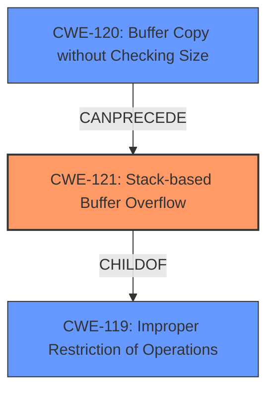

# Final Resolution for CVE-2022-24324

# Summary
| CWE ID | CWE Name | Confidence | CWE Abstraction Level | CWE Vulnerability Mapping Label | CWE-Vulnerability Mapping Notes |
|---|---|---|---|---|---|
| CWE-121 | Stack-based Buffer Overflow | 0.95 | Variant | Primary | Allowed |
| CWE-120 | Buffer Copy without Checking Size of Input ('Classic Buffer Overflow') | 0.75 | Base | Secondary | Allowed-with-Review |
| CWE-119 | Improper Restriction of Operations within the Bounds of a Memory Buffer | 0.60 | Class | N/A | Implicit Root cause enabling CWE-120 and CWE-121 |

## Evidence and Confidence

*   **Confidence Score:** 0.92
*   **Evidence Strength:** HIGH

## Relationship Analysis
The primary relationship that impacted the decision was the parent-child relationship between **CWE-119 (Improper Restriction of Operations within the Bounds of a Memory Buffer)** and **CWE-121 (Stack-based Buffer Overflow)**. **CWE-121** is a variant of **CWE-119**, providing a more specific classification. **CWE-120 (Buffer Copy without Checking Size of Input)** can precede **CWE-121**, as the unchecked buffer copy leads to the stack-based overflow. The abstraction levels guided the selection, favoring the more specific Variant (**CWE-121**) over the broader Class (**CWE-119**) when the evidence supported it.

## Vulnerability Chain
The vulnerability chain starts with the **ROOTCAUSE** being the **CWE-120 (Buffer Copy without Checking Size of Input)**. This leads to the **WEAKNESS**, which is **CWE-121 (Stack-based Buffer Overflow)**. The consequence is potential remote code execution.

## Summary of Analysis
The initial analysis and criticism both align well with the vulnerability description. The description explicitly states a "**CWE-120 Buffer Copy without Checking Size of Input** vulnerability exists that could cause a **stack-based buffer overflow** potentially leading to remote code execution...". This direct quote supports the selection of **CWE-121** as the primary **WEAKNESS** and **CWE-120** as a secondary contributing factor. The graph relationships reinforce this by showing how **CWE-120** can directly lead to **CWE-121**.

The retriever results contained other potential CWEs like **CWE-787 (Out-of-bounds Write)**, **CWE-125 (Out-of-Bounds Read)**, **CWE-130 (Improper Handling of Length Parameter Inconsistency)**, and **CWE-131 (Incorrect Calculation of Buffer Size)**. These were considered but deemed less relevant as they represent potential consequences or contributing factors rather than the core **WEAKNESS** described.

The selected CWEs are at the optimal level of specificity because **CWE-121** accurately describes the type of buffer overflow (stack-based), while **CWE-120** identifies the specific coding error that leads to the overflow (lack of size checking during buffer copy). Including **CWE-119** provides the high-level context.