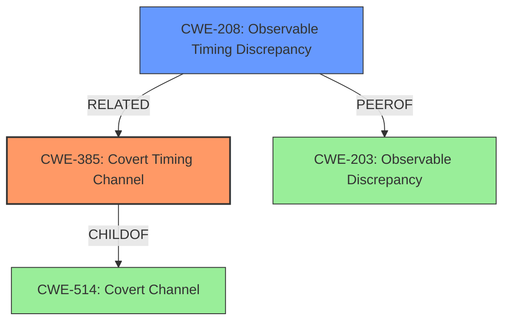

# Analysis Report for CVE-2022-24409

# Vulnerability Analysis Report: CVE-2022-24409

## Description

Dell BSAFE SSL-J contains remediation for a covert timing channel vulnerability that may be exploited by malicious users to compromise the affected system. Only customers with active BSAFE maintenance contracts can receive details about this vulnerability. Public disclosure of the vulnerability details will be shared at a later date.

## Vulnerability Description Key Phrases

**Rootcause:** covert timing channel vulnerability
**Impact:** compromise the affected system
**Attacker:** malicious users
**Product:** Dell BSAFE SSL-J

## Analysis (with Relationship Data)

# Summary
| CWE ID  | CWE Name                      | Confidence | CWE Abstraction Level | CWE Vulnerability Mapping Label | CWE-Vulnerability Mapping Notes |
| :-------- | :---------------------------- | :--------- | :-------------------- | :------------------------------ | :---------------------------- |
| CWE-385 | Covert Timing Channel | 1.00      | Base                  | Allowed                         | Acceptable-Use                |
| CWE-208 | Observable Timing Discrepancy | 0.75      | Base                  | Allowed                         | Acceptable-Use                |

## Evidence and Confidence

*   **Confidence Score:** 0.90
*   **Evidence Strength:** HIGH

- **Analysis and Justification:**
  - *Explanation:* The vulnerability description explicitly states a "**covert timing channel vulnerability**" exists in Dell BSAFE SSL-J. The "CVE Reference Links Content Summary" further confirms this by stating the **root cause** is a "covert timing channel" and the **weakness** is a "Covert Timing Channel vulnerability". CWE-385 (Covert Timing Channel) directly matches this description. The impact of the vulnerability is that it can compromise the affected system, and attackers can eavesdrop on encrypted communications. CWE-385 is a Base level CWE, which is the preferred level of abstraction. Its usage is ALLOWED according to MITRE mapping guidance. CWE-208 (Observable Timing Discrepancy) is a related weakness where timing differences reveal information. While related, CWE-385 is a more precise match because the description explicitly mentions a "covert channel", the defining characteristic of CWE-385.
  
  - *Relationship Analysis:* CWE-385 is a child of CWE-514 (Covert Channel) and is related to CWE-208 (Observable Timing Discrepancy).

- **Confidence Score:**
  - Confidence: 1.0 (Direct match with explicit mention of "covert timing channel vulnerability")

---

- **Analysis and Justification:**
  - *Explanation:* CWE-208 (Observable Timing Discrepancy) is considered a secondary candidate CWE because the description mentions timing variations can be exploited. This CWE captures the broader category of timing-related vulnerabilities. However, since the vulnerability is specifically identified as a "covert timing channel," CWE-385 is the more precise classification. CWE-208 is a Base level CWE, which is the preferred level of abstraction. Its usage is ALLOWED according to MITRE mapping guidance.

  - *Relationship Analysis:* CWE-208 is a parent of CWE-1254 (Timing Attack) and is a peer of CWE-203 (Observable Discrepancy).

- **Confidence Score:**
  - Confidence: 0.75 (Related, but less specific than CWE-385)

## Criticism of Analysis

Okay, here's a review of the CWE analysis, considering the full CWE specifications:

**Overall Assessment:**

The analysis is generally good and well-reasoned. The primary mapping to CWE-385 (Covert Timing Channel) is accurate and justified. The secondary mapping to CWE-208 (Observable Timing Discrepancy) is also reasonable as a related, broader category. The confidence scores assigned are appropriate. The analysis considers the relationships between the CWEs.  The reasoning is explained well.

**Detailed Review:**

**1. CWE-385: Covert Timing Channel**

*   **Confidence:** The assigned confidence of 1.0 is appropriate, given the explicit mention of "covert timing channel vulnerability" in the description.
*   **Justification:** The justification is strong. It directly connects the description's keywords to the CWE definition.  It also notes that this is a Base level CWE and that its usage is ALLOWED.
*   **Relationship Analysis:** The analysis correctly identifies that CWE-385 is a child of CWE-514 (Covert Channel) and related to CWE-208.
*   **Mitigations:** The Potential Mitigations provided in the CWE spec are relevant.  Mitigation 1, "Whenever possible, specify implementation strategies that do not introduce time variances in operations," speaks directly to the root cause.  Mitigation 2, "Often one can artificially manipulate the time which operations take or -- when operations occur -- can remove information from the attacker," and Mitigation 3, "It is reasonable to add artificial or random delays so that the amount of CPU time consumed is independent of the action being taken by the application," are also applicable countermeasures.
*   **CWE Specification:** The complete specification reinforces the accuracy of the mapping. The "Extended Description" clarifies the mechanism of how covert timing channels work.

**2. CWE-208: Observable Timing Discrepancy**

*   **Confidence:** The confidence of 0.75 is well-considered. It acknowledges that CWE-208 is a broader category.
*   **Justification:** The justification is sound, stating that timing variations can be exploited, which aligns with the definition of CWE-208. The acknowledgement that CWE-385 is a more precise fit is important.
*   **Relationship Analysis:**  The analysis correctly identifies the parent/peer relationships of CWE-208.
*   **Mitigations:** The Potential Mitigations for CWE-208 are also useful. Mitigation 1, "Compartmentalize the system to have 'safe' areas where trust boundaries can be unambiguously drawn," speaks to a broader design principle that can help to limit information leakage. Mitigation 2, "Ensure that error messages only contain minimal details that are useful to the intended audience and no one else," is related, but less directly applicable than the mitigations for CWE-385.
*   **CWE Specification:** The complete specification, especially the "Extended Description" section, helps to understand why this is a relevant, but less precise, classification.

**Suggestions for Improvement:**

*   **Consider Specifics on the Timing Channel:** While details are limited by the disclosure policy, if any further information is known about *how* the timing channel is created (e.g., related to specific cryptographic operations), that could be included, even without disclosing sensitive details.  This could allow for a more nuanced selection of mitigations.
*   **Acknowledge the Limitations:** It might be helpful to explicitly state that the analysis is constrained by the limited publicly available information. This sets appropriate expectations.
*   **Covert Channel (CWE-514):** While CWE-514 is the parent of CWE-385, its 'Allowed-with-Review' status might warrant a brief mention of why it's not the *primary* mapping choice. The justification would be that CWE-385 is a *more specific* Base-level CWE, and the description directly references a timing channel.

**Additional Notes based on CWE Specifications:**

*   **CWE-514 (Covert Channel) Mapping Guidance:** The guidance states "Examine children of this entry to see if there is a better fit." This is precisely what the analysis does, leading to the correct selection of CWE-385.
*   **CWE-200 (Exposure of Sensitive Information to an Unauthorized Actor):** It is good that this CWE was *not* chosen. As the specification notes, it is frequently misused and is a higher-level consequence rather than a direct cause. The analysis correctly identifies the *timing channel* as the root cause.
*   **CWE-1254 (Incorrect Comparison Logic Granularity):** This CWE is a child of CWE-208 and is related to timing attacks in comparison operations. If the vulnerability were specifically related to comparing cryptographic keys or other sensitive data, this could potentially be relevant. However, based on the provided information, CWE-385 and CWE-208 are more appropriate.

**Conclusion:**

The analysis is accurate, well-justified, and demonstrates a good understanding of the relevant CWE specifications. The suggested improvements are minor and aimed at further strengthening the analysis. The assigned confidence scores are well-supported.

## Final Resolution

# Summary
| CWE ID  | CWE Name                      | Confidence | CWE Abstraction Level | CWE Vulnerability Mapping Label | CWE-Vulnerability Mapping Notes |
| :-------- | :---------------------------- | :--------- | :-------------------- | :------------------------------ | :---------------------------- |
| CWE-385 | Covert Timing Channel | 1.00      | Base                  | Allowed                         | Acceptable-Use   |
| CWE-208 | Observable Timing Discrepancy | 0.75      | Base                  | Allowed                         | Acceptable-Use                |

  - The Primary CWE should be first and noted as the Primary CWEs
  - The secondary candidate CWEs should be next and noted as secondary candidates.
  - The confidence is a confidence score 0 to 1 to rate your confidence in your assessment for that CWE.
  - The CWE Abstraction Level as one of these values: Base, Variant, Pillar, Class, Compound
  - The Mapping Notes Usage as one of these values: Allowed, Allowed-with-Review, Prohibited, Discouraged

## Evidence and Confidence

*   **Confidence Score:** 0.95
*   **Evidence Strength:** HIGH

## Relationship Analysis
The primary relationship that influenced the decision was the parent-child relationship between CWE-514 (Covert Channel) and CWE-385 (**Covert Timing Channel**). While CWE-514 is a relevant ancestor, CWE-385 is more specific and aligns directly with the vulnerability description's explicit mention of a "**covert timing channel**". The peer relationship between CWE-203 (Observable Discrepancy) and CWE-208 (**Observable Timing Discrepancy**) highlights alternative classifications based on observable differences, but these are less precise than CWE-385. The Base abstraction level of CWE-385 and CWE-208 influenced the selection, as Base-level CWEs are preferred for vulnerability mapping.

## Vulnerability Chain
The vulnerability chain starts with the **root cause**: the implementation of the Dell BSAFE SSL-J library introduces time variances in operations, creating a **covert timing channel (CWE-385)**. This **weakness** allows malicious users to observe these timing differences and infer security-relevant information, potentially compromising the affected system. The final impact is the exposure of sensitive data or unauthorized access due to the compromised system. There are no missing links in the chain based on the available information.

## Summary of Analysis
The initial analysis and criticism were both well-reasoned and accurate. My assessment agrees with the primary classification of CWE-385 (**Covert Timing Channel**) and the secondary classification of CWE-208 (**Observable Timing Discrepancy**).

The primary justification is based on the explicit mention of a "**covert timing channel vulnerability**" in the vulnerability description, which directly corresponds to the definition of CWE-385. As the analysis states, "The vulnerability description explicitly states a "**covert timing channel vulnerability**" exists in Dell BSAFE SSL-J...CWE-385 (**Covert Timing Channel**) directly matches this description."

The graph relationships influenced the decision by highlighting the importance of selecting the most specific and relevant CWE. While CWE-514 (**Covert Channel**) is a parent, CWE-385 provides a more precise characterization of the vulnerability.

The selected CWEs are at the optimal level of specificity because CWE-385 directly addresses the **root cause**, and both CWE-385 and CWE-208 are Base-level CWEs, which are preferred for vulnerability mapping.

*Report generated on 2025-03-17 04:22:21*
