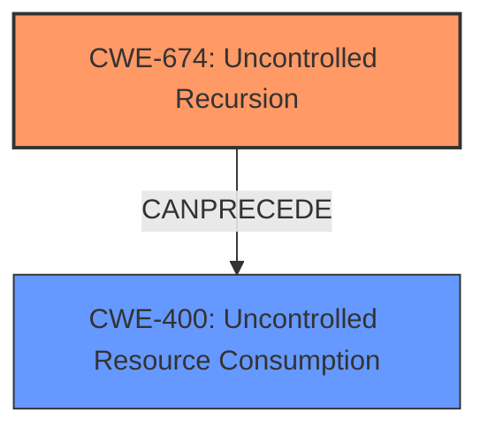

# Final Resolution for CVE-2022-24675

# Summary
| CWE ID | CWE Name | Confidence | CWE Abstraction Level | CWE Vulnerability Mapping Label | CWE-Vulnerability Mapping Notes |
|---|---|---|---|---|---|
| **CWE-674** | **Uncontrolled Recursion** | 0.95 | Class | Primary | The vulnerability is a stack overflow caused by unbounded recursion. |
| CWE-400 | Uncontrolled Resource Consumption | 0.70 | Class | Secondary | The stack overflow leads to resource exhaustion. |

## Evidence and Confidence

*   **Confidence Score:** 0.93
*   **Evidence Strength:** HIGH

## Relationship Analysis
The primary weakness is **CWE-674 (Uncontrolled Recursion)**, which is a Class-level CWE. It directly leads to **CWE-400 (Uncontrolled Resource Consumption)**, a Class-level CWE, as a consequence of the stack overflow. While CWE-400 is often misused, it's justified here because the uncontrolled recursion predictably exhausts stack resources. Alternatives like CWE-770 and CWE-834 were considered but deemed less appropriate due to their focus on allocation and iteration, respectively. The hierarchical relationships show that CWE-674 could be seen as a specific type of excessive iteration, but the description is more accurate.

## Vulnerability Chain
The vulnerability chain starts with **uncontrolled recursion** (**CWE-674**) within the `decodeError` function of the `encoding/pem` package. This leads to excessive consumption of stack memory, eventually resulting in a **stack overflow** and **resource exhaustion** (**CWE-400**). The lack of proper bounds on the recursive calls is the root cause. The impact is a denial-of-service condition due to program crash.

## Summary of Analysis
The initial analysis and criticism are both well-reasoned. The conclusion to use **CWE-674 (Uncontrolled Recursion)** as the primary **WEAKNESS** is accurate because the vulnerability description clearly states a stack overflow in the `encoding/pem` package due to a large amount of PEM data, indicating **uncontrolled recursion**. The CVE Reference Links Content Summary confirms that the `decodeError` function is recursively called without proper bounds, leading to the stack overflow when processing malformed PEM data. The inclusion of **CWE-400 (Uncontrolled Resource Consumption)** as a secondary **WEAKNESS** is justified because the stack overflow directly and predictably results in the consumption of stack resources.

The graph relationships influenced the final selection by highlighting the direct causal link between the **uncontrolled recursion** and the **resource exhaustion**. Although **CWE-400** is a Class and "Discouraged", the analysis makes a good case for including it because the uncontrolled recursion *directly* leads to predictable and unmanaged consumption of stack resources, making it a valid secondary **WEAKNESS**.

The selected CWEs are at the optimal level of specificity. While **CWE-674** is a Class, there isn't a more specific Base-level CWE that directly describes the missing exit condition within the recursive function in this context.