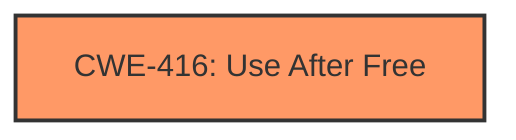

# Analysis Report for CVE-2022-2477

# Vulnerability Analysis Report: CVE-2022-2477

## Description

Use after free in Guest View in Google Chrome prior to 103.0.5060.134 allowed an attacker who convinced a user to install a malicious extension to potentially exploit heap corruption via a crafted HTML page.

## Vulnerability Description Key Phrases

**Rootcause:** use after free
**Weakness:** heap corruption
**Vector:** crafted HTML page
**Attacker:** attacker
**Product:** Google Chrome
**Version:** prior to 103.0.5060.134
**Component:** Guest View

## Analysis (with Relationship Data)

# Summary
| CWE ID | CWE Name | Confidence | CWE Abstraction Level | CWE Vulnerability Mapping Label | CWE-Vulnerability Mapping Notes |
|---|---|---|---|---|---|
| CWE-416 | Use After Free | 1.0 | Variant | Primary | Allowed |

## Evidence and Confidence

*   **Confidence Score:** 1.0
*   **Evidence Strength:** HIGH

- **Analysis and Justification:**  
  - *Explanation:* The vulnerability is described as a **use-after-free** in Google Chrome. The "Vulnerability Description Key Phrases" section identifies the **root cause** as "**use after free**" and the **weakness** as "**heap corruption**". The "CVE Reference Links Content Summary" also states the "Root cause of vulnerability" as "Use after free". CWE-416 (Use After Free) is a Variant level CWE that describes the re-use or referencing of memory after it has been freed, which aligns directly with the vulnerability description. The MITRE mapping guidance indicates that CWE-416 is ALLOWED for this type of vulnerability.

  - *Relationship Analysis:* There are no direct relationships for CWE-416 in the provided information. However, the description of CWE-416 aligns perfectly with the vulnerability details.

- **Confidence Score:**  
  - Confidence: 1.0 (Complete confidence due to direct evidence and clear alignment with CWE-416).

## Criticism of Analysis

Okay, I've reviewed the provided analysis and the full CWE specifications. Here's my critique:

**Overall Assessment:**

The analysis correctly identifies **CWE-416 (Use After Free)** as the primary CWE for the vulnerability described. The confidence level of 1.0 is justified given the explicit mention of "use-after-free" in the vulnerability description and supporting information. The justification provided is clear, concise, and accurately reflects the nature of the weakness.

**Detailed Critique and Suggestions:**

1.  **CWE-416: Use After Free (Primary Mapping):**

    *   **Accuracy:** The mapping to CWE-416 is accurate. The description of CWE-416 directly aligns with the vulnerability, where memory is reused after it has been freed.
    *   **Abstraction Level:**  The analysis correctly identifies CWE-416 as a "Variant" level CWE, which is the preferred abstraction level, as per the CWE mapping guidance.
    *   **Mapping Guidance:** The analysis correctly states that CWE-416 is "Allowed" according to MITRE's mapping guidance.
    *   **Mitigations:** The analysis does not include suggestions for mitigations, which could be improved by adding a brief summary of possible solutions, such as:
        *   Using languages with automatic memory management (e.g., Java, Go, Rust).
        *   Implementing defensive programming practices such as setting pointers to NULL after freeing memory.
        *   Using static analysis tools to detect potential use-after-free vulnerabilities.

2. **Consideration of Heap Corruption:**

*   **Heap Corruption as a Consequence, not a root cause:** The original description mentions "heap corruption." While heap corruption is a *consequence* of a use-after-free (or other memory safety violations), it's not the root cause. The analysis correctly identifies the root cause as the "use-after-free."

3.  **Review of Retriever Results and Alternative CWEs:**

    *   **CWE-787 (Out-of-bounds Write):** CWE-787 can be a consequence of a use-after-free, but not the root cause, so it should not be included.
    *   **CWE-362 (Concurrent Execution using Shared Resource with Improper Synchronization) and CWE-366 (Race Condition within a Thread):** While race conditions *can* lead to use-after-free vulnerabilities (as seen in some examples provided in the CWE specification), it is not mentioned in the current vulnerability. If the vulnerability analysis clearly stated that the use-after-free was due to a race condition, then this CWE would be relevant.  Without that direct evidence, it should not be added.
    *   **CWE-843 (Access of Resource Using Incompatible Type ('Type Confusion')):** Type confusion could theoretically contribute to the exploitation of a UAF, especially if an attacker can influence the type of data written into the freed memory. However, without specific details, this is speculative.
    *   **CWE-122 (Heap-based Buffer Overflow):** While heap corruption might occur *because* of the use-after-free, a heap-based buffer overflow is a separate weakness that results from writing past the end of an allocated buffer.
    *   **CWE-415 (Double Free):** Similar to CWE-787, a double free can corrupt the heap, but it's not the primary cause in this scenario.
    *   **CWE-125 (Out-of-bounds Read):** Similar to CWE-787.
    *   **CWE-190 (Integer Overflow or Wraparound) and CWE-131 (Incorrect Calculation of Buffer Size):** These are less likely causes for this vulnerability, so should not be included.
    *   **CWE-356 (Product UI does not Warn User of Unsafe Actions):** This CWE is related to user interaction and warnings, so it is not related to this vulnerability.
    *   **General Comment on Alternatives:** It's good to consider alternative CWEs, but it's important to justify why a particular CWE is *relevant* based on the available information. Don't just list alternatives without a clear connection to the specific vulnerability.

4.  **CWE Examples:** The included CWE examples are helpful in illustrating the nature of use-after-free vulnerabilities.

5.  **Relationships:** The analysis correctly states that there are no direct relationships for CWE-416 in the provided information.

**Recommendations:**

*   **Keep the focus on CWE-416.** It's the most accurate and well-supported mapping.
*   **Add a brief section on mitigations for CWE-416.**
*   **Be more selective and provide strong justification for alternative CWEs.** If there is no clear evidence in the vulnerability description or supporting information, it's better to exclude them.
*   **Clarify relationship between Heap Corruption and Use-After-Free.** Heap Corruption is a *consequence* of the Use-After-Free, not a separate, independent cause.

By following these recommendations, the analysis can be made even more accurate and useful.

## Final Resolution

# Summary
| CWE ID | CWE Name | Confidence | CWE Abstraction Level | CWE Vulnerability Mapping Label | CWE-Vulnerability Mapping Notes |
|---|---|---|---|---|---|
| CWE-416 | Use After Free | 1.0 | Variant | Primary | Allowed |

## Evidence and Confidence

*   **Confidence Score:** 1.0
*   **Evidence Strength:** HIGH

## Relationship Analysis
The primary CWE, CWE-416, stands alone with no parent-child, chain, or peer relationships impacting the decision. Its Variant level of abstraction is deemed optimal as it directly reflects the specific vulnerability detailed in the description.

## Vulnerability Chain
The vulnerability chain starts with the **root cause**, a **CWE-416 (Use After Free)**, where memory is accessed after being freed. This leads to **heap corruption** which is the impact in this specific case.

## Summary of Analysis
The initial analysis and the criticism both converge on the correct assessment: **CWE-416 (Use After Free)** is indeed the most appropriate classification.

The vulnerability description explicitly states "Use after free in Guest View in Google Chrome," which aligns directly with the definition of **CWE-416 (Use After Free)**: "The product reuses or references memory after it has been freed."

The evidence is strong and directly supports the classification. The abstraction level (Variant) is appropriate for this specific type of memory management issue. The graph relationships do not influence the selection because the description is a direct match. The level of specificity is optimal because it captures the exact nature of the vulnerability without being overly broad or narrow.

*Report generated on 2025-03-18 10:55:55*
