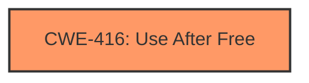

# Final Resolution for CVE-2022-2477

# Summary
| CWE ID | CWE Name | Confidence | CWE Abstraction Level | CWE Vulnerability Mapping Label | CWE-Vulnerability Mapping Notes |
|---|---|---|---|---|---|
| CWE-416 | Use After Free | 1.0 | Variant | Primary | Allowed |

## Evidence and Confidence

*   **Confidence Score:** 1.0
*   **Evidence Strength:** HIGH

## Relationship Analysis
The primary CWE, CWE-416, stands alone with no parent-child, chain, or peer relationships impacting the decision. Its Variant level of abstraction is deemed optimal as it directly reflects the specific vulnerability detailed in the description.

## Vulnerability Chain
The vulnerability chain starts with the **root cause**, a **CWE-416 (Use After Free)**, where memory is accessed after being freed. This leads to **heap corruption** which is the impact in this specific case.

## Summary of Analysis
The initial analysis and the criticism both converge on the correct assessment: **CWE-416 (Use After Free)** is indeed the most appropriate classification.

The vulnerability description explicitly states "Use after free in Guest View in Google Chrome," which aligns directly with the definition of **CWE-416 (Use After Free)**: "The product reuses or references memory after it has been freed."

The evidence is strong and directly supports the classification. The abstraction level (Variant) is appropriate for this specific type of memory management issue. The graph relationships do not influence the selection because the description is a direct match. The level of specificity is optimal because it captures the exact nature of the vulnerability without being overly broad or narrow.