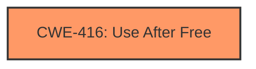

# Analysis Report for CVE-2022-2478

# Vulnerability Analysis Report: CVE-2022-2478

## Description

Use after free in PDF in Google Chrome prior to 103.0.5060.134 allowed a remote attacker to potentially exploit heap corruption via a crafted HTML page.

## Vulnerability Description Key Phrases

**Weakness:** use after free
**Impact:** heap corruption
**Vector:** crafted HTML page
**Attacker:** remote attacker
**Product:** Google Chrome
**Version:** prior to 103.0.5060.134
**Component:** PDF

## Analysis (with Relationship Data)

# Summary
| CWE ID | CWE Name | Confidence | CWE Abstraction Level | CWE Vulnerability Mapping Label | CWE-Vulnerability Mapping Notes |
|---|---|---|---|---|---|
| CWE-416 | Use After Free | 1.0 | Variant | Allowed | Primary CWE |

## Evidence and Confidence

*   **Confidence Score:** 1.0
*   **Evidence Strength:** HIGH

- **Analysis and Justification:**  
  - *Explanation:* The vulnerability description explicitly states a "**use after free**" condition in Google Chrome's PDF processing. The "CVE Reference Links Content Summary" confirms "**Use after free** in PDF" as the root cause and "heap corruption" as the impact. CWE-416 (Use After Free) perfectly matches this description: "The product reuses or references memory after it has been freed." The provided mapping guidance for CWE-416 states that its usage is "Allowed" and the rationale indicates its Variant level of abstraction is a preferred level.
  
  - *Relationship Analysis:* CWE-416 is a variant-level CWE, providing a specific description of the vulnerability. While other CWEs like CWE-362 (Race Condition) and CWE-787 (Out-of-bounds Write) appeared in the Retriever Results, they do not accurately describe the root cause of this particular vulnerability, which is the premature freeing of memory.

- **Confidence Score:**  
  - Confidence: 1.0 (The vulnerability description directly indicates a use-after-free condition, and the reference summary confirms this.)

## Criticism of Analysis

Okay, here's a review of the analysis, considering the full CWE specifications:

**Overall Assessment:**

The analysis is generally good and arrives at the correct primary CWE, CWE-416 (Use After Free).  The confidence score of 1.0 is justified given the explicit nature of the vulnerability description. The reasoning is sound, and the consideration of alternative CWEs is appropriate.

**Detailed Critique:**

*   **Correct Identification of Primary CWE (CWE-416):** The analysis correctly identifies CWE-416 as the primary weakness. The vulnerability description directly states a "use after free" condition, and the reference summary confirms this. The provided explanation and justification are accurate. The abstraction level (Variant) is ideal, as per CWE guidelines.
*   **Thorough Consideration of Alternatives:** The analysis correctly dismisses alternative CWEs like CWE-362 (Race Condition) and CWE-787 (Out-of-bounds Write). The reasoning is valid: these CWEs may be related as *consequences* or *prerequisites*, but they do not define the root cause.
*   **Evidence Strength:** The evidence is strong because it directly uses the keywords "use after free" from the vulnerability description and the reference summary.
*   **Mapping Guidance Adherence:** The analysis adheres to the mapping guidance for CWE-416, which explicitly states that its usage is "Allowed" and that its variant level of abstraction is a preferred level.

**Areas for potential improvement (minor):**

*   **Chain of Events (Optional):** While CWE-416 is the core problem, it could be helpful to explore the events leading *to* the use-after-free condition. What caused the memory to be freed prematurely? Was it a logic error, a race condition, or some other contributing factor?  Describing any contributing factors to CWE-416 (if known from the source material) would make the analysis more comprehensive. It's important to note that this is a "nice to have" and not strictly required for a correct mapping, especially if the available information doesn't provide these details.
*  **Example Chain:** The CVE Examples show that vulnerabilities can be chained together. CVE-2021-0920, CVE-2022-2621, and CVE-2022-20141 are all linked to CWE-416.
*   **Potential Mitigations Discussion:**  The analysis could briefly mention potential mitigations for CWE-416, drawing directly from the CWE specification. These mitigations include:
    *   **Language Selection:** Choosing a language with automatic memory management (e.g., Java, Go, Rust)
    *   **Nulling Pointers:** Setting pointers to `NULL` after freeing memory.  While this isn't a foolproof solution, it can help prevent simple UAF errors.
*  **Relationship Analysis:** The relationship analysis section focuses on why other CWEs are not a good fit. This is good, but it could be expanded to discuss how *other* CWEs might be related to CWE-416 in a causal chain. For instance, if a race condition caused the premature freeing of memory, then CWE-362 might be considered a "CanPrecede" relationship to CWE-416.

**Revised Analysis Fragment (Illustrative):**

```
# Analysis to Review
# Summary
| CWE ID | CWE Name | Confidence | CWE Abstraction Level | CWE Vulnerability Mapping Label | CWE-Vulnerability Mapping Notes |
|---|---|---|---|---|---|
| CWE-416 | Use After Free | 1.0 | Variant | Allowed | Primary CWE |

## Evidence and Confidence

*   **Confidence Score:** 1.0
*   **Evidence Strength:** HIGH

- **Analysis and Justification:**  
  - *Explanation:* The vulnerability description explicitly states a "**use after free**" condition in Google Chrome's PDF processing. The "CVE Reference Links Content Summary" confirms "**Use after free** in PDF" as the root cause and "heap corruption" as the impact. CWE-416 (Use After Free) perfectly matches this description: "The product reuses or references memory after it has been freed." The provided mapping guidance for CWE-416 states that its usage is "Allowed" and the rationale indicates its Variant level of abstraction is a preferred level.
  
  - *Relationship Analysis:* CWE-416 is a variant-level CWE, providing a specific description of the vulnerability. While other CWEs like CWE-362 (Race Condition) and CWE-787 (Out-of-bounds Write) appeared in the Retriever Results, they do not accurately describe the root cause of this particular vulnerability, which is the premature freeing of memory.  It is possible that the use-after-free was caused by a race condition (CWE-362) or other error within the PDF processing component, leading to the memory being released prematurely.

- **Potential Mitigations:**
  - Based on the CWE-416 specification, potential mitigations include:
    *   **Language Selection:**  Using a language with automatic memory management.
    *   **Nulling Pointers:** Setting pointers to `NULL` after freeing memory to reduce the risk of accidental dereferences.

- **Confidence Score:**  
  - Confidence: 1.0 (The vulnerability description directly indicates a use-after-free condition, and the reference summary confirms this.)
```

**In Conclusion:**

The initial analysis is very good. The suggested additions would provide a more comprehensive understanding of the vulnerability and its context but aren't necessary for a correct mapping of the vulnerability. The analysis correctly maps to CWE-416 and provides a clear justification for this choice.

## Final Resolution

# Summary
| CWE ID | CWE Name | Confidence | CWE Abstraction Level | CWE Vulnerability Mapping Label | CWE-Vulnerability Mapping Notes |
|---|---|---|---|---|---|
| CWE-416 | Use After Free | 1.0 | Variant | Allowed | Primary CWE |
  
## Evidence and Confidence

*   **Confidence Score:** 1.0
*   **Evidence Strength:** HIGH

## Relationship Analysis
The primary relationship considered was the direct match of the vulnerability description to CWE-416. Although other CWEs such as CWE-362 (Race Condition) could potentially precede CWE-416, there is no explicit evidence in the vulnerability description to support including it in the classification. The Variant level of CWE-416 provides sufficient specificity.



## Vulnerability Chain
The vulnerability chain is straightforward: the memory is freed prematurely, and a subsequent attempt to access the freed memory results in a use-after-free condition, leading to potential heap corruption. The **ROOTCAUSE** is the premature freeing of memory, and the **WEAKNESS** is the use of that memory after it's freed.

## Summary of Analysis
The initial analysis and the criticism both agree that CWE-416 is the correct classification, and I concur. The vulnerability description explicitly mentions "use after free," and the reference summary confirms this. This constitutes strong evidence for classifying the vulnerability as CWE-416. The criticism suggested exploring contributing factors, such as race conditions, but the available information does not provide enough evidence to confidently include these as part of the vulnerability chain. Therefore, the classification remains focused on the primary **WEAKNESS**: **use after free**. CWE-416 is at the optimal level of specificity, as it accurately describes the vulnerability as a variant.


*Report generated on 2025-03-18 10:56:34*
