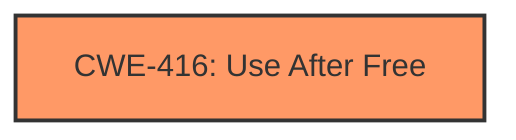

# Final Resolution for CVE-2022-2478

# Summary
| CWE ID | CWE Name | Confidence | CWE Abstraction Level | CWE Vulnerability Mapping Label | CWE-Vulnerability Mapping Notes |
|---|---|---|---|---|---|
| CWE-416 | Use After Free | 1.0 | Variant | Allowed | Primary CWE |
  
## Evidence and Confidence

*   **Confidence Score:** 1.0
*   **Evidence Strength:** HIGH

## Relationship Analysis
The primary relationship considered was the direct match of the vulnerability description to CWE-416. Although other CWEs such as CWE-362 (Race Condition) could potentially precede CWE-416, there is no explicit evidence in the vulnerability description to support including it in the classification. The Variant level of CWE-416 provides sufficient specificity.

## Vulnerability Chain
The vulnerability chain is straightforward: the memory is freed prematurely, and a subsequent attempt to access the freed memory results in a use-after-free condition, leading to potential heap corruption. The **ROOTCAUSE** is the premature freeing of memory, and the **WEAKNESS** is the use of that memory after it's freed.

## Summary of Analysis
The initial analysis and the criticism both agree that CWE-416 is the correct classification, and I concur. The vulnerability description explicitly mentions "use after free," and the reference summary confirms this. This constitutes strong evidence for classifying the vulnerability as CWE-416. The criticism suggested exploring contributing factors, such as race conditions, but the available information does not provide enough evidence to confidently include these as part of the vulnerability chain. Therefore, the classification remains focused on the primary **WEAKNESS**: **use after free**. CWE-416 is at the optimal level of specificity, as it accurately describes the vulnerability as a variant.