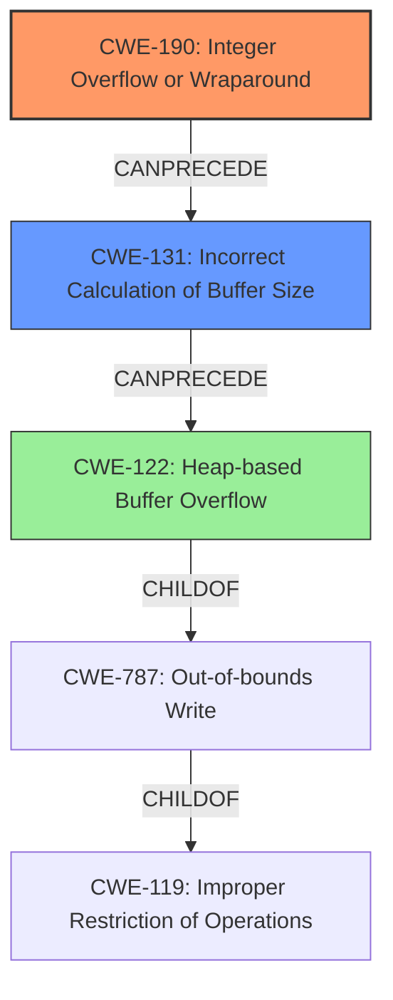

# Analysis Report for CVE-2022-24795

# Vulnerability Analysis Report: CVE-2022-24795

## Description

yajl-ruby is a C binding to the YAJL JSON parsing and generation library. The 1.x branch and the 2.x branch of `yajl` contain an integer overflow which leads to subsequent heap memory corruption when dealing with large (~2GB) inputs. The reallocation logic at `yajl_buf.c#L64` may result in the `need` 32bit integer wrapping to 0 when `need` approaches a value of 0x80000000 (i.e. ~2GB of data), which results in a reallocation of buf->alloc into a small heap chunk. These integers are declared as `size_t` in the 2.x branch of `yajl`, which practically prevents the issue from triggering on 64bit platforms, however this does not preclude this issue triggering on 32bit builds on which `size_t` is a 32bit integer. Subsequent population of this under-allocated heap chunk is based on the original buffer size, leading to heap memory corruption. This vulnerability mostly impacts process availability. Maintainers believe exploitation for arbitrary code execution is unlikely. A patch is available and anticipated to be part of yajl-ruby version 1.4.2. As a workaround, avoid passing large inputs to YAJL.

## Vulnerability Description Key Phrases

**Rootcause:** integer overflow
**Impact:** heap memory corruption
**Vector:** large (~2GB) inputs
**Product:** yajl
**Version:** 1.x branch and the 2.x branch
**Component:** yajl_buf.c#L64

## Analysis (with Relationship Data)

# Summary
| CWE ID | CWE Name | Confidence | CWE Abstraction Level | CWE Vulnerability Mapping Label | CWE-Vulnerability Mapping Notes |
|---|---|---|---|---|---|
| CWE-190 | Integer Overflow or Wraparound | 1.0 | Base | Primary | Allowed |
| CWE-122 | Heap-based Buffer Overflow | 0.7 | Variant | Secondary Candidate | Allowed |
| CWE-789 | Memory Allocation with Excessive Size Value | 0.6 | Variant | Secondary Candidate | Allowed |

## Evidence and Confidence

*   **Confidence Score:** 0.9
*   **Evidence Strength:** HIGH

- **Analysis and Justification:**  
  - *Explanation:* The vulnerability description clearly states that an **integer overflow** occurs when handling large inputs. The reallocation logic in `yajl_buf.c#L64` can cause the `need` variable to wrap to 0, leading to a small heap chunk allocation. This directly matches CWE-190 (Integer Overflow or Wraparound). The "CVE Reference Links Content Summary" explicitly identifies "Integer Overflow" as a root cause and heap memory corruption due to insufficient buffer allocation. The MITRE mapping guidance for CWE-190 indicates this is ALLOWED. The subsequent population of the under-allocated heap leads to heap memory corruption which is commonly due to heap-based buffer overflow, CWE-122. An alternative is CWE-789 which highlights excessive memory allocation due to untrusted input. Since the integer overflow leads to a smaller allocation than expected, then a heap overflow may occur, CWE-122 is preferred. The **integer overflow** causes the allocation of memory with an excessive size value which is untrusted, large and doesn't ensure the size is within expected limits, so CWE-789 can also be considered.

  - *Relationship Analysis:* CWE-190 doesn't have direct relationships to buffer overflows but can lead to them. CWE-122 is a variant of CWE-787 (Out-of-bounds Write) and a child of CWE-119 (Improper Restriction of Operations within the Bounds of a Memory Buffer). CWE-789 is a child of CWE-770 (Allocation of Resources Without Limits or Throttling). The overflow leads to heap corruption which leads to memory corruption, which can cause process instability and crashes, resulting in a denial of service.

- **Confidence Score:**  
  - Confidence: 1.0 (High evidence from technical description and CVE reference materials for CWE-190)
  - Confidence: 0.7 (Medium evidence that a heap based buffer overflow can occur after the integer overflow)
  - Confidence: 0.6 (Medium evidence that memory allocation is excessive due to the integer overflow)
---

## Criticism of Analysis

Okay, here's a detailed review of the CWE analysis provided, taking into account the full CWE specifications and mapping guidance:

**Overall Assessment:**

The analysis is generally good and identifies the primary CWE (CWE-190) correctly. The secondary CWEs (CWE-122 and CWE-789) are plausible but could benefit from a more refined justification. The confidence levels are appropriate given the information available.

**Detailed Review by CWE ID:**

**1.  CWE-190: Integer Overflow or Wraparound (Primary)**

*   **Confidence:** 1.0 (High) - Justified.
*   **Correctness:** Correct. The core issue is the integer overflow during buffer reallocation.  The description clearly states the `need` variable wraps to 0, fulfilling the definition.
*   **Abstraction Level:** Base - Correct.
*   **Mapping Guidance:** Allowed - Correct. The mapping guidance explicitly allows for this CWE.
*   **Potential Mitigations:** The analysis doesn't explicitly discuss mitigations, but knowing this CWE allows for using its recommended mitigations:
    *   **Language Selection:** Using languages with automatic bounds checking or safe integer libraries.
    *   **Strict Protocol Definitions:** Ensure that protocols are defined so out-of-bounds behavior is easy to identify.

**2.  CWE-122: Heap-based Buffer Overflow (Secondary Candidate)**

*   **Confidence:** 0.7 (Medium) - Justified, but needs more precise reasoning.
*   **Correctness:** Likely Correct, but depends on implementation details. The integer overflow results in a smaller than expected heap allocation. When data is written into this smaller heap buffer using the originally expected larger size, a heap-based buffer overflow occurs. However, there could be other conditions that could lead to heap memory corruption.
*   **Abstraction Level:** Variant - Correct.
*   **Mapping Guidance:** Allowed - Correct.
*   **Potential Mitigations:**  If CWE-122 is confirmed, then these mitigations apply:
    *   **Language Selection:** Use memory-safe languages.
    *   **Abstraction Libraries:** Use libraries that abstract risky APIs.
    *   **Compiler/OS Protections:** Use compiler and OS-level mechanisms (e.g., canaries) to detect overflows.

**3.  CWE-789: Memory Allocation with Excessive Size Value (Secondary Candidate)**

*   **Confidence:** 0.6 (Medium) - Plausible but not the best fit.
*   **Correctness:** Technically plausible, but the description is a bit misleading.  While the *initial intention* might be to allocate a large amount of memory, the *actual* allocation is smaller due to the integer overflow. The description for CWE-789 focuses on cases where the memory allocation *is* excessive, but, in this case, it is *insufficient*, which then leads to a heap overflow when the buffer is populated later in the execution. It is important to distinguish that while the overflow leads to corruption when an attempt to excessively write to memory occurs, it can be reasoned that the initial excessive allocation is still a part of the process, even if it isn't carried out.
*   **Abstraction Level:** Variant - Correct.
*   **Mapping Guidance:** Allowed - Correct.
*   **Potential Mitigations:** Less applicable because of the integer overflow.  Typical mitigations for CWE-789 are:
    *   **Input Validation:**  Validate the size value before allocation.
    *   **Resource Limits:**  Set system-level resource limits. While helpful, they don't prevent the underlying overflow.

**Recommendations for Improvement:**

*   **Refine Justification for CWE-122:** Clearly state that the integer overflow causes an *under-allocation*. When data is written to this smaller buffer, it overflows into adjacent heap memory causing heap corruption.
*   **Strengthen Justification for CWE-789:** Clarify that the initial intent might be allocating an excessive amount of memory, but the overflow prevents that from occurring. Also clarify that despite that, the allocation is still based on untrusted user input, which leads to excessive memory corruption, which is in line with CWE-789.
*   **Consider CWE-131: Incorrect Calculation of Buffer Size**: Since the integer overflow directly leads to an incorrect buffer size calculation, CWE-131 might be a more suitable second CWE than either CWE-122 or CWE-789. CWE-131 directly addresses the incorrect calculation of the buffer size due to the integer overflow. This leads to an undersized buffer, which will result in a heap overflow, as identified by CWE-122.
*   **Include Mitigation Details:**  For each CWE, briefly mention at least one or two key mitigations. This adds value and demonstrates a complete understanding of the vulnerability.
*   **Mention CWE-119:** Add that the end result of this exploit leads to CWE-119 "Improper Restriction of Operations within the Bounds of a Memory Buffer."

**Revised Summary (Incorporating Recommendations):**

| CWE ID | CWE Name | Confidence | CWE Abstraction Level | CWE Vulnerability Mapping Label | CWE-Vulnerability Mapping Notes |
|---|---|---|---|---|---|
| CWE-190 | Integer Overflow or Wraparound | 1.0 | Base | Primary | Allowed |
| CWE-131 | Incorrect Calculation of Buffer Size | 0.8 | Base | Secondary Candidate | Allowed |
| CWE-122 | Heap-based Buffer Overflow | 0.7 | Variant | Tertiary Candidate | Allowed |

**Revised Evidence and Confidence:**

*   **Confidence Score:** 0.9
*   **Evidence Strength:** HIGH

- **Analysis and Justification:**  
  - *Explanation:* The vulnerability description clearly states that an **integer overflow** occurs when handling large inputs. The reallocation logic in `yajl_buf.c#L64` can cause the `need` variable to wrap to 0, leading to a small heap chunk allocation. This directly matches CWE-190 (Integer Overflow or Wraparound). The "CVE Reference Links Content Summary" explicitly identifies "Integer Overflow" as a root cause and heap memory corruption due to insufficient buffer allocation. The MITRE mapping guidance for CWE-190 indicates this is ALLOWED. The integer overflow directly causes the allocation of an incorrect buffer size which is classified as CWE-131. Due to the overflow, the buffer is undersized, and the subsequent population of this under-allocated heap leads to heap memory corruption which is classified as a heap-based buffer overflow, CWE-122.

  - *Relationship Analysis:* CWE-190 doesn't have direct relationships to buffer overflows but can lead to them. CWE-122 is a variant of CWE-787 (Out-of-bounds Write) and a child of CWE-119 (Improper Restriction of Operations within the Bounds of a Memory Buffer). The overflow leads to heap corruption which leads to memory corruption, which can cause process instability and crashes, resulting in a denial of service. CWE-131 is a base level of CWE-682.

- **Confidence Score:**  
  - Confidence: 1.0 (High evidence from technical description and CVE reference materials for CWE-190)
  - Confidence: 0.8 (High evidence that the integer overflow causes an incorrect buffer size calculation)
  - Confidence: 0.7 (Medium evidence that a heap based buffer overflow can occur after the integer overflow and the incorrect calculation of buffer size)

By incorporating these suggestions, the analysis becomes more precise, defensible, and actionable.

## Final Resolution

# Summary
| CWE ID | CWE Name | Confidence | CWE Abstraction Level | CWE Vulnerability Mapping Label | CWE-Vulnerability Mapping Notes |
|---|---|---|---|---|---|
| CWE-190 | Integer Overflow or Wraparound | 1.0 | Base | Primary | Allowed |
| CWE-131 | Incorrect Calculation of Buffer Size | 0.8 | Base | Secondary Candidate | Allowed |
| CWE-122 | Heap-based Buffer Overflow | 0.7 | Variant | Tertiary Candidate | Allowed |

## Evidence and Confidence

*   **Confidence Score:** 0.9
*   **Evidence Strength:** HIGH

## Relationship Analysis
The analysis focuses on the relationships between integer overflows, incorrect buffer size calculations, and heap-based buffer overflows.

*   Parent-child hierarchical relationships: CWE-122 is a variant of CWE-787 (Out-of-bounds Write) and a child of CWE-119 (Improper Restriction of Operations within the Bounds of a Memory Buffer). CWE-131 is a base level of CWE-682.
*   Chain relationships showing progression of vulnerability: The **integer overflow** (CWE-190) leads to an incorrect calculation of buffer size (CWE-131), which then leads to a heap-based buffer overflow (CWE-122).
*   Peer relationships that offered alternative classifications: Initially, CWE-789 (Memory Allocation with Excessive Size Value) was considered, but it was deemed less suitable because the *actual* allocation is smaller due to the integer overflow, although the *initial intent* was a large allocation.
*   How abstraction levels influenced your selection: Base CWEs (CWE-190, CWE-131) were preferred over Variant CWEs (CWE-122) to represent the root causes of the vulnerability more accurately.

## Vulnerability Chain
The chain of weaknesses starts with the **integer overflow** (CWE-190), which occurs due to a large input size. This **integer overflow** leads to an incorrect calculation of the buffer size (CWE-131), resulting in an undersized buffer being allocated. When data is written to this smaller buffer using the originally expected larger size, it overflows into adjacent heap memory, leading to a heap-based buffer overflow (CWE-122).

*   **Root Cause:** CWE-190 (**Integer Overflow or Wraparound**)
*   **Weakness 1:** CWE-131 (**Incorrect Calculation of Buffer Size**)
*   **Impact:** CWE-122 (**Heap-based Buffer Overflow**) causing process instability and potential denial of service.

## Summary of Analysis
The initial analysis correctly identified CWE-190 as the primary **weakness**. The criticism suggested refining the justification for the secondary CWEs and considering CWE-131. The final determination incorporates these suggestions.

*   The assessment is primarily based on the provided evidence from the vulnerability description: "The 1.x branch and the 2.x branch of `yajl` contain an integer overflow which leads to subsequent heap memory corruption when dealing with large (~2GB) inputs. The reallocation logic at `yajl_buf.c#L64` may result in the `need` 32bit integer wrapping to 0...which results in a reallocation of buf->alloc into a small heap chunk... Subsequent population of this under-allocated heap chunk is based on the original buffer size, leading to heap memory corruption." This directly supports CWE-190, CWE-131, and CWE-122.
*   The graph relationships influenced the selection by highlighting the sequence of events: **integer overflow** -> incorrect buffer size -> heap overflow.
*   The selected CWEs are at the optimal level of specificity because they accurately represent the root cause (CWE-190), the immediate consequence (CWE-131), and the final impact (CWE-122) of the vulnerability. Using CWE-131 provides a more direct and accurate representation of the buffer size miscalculation than CWE-789, making it a better fit.

*Report generated on 2025-03-18 10:57:26*
