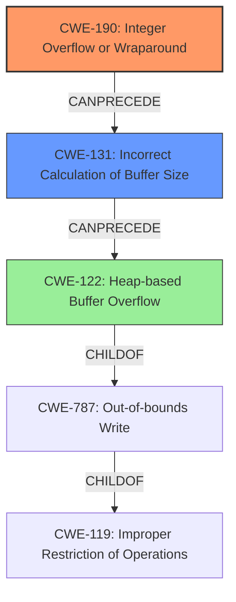

# Final Resolution for CVE-2022-24795

# Summary
| CWE ID | CWE Name | Confidence | CWE Abstraction Level | CWE Vulnerability Mapping Label | CWE-Vulnerability Mapping Notes |
|---|---|---|---|---|---|
| CWE-190 | Integer Overflow or Wraparound | 1.0 | Base | Primary | Allowed |
| CWE-131 | Incorrect Calculation of Buffer Size | 0.8 | Base | Secondary Candidate | Allowed |
| CWE-122 | Heap-based Buffer Overflow | 0.7 | Variant | Tertiary Candidate | Allowed |

## Evidence and Confidence

*   **Confidence Score:** 0.9
*   **Evidence Strength:** HIGH

## Relationship Analysis
The analysis focuses on the relationships between integer overflows, incorrect buffer size calculations, and heap-based buffer overflows.

*   Parent-child hierarchical relationships: CWE-122 is a variant of CWE-787 (Out-of-bounds Write) and a child of CWE-119 (Improper Restriction of Operations within the Bounds of a Memory Buffer). CWE-131 is a base level of CWE-682.
*   Chain relationships showing progression of vulnerability: The **integer overflow** (CWE-190) leads to an incorrect calculation of buffer size (CWE-131), which then leads to a heap-based buffer overflow (CWE-122).
*   Peer relationships that offered alternative classifications: Initially, CWE-789 (Memory Allocation with Excessive Size Value) was considered, but it was deemed less suitable because the *actual* allocation is smaller due to the integer overflow, although the *initial intent* was a large allocation.
*   How abstraction levels influenced your selection: Base CWEs (CWE-190, CWE-131) were preferred over Variant CWEs (CWE-122) to represent the root causes of the vulnerability more accurately.

## Vulnerability Chain
The chain of weaknesses starts with the **integer overflow** (CWE-190), which occurs due to a large input size. This **integer overflow** leads to an incorrect calculation of the buffer size (CWE-131), resulting in an undersized buffer being allocated. When data is written to this smaller buffer using the originally expected larger size, it overflows into adjacent heap memory, leading to a heap-based buffer overflow (CWE-122).

*   **Root Cause:** CWE-190 (**Integer Overflow or Wraparound**)
*   **Weakness 1:** CWE-131 (**Incorrect Calculation of Buffer Size**)
*   **Impact:** CWE-122 (**Heap-based Buffer Overflow**) causing process instability and potential denial of service.

## Summary of Analysis
The initial analysis correctly identified CWE-190 as the primary **weakness**. The criticism suggested refining the justification for the secondary CWEs and considering CWE-131. The final determination incorporates these suggestions.

*   The assessment is primarily based on the provided evidence from the vulnerability description: "The 1.x branch and the 2.x branch of `yajl` contain an integer overflow which leads to subsequent heap memory corruption when dealing with large (~2GB) inputs. The reallocation logic at `yajl_buf.c#L64` may result in the `need` 32bit integer wrapping to 0...which results in a reallocation of buf->alloc into a small heap chunk... Subsequent population of this under-allocated heap chunk is based on the original buffer size, leading to heap memory corruption." This directly supports CWE-190, CWE-131, and CWE-122.
*   The graph relationships influenced the selection by highlighting the sequence of events: **integer overflow** -> incorrect buffer size -> heap overflow.
*   The selected CWEs are at the optimal level of specificity because they accurately represent the root cause (CWE-190), the immediate consequence (CWE-131), and the final impact (CWE-122) of the vulnerability. Using CWE-131 provides a more direct and accurate representation of the buffer size miscalculation than CWE-789, making it a better fit.