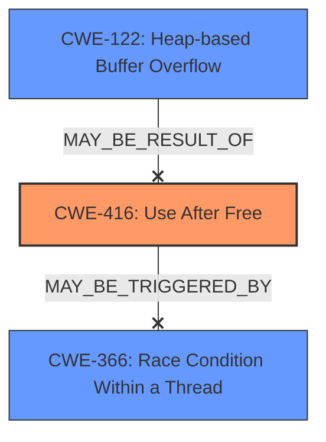

# Analysis Report for CVE-2022-2481

# Vulnerability Analysis Report: CVE-2022-2481

## Description

Use after free in Views in Google Chrome prior to 103.0.5060.134 allowed a remote attacker who convinced a user to engage in specific user interactions to potentially exploit heap corruption via UI interaction.

## Vulnerability Description Key Phrases

**Rootcause:** use after free
**Weakness:** heap corruption
**Vector:** UI interaction
**Attacker:** remote attacker
**Product:** Google Chrome
**Version:** prior to 103.0.5060.134
**Component:** Views

## Analysis (with Relationship Data)

# Summary
| CWE ID | CWE Name | Confidence | CWE Abstraction Level | CWE Vulnerability Mapping Label | CWE-Vulnerability Mapping Notes |
|---|---|---|---|---|---|
| CWE-416 | Use After Free | 1.0 | Variant | Allowed | Primary |

## Evidence and Confidence

*   **Confidence Score:** 1.0
*   **Evidence Strength:** HIGH

- **Analysis and Justification:**  
  - *Explanation:* The vulnerability description explicitly states "**use after free** in Views in Google Chrome...allowed a remote attacker...to potentially exploit **heap corruption** via UI interaction." The CVE Reference Links Content Summary confirms this, stating "Use-after-free (UAF): This vulnerability occurs when a program attempts to access memory after it has been freed, potentially leading to corruption or unexpected behavior." This aligns directly with CWE-416 (Use After Free), which is a Variant level CWE, making it a precise and appropriate match. The MITRE mapping guidance for CWE-416 indicates that its usage is ALLOWED.

  - *Relationship Analysis:* While other CWEs were suggested by the retriever, such as CWE-366 (Race Condition Within a Thread), CWE-843 (Access of Resource Using Incompatible Type), and CWE-122 (Heap-based Buffer Overflow), they do not directly address the root cause of the vulnerability as clearly as CWE-416. CWE-416 may be related to heap corruption, as noted in the description, but the root cause is the use of memory after it has been freed. Other CWEs may be indirectly related but are less precise than CWE-416.

- **Confidence Score:**  
  - Confidence: 1.0 (Strong evidence from the vulnerability description and CVE reference materials)

## Criticism of Analysis

Okay, here's a review of the analysis, considering the full CWE specifications you've provided.

**Overall Assessment:**

The analysis is generally very good, and the chosen CWE-416 (Use After Free) is the most accurate and relevant mapping for this vulnerability. The justification is well-reasoned and supported by the evidence. The analysis correctly identifies the limitations of the other CWEs suggested by the retriever.

**Specific Feedback:**

*   **CWE-416 Mapping (Confidence: 1.0):**

    *   The confidence score of 1.0 is appropriate.  The evidence from the vulnerability description and CVE reference materials directly supports the use-after-free condition.
    *   The analysis correctly identifies CWE-416 as a Variant-level CWE, which is a preferred level of abstraction for mapping to root causes.
    *   The reference to MITRE mapping guidance is helpful.
    *   The description of the vulnerability perfectly matches what is described in the description of CWE-416.
    *   The analysis would be even stronger if it briefly mentioned the *potential* consequences of a UAF (remote code execution, denial of service, information disclosure) which further strengthens the argument for this CWE.

*   **Alternative CWE Considerations:**

    *   **CWE-366 (Race Condition Within a Thread):** The analysis correctly notes that while concurrency might be *involved* in triggering the UAF, it's not the root cause itself. The core issue is still the access of freed memory, regardless of whether a race condition contributed to it. In fact, the CWE specifications for CWE-366 even contain the observed example of "CVE-2022-2621: Chain: two threads in a web browser use the same resource (CWE-366), but one of those threads can destroy the resource before the other has completed (CWE-416)."
    *   **CWE-843 (Access of Resource Using Incompatible Type):** This is less relevant. While the freed memory *might* be reallocated and then interpreted as a different type, this is a *consequence* of the UAF, not the root cause. The primary problem is using memory that is no longer valid, not necessarily that it's being interpreted as the wrong *type*.
    *   **CWE-122 (Heap-based Buffer Overflow):** The analysis correctly mentions that heap corruption is a *potential* consequence, but not the primary cause. A UAF can lead to heap corruption, which *could* then lead to a buffer overflow. However, the UAF itself is the direct fault.
    *   **CWE-356 (Product UI does not Warn User of Unsafe Actions):** While UI interaction is the vector, the lack of a UI warning is not the weakness itself.  This is more of a contextual factor.

*   **Mitigations:**

    *   The analysis doesn't explicitly discuss mitigations, which is fine, but it's worth noting the mitigations suggested by the CWE entry for CWE-416:
        *   *Language Selection (Automatic Memory Management):* Choosing a language with garbage collection or automatic memory management.
        *   *Implementation (Setting Pointers to NULL):*  Setting pointers to NULL after freeing them (though the CWE description acknowledges its limitations in complex data structures).
        *   *Static analysis:* Use static analysis tools to find double free instances.

*   **Minor Improvements:**

    *   While the explanation of relationship analysis is good, consider phrasing it in terms of "CWE-416 is the *most direct and precise* mapping" or "best captures the core vulnerability."
    *   In the known examples for CWE-122, it might be helpful to briefly describe how the root cause led to the example.

**Final Recommendation:**

The analysis is accurate and well-justified. I would recommend keeping the classification as CWE-416 with a confidence score of 1.0. The suggested minor improvements can enhance the analysis, but the current state is excellent.

## Final Resolution

# Summary

| CWE ID | CWE Name | Confidence | CWE Abstraction Level | CWE Vulnerability Mapping Label | CWE-Vulnerability Mapping Notes |
|---|---|---|---|---|---|
| CWE-416 | Use After Free | 1.0 | Variant | Allowed | Primary CWE |

## Evidence and Confidence

*   **Confidence Score:** 1.0
*   **Evidence Strength:** HIGH

## Relationship Analysis
The primary relationship considered was the direct match of the vulnerability description to **CWE-416 (Use After Free)**. While other CWEs like **CWE-366 (Race Condition Within a Thread)**, **CWE-843 (Access of Resource Using Incompatible Type)**, and **CWE-122 (Heap-based Buffer Overflow)** were considered, they were deemed less specific to the root cause. The abstraction level of **CWE-416 (Use After Free)** as a Variant further solidified its appropriateness.

## Vulnerability Chain
The vulnerability chain starts with the **ROOTCAUSE** being a use-after-free condition (**CWE-416**). This leads to accessing memory that has been freed, potentially leading to **heap corruption**. The UI interaction serves as a trigger or vector.

## Summary of Analysis
The initial analysis correctly identified **CWE-416 (Use After Free)** as the primary **WEAKNESS**. The vulnerability description explicitly mentions "**use after free** in Views in Google Chrome...allowed a remote attacker...to potentially exploit **heap corruption** via UI interaction." The analysis accurately dismissed other potential CWEs due to their lower specificity. The graph relationships confirm that while other weaknesses may be related, **CWE-416 (Use After Free)** is the most direct and precise mapping. The selected CWE is at the optimal level of specificity (Variant). The final recommendation is to keep the classification as **CWE-416 (Use After Free)** with a confidence score of 1.0.

*Report generated on 2025-03-18 11:08:51*
