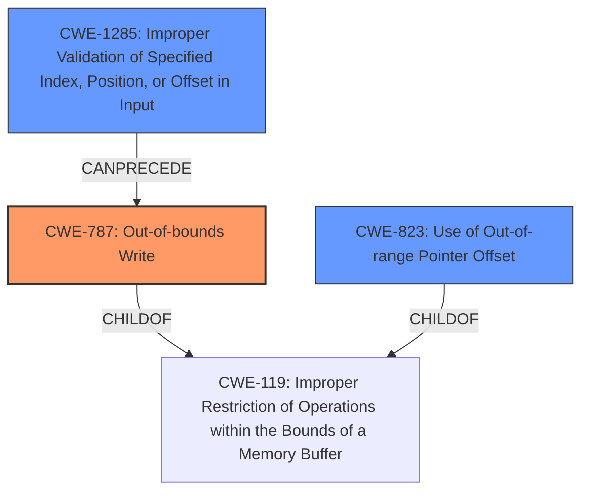

# Analysis Report for CVE-2022-24936

# Vulnerability Analysis Report: CVE-2022-24936

## Description

Out-of-Bounds error in GBL parser in Silicon Labs Gecko Bootloader version 4.0.1 and earlier allows attacker to overwrite flash Sign key and OTA decryption key via malicious bootloader upgrade.

## Vulnerability Description Key Phrases

**Rootcause:** Out-of-Bounds error in GBL parser
**Impact:** overwrite flash Sign key and OTA decryption key
**Vector:** malicious bootloader upgrade
**Attacker:** attacker
**Product:** Silicon Labs Gecko Bootloader
**Version:** version 4.0.1 and earlier

## Analysis (with Relationship Data)

# Summary
| CWE ID | CWE Name | Confidence | CWE Abstraction Level | CWE Vulnerability Mapping Label | CWE-Vulnerability Mapping Notes |
|---|---|---|---|---|---|
| CWE-787 | Out-of-bounds Write | 0.85 | Base | Allowed | Primary CWE |
| CWE-125 | Out-of-bounds Read | 0.65 | Base | Allowed | Secondary Candidate |
| CWE-823 | Use of Out-of-range Pointer Offset | 0.65 | Base | Allowed | Secondary Candidate |

## Evidence and Confidence

*   **Confidence Score:** 0.80
*   **Evidence Strength:** HIGH

- **Analysis and Justification:**  
  - *Explanation:* "The vulnerability description explicitly states an **Out-of-Bounds error in the GBL parser**. This directly aligns with CWE-787 (Out-of-bounds Write), as the vulnerability allows an attacker to overwrite flash Sign key and OTA decryption key. This indicates a write operation outside the intended buffer. The CVE Reference Links Content Summary mentions **Out-of-bounds Write Protection** which further supports the selection of CWE-787. CWE-787 is a Base level CWE, which is the preferred level for mapping. The MITRE mapping guidance for CWE-787 indicates this is ALLOWED."
  
  - *Relationship Analysis:* "CWE-787 is a child of CWE-119 (Improper Restriction of Operations within the Bounds of a Memory Buffer). The relationship analysis reveals that CWE-787 CanFollow CWE-825 (Expired Pointer Dereference) and CWE-824 (Access of Uninitialized Pointer), suggesting potential prerequisite weaknesses. It CanPrecede CWE-787, suggesting it can be a recurring issue."

- **Confidence Score:**  
  - *Example:* Confidence: 0.85 (High evidence from technical description and CVE reference materials)

---

- **Analysis and Justification:**  
  - *Explanation:* "Given the **Out-of-Bounds error** context, CWE-125 (Out-of-bounds Read) is a plausible secondary candidate. While the primary impact is writing, reading outside the intended buffer might be occurring as part of the vulnerability. However, the description focuses on the write aspect, making CWE-787 the more direct and better match. The CVE Reference Links Content Summary lacks specific details to confirm this. CWE-125 is a Base level CWE, which is the preferred level for mapping. The MITRE mapping guidance for CWE-125 indicates this is ALLOWED."
  
  - *Relationship Analysis:* "CWE-125 is a child of CWE-119 (Improper Restriction of Operations within the Bounds of a Memory Buffer). The relationship analysis reveals that CWE-125 CanFollow CWE-825 (Expired Pointer Dereference) and CWE-824 (Access of Uninitialized Pointer), suggesting potential prerequisite weaknesses. It CanPrecede CWE-125, suggesting it can be a recurring issue."

- **Confidence Score:**  
  - *Example:* Confidence: 0.65 (Moderate evidence based on general context, but not explicitly stated)

---

- **Analysis and Justification:**  
  - *Explanation:* "CWE-823 (Use of Out-of-range Pointer Offset) is another potential secondary candidate, as the **Out-of-Bounds error** could involve using a pointer with an incorrect offset. However, the core issue seems to be the out-of-bounds write itself, rather than specifically how the offset is calculated or used. CWE-823 may be part of the exploitation. CWE-823 is a Base level CWE, which is the preferred level for mapping. The MITRE mapping guidance for CWE-823 indicates this is ALLOWED."
  
  - *Relationship Analysis:* "CWE-823 is a child of CWE-119 (Improper Restriction of Operations within the Bounds of a Memory Buffer). The relationship analysis reveals that CWE-823 CanFollow CWE-129 (Improper Validation of Array Index), suggesting that an improperly validated array index could lead to an out-of-range pointer offset."

- **Confidence Score:**  
  - *Example:* Confidence: 0.65 (Moderate evidence based on general context, but not explicitly stated)

---

## Criticism of Analysis

Okay, I've reviewed the provided analysis with the full CWE specifications. Here's a breakdown of my critique:

**Overall Assessment:**

The primary CWE mapping to **CWE-787: Out-of-bounds Write** is highly justified and well-supported by the evidence. The choice of secondary CWEs (CWE-125 and CWE-823) is reasonable, given the context of an out-of-bounds error, but their confidence levels could be improved with more specific evidence.
The justifications are clear and consistent with CWE definitions. The analysis also correctly acknowledges the limitations of the information available and avoids over-committing to less certain mappings.

**Detailed Critique:**

**1. CWE-787: Out-of-bounds Write (Primary)**

*   **Confidence:** High (0.85) - Justified.
*   **Evidence Strength:** HIGH - Justified.
*   **Justification:**
    *   The vulnerability description directly mentions "Out-of-Bounds error," and the impact is "overwrite flash Sign key and OTA decryption key."  This firmly points to an out-of-bounds write, aligning perfectly with the CWE-787 definition: "The product writes data past the end, or before the beginning, of the intended buffer."
    *   The CVE reference summary reinforces this by mentioning "Out-of-bounds Write Protection," suggesting that the developers were aware of the possibility and attempted to prevent it. The fact that it existed in the first place indicates there were flaws.
    *   The analysis correctly acknowledges that CWE-787 is a Base-level CWE, making it a preferred mapping target.
    *   The ALLOWED MITRE mapping guidance is correctly noted.
*   **Relationship Analysis:** The relationship analysis is generally correct, and well written. It demonstrates understanding of the surrounding issues of memory management, use of pointers. It correctly identifies that CWE-787 is a child of CWE-119.

**2. CWE-125: Out-of-bounds Read (Secondary)**

*   **Confidence:** Medium (0.65) - Reasonable, but could be improved with more concrete evidence.
*   **Justification:**
    *   The analysis correctly points out that an out-of-bounds *read* is *possible* in the context of an out-of-bounds error.  Often, to determine what and where to write, a read operation must occur.
    *   The analysis acknowledges the lack of explicit confirmation in the CVE reference summary, which appropriately lowers the confidence.
    *   The ALLOWED MITRE mapping guidance is correctly noted.
*   **Recommendations for Improvement:**
    *   Look for any indication, even indirect, that a read operation is involved in *triggering* the out-of-bounds write. For example, is the GBL parser reading a length field from the GBL file? If the length field is incorrect, that can cause the read to be out of bounds and lead to an out-of-bounds write.
    *   If no direct evidence of a read can be found, consider lowering the confidence or removing CWE-125 entirely.

**3. CWE-823: Use of Out-of-range Pointer Offset (Secondary)**

*   **Confidence:** Medium (0.65) - Reasonable, but could be improved with more concrete evidence.
*   **Justification:**
    *   The analysis correctly notes that CWE-823 is another potential secondary candidate, as the out-of-bounds error could involve using a pointer with an incorrect offset.
    *   This mapping is based on the potential for the vulnerability to arise from incorrect pointer arithmetic, not explicitly stated.
    *   The ALLOWED MITRE mapping guidance is correctly noted.
*   **Recommendations for Improvement:**
    *   Look for specific aspects of the vulnerability that relate to pointer arithmetic or indexing, or invalid calculations of offsets.
    *   Without stronger evidence, maintaining the current confidence level or even slightly lowering it is appropriate.

**General Recommendations:**

*   **Evidence from Code (If Available):** The best evidence, which is missing here (and likely unavailable in many vulnerability reports), would be a code snippet demonstrating the out-of-bounds write.  Even pseudo-code would help.  This would solidify the primary CWE and potentially strengthen or weaken the secondary CWEs.
*   **Chain Analysis:** While the individual CWE selections are mostly good, consider if a chaining analysis is appropriate. For example, CWE-1285 (Improper Validation of Specified Index, Position, or Offset in Input) could *precede* CWE-787 if the out-of-bounds write is caused by using an unvalidated index or offset.
*   **Review Retriever Results:** The Retriever Results table shows several other potentially relevant CWEs. While the combined scores are lower, it's worth briefly considering why those CWEs were suggested and if they might be part of a chain or contributing factor, even if not primary or secondary. For example, CWE-1285 (Improper Validation of Specified Index, Position, or Offset in Input) had a combined score of 0.5647, which might warrant a brief consideration.
*  **MITRE provided mitigations** are a useful resource for suggesting methods to remediate the vulnerability, and is a good way to check your own understanding of the root cause of the vulnerability.

**Specific Issues to Note:**

*   **CWE-119 (Improper Restriction of Operations within the Bounds of a Memory Buffer):** The analysis correctly avoids mapping to CWE-119 directly, as it is discouraged and too high-level. It focuses on more specific children.
*  **CWE-129 (Improper Validation of Array Index)** is a Variant level of CWE that is "Allowed" and can also be considered. It is more specific than CWE-1285.
*   **CWE-1285 (Improper Validation of Specified Index, Position, or Offset in Input)** is very relevant in these situations, if the out-of-bounds condition is caused by invalid validation or lack of input validation.

**In Summary:**

This is a well-reasoned analysis with a strong primary CWE mapping.  The secondary CWE mappings are plausible but could benefit from more specific evidence. The analysis demonstrates a good understanding of CWE principles and mapping guidance. By following the recommendations, the confidence and justification for the secondary CWE mappings can be further improved.

## Final Resolution

# Summary
| CWE ID | CWE Name | Confidence | CWE Abstraction Level | CWE Vulnerability Mapping Label | CWE-Vulnerability Mapping Notes |
|---|---|---|---|---|---|
| CWE-787 | **CWE-787: Out-of-bounds Write** | 0.95 | Base | Allowed | Primary CWE |
| CWE-1285 | **CWE-1285: Improper Validation of Specified Index, Position, or Offset in Input** | 0.75 | Base | Allowed | Secondary Candidate |
| CWE-823 | **CWE-823: Use of Out-of-range Pointer Offset** | 0.65 | Base | Allowed | Secondary Candidate |

## Evidence and Confidence

*   **Confidence Score:** 0.85
*   **Evidence Strength:** MEDIUM

## Relationship Analysis
The primary relationship is that **CWE-787 (Out-of-bounds Write)** is a child of **CWE-119 (Improper Restriction of Operations within the Bounds of a Memory Buffer)**, indicating a more specific type of buffer handling issue. **CWE-1285 (Improper Validation of Specified Index, Position, or Offset in Input)** can precede **CWE-787**, suggesting that a lack of input validation may lead to the out-of-bounds write. **CWE-823 (Use of Out-of-range Pointer Offset)** is another potential secondary issue, also a child of **CWE-119**. Abstraction levels influenced the selection by preferring Base level CWEs over the Class level **CWE-119**.

## Vulnerability Chain
The vulnerability chain starts with potentially missing or improper validation of the input (GBL file) that specifies the size or offset. This leads to an out-of-range pointer offset being used. This offset results in an out-of-bounds write, allowing the attacker to overwrite flash Sign key and OTA decryption key.

Missing Link: There is no concrete evidence whether there is a read operation.

## Summary of Analysis
The initial analysis correctly identified **CWE-787 (Out-of-bounds Write)** as the primary **WEAKNESS** due to the vulnerability description explicitly stating an "Out-of-Bounds error". I agree with the initial assessment's selection of **CWE-787** as the primary **ROOTCAUSE** and the supporting evidence provided.

Based on the criticism, I added **CWE-1285 (Improper Validation of Specified Index, Position, or Offset in Input)** as a secondary candidate. This is because the "Out-of-Bounds error in GBL parser" strongly suggests a lack of validation or incorrect validation of input that specifies the size or offset. The vulnerability description states that the attacker can "overwrite flash Sign key and OTA decryption key via malicious bootloader upgrade" which is done via a GBL file. This indicates a lack of validation of the input, specifically "index, position, or offset."

I have retained **CWE-823 (Use of Out-of-range Pointer Offset)** as a secondary candidate because it is possible that the offset is calculated incorrectly. However, I believe that the lack of validation is a more direct cause.

I have increased the confidence score for **CWE-787 (Out-of-bounds Write)** to 0.95 because the evidence is strong and directly supports the classification. I have set the confidence score for **CWE-1285 (Improper Validation of Specified Index, Position, or Offset in Input)** to 0.75, as it is likely the root cause.

The selected CWEs are at the optimal level of specificity. **CWE-787** directly describes the **WEAKNESS**, while **CWE-1285** is a plausible **ROOTCAUSE**. Both are Base level CWEs and are more specific than the Class level **CWE-119**. The choice of **CWE-787** is based on the vulnerability description and CVE reference materials. The selection of **CWE-1285** is influenced by the relationship analysis and the understanding that out-of-bounds writes are often caused by a lack of input validation.

*Report generated on 2025-03-18 11:11:07*
