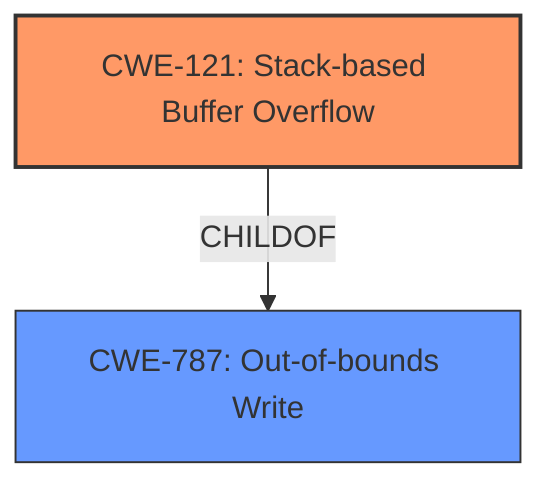

# Analysis Report for CVE-2022-25428

# Vulnerability Analysis Report: CVE-2022-25428

## Description

Tenda AC9 v15.03.2.21 was discovered to contain a stack overflow via the deviceId parameter in the saveparentcontrolinfo function.

## Vulnerability Description Key Phrases

**Weakness:** stack overflow
**Product:** Tenda AC9
**Version:** v15.03.2.21
**Component:** saveparentcontrolinfo function

## Analysis (with Relationship Data)

# Summary
| CWE ID | CWE Name | Confidence | CWE Abstraction Level | CWE Vulnerability Mapping Label | CWE-Vulnerability Mapping Notes |
|---|---|---|---|---|---|
| CWE-121 | Stack-based Buffer Overflow | 0.95 | Variant | Allowed | Primary CWE |

## Evidence and Confidence

*   **Confidence Score:** 0.95
*   **Evidence Strength:** HIGH

- **Analysis and Justification:**
  - *Explanation:* The vulnerability description clearly states a **stack overflow** via the deviceId parameter in the saveparentcontrolinfo function. CWE-121 (Stack-based Buffer Overflow) is a Variant-level CWE which specifies that the overflow occurs on the stack. The vulnerability description explicitly mentions a **stack overflow**, aligning directly with CWE-121. The primary CWE match from similar CVE descriptions is CWE-787 (Out-of-bounds Write). While a stack overflow is indeed an out-of-bounds write, CWE-121 is a more specific variant that describes the location of the buffer as being on the stack. The Retriever results also list CWE-121 as the top candidate.

  - *Relationship Analysis:* CWE-121 is a variant of the more general CWE-787 (Out-of-bounds Write), but given the explicit mention of "stack overflow", CWE-121 is the more appropriate choice. There are no direct relationships mentioned in the provided data, but buffer overflows can lead to various impacts, such as arbitrary code execution or denial of service.

- **Confidence Score:**
  - Confidence: 0.95 (High confidence because the description explicitly states "stack overflow.")

---

## Criticism of Analysis

Okay, I've reviewed the analysis in light of the provided full CWE specifications. Here's my critique:

**Overall Assessment:**

The analysis is very strong.  The selection of CWE-121 (Stack-based Buffer Overflow) is highly appropriate and well-justified. The confidence level of 0.95 is also fitting given the explicit mention of "stack overflow" in the vulnerability description. The analysis considered the other potential CWEs such as CWE-787, and correctly deduced that CWE-121 is a more specific and appropriate choice.

**Detailed Breakdown:**

*   **CWE-121 Justification:** The justification is excellent. It directly links the "stack overflow" in the vulnerability description to the definition of CWE-121. It clearly explains why CWE-121 is a better fit than its parent CWE-787, and why it is the top candidate in the Retriever results.

*   **Confidence Score:**  The justification for the confidence score is solid and appropriate.

*   **CWE Examples:** The provided examples are relevant and useful.  Including these examples strengthens the analysis by demonstrating real-world instances of CWE-121.

*   **CWE Specification Review:** The inclusion of relevant sections from the CWE specifications demonstrates a thorough understanding of the CWE framework and provides a solid foundation for the analysis.

*   **Retriever Results:** The analysis acknowledges and correctly interprets the retriever results. The Retriever results, specifically, the high score for CWE-121, further supports the correctness of the analysis.

**Potential Areas for Minor Improvement (Nitpicks):**

*   **Relationship Discussion (CWE-121):** While the analysis mentions CWE-121 being a variant of CWE-787, it could benefit from a slightly deeper dive into the *implications* of this relationship. For example, stating that mitigations for CWE-787 may also partially address CWE-121, but specific stack overflow protection mechanisms are ideal.

*   **Mitigation Awareness:**  The analysis correctly identifies CWE-121. While not explicitly required, the analysis could have briefly touched upon the *relevance* of the *Potential Mitigations* listed in the CWE-121 specification to the specific vulnerability. For example: mentioning that using compiler flags like `/GS` (Microsoft Visual Studio) or `-fstack-protector` (GCC) could potentially mitigate this specific type of stack overflow.

**Specific Comments on Other CWEs Mentioned:**

*   **CWE-787 (Out-of-bounds Write):** The analysis correctly identifies that CWE-787 is a broader category. The explanation of why CWE-121 is more appropriate is well done.

*   **CWE-120 (Buffer Copy without Checking Size of Input):** While CWE-120 isn't the primary CWE, it's worth noting that *if* the vulnerability stems from a `strcpy` or similar function *without* a size check, then CWE-120 *could* be considered, but it's less precise than CWE-121. However, without the source code, this is difficult to determine.

*   **CWE-119 (Improper Restriction of Operations within the Bounds of a Memory Buffer):** The analysis implicitly acknowledges the general nature of CWE-119 by focusing on its more specific child CWE-121.

**In Summary:**

This is a high-quality analysis. The selection of CWE-121 is well-justified, and the analysis demonstrates a strong understanding of the CWE framework and the specific vulnerability. The minor suggestions above are primarily for added completeness and to further demonstrate awareness of mitigation strategies.

## Final Resolution

# Summary
| CWE ID | CWE Name | Confidence | CWE Abstraction Level | CWE Vulnerability Mapping Label | CWE-Vulnerability Mapping Notes |
|---|---|---|---|---|---|
| CWE-121 | Stack-based Buffer Overflow | 0.95 | Variant | Allowed | Primary CWE |

## Evidence and Confidence

*   **Confidence Score:** 0.95
*   **Evidence Strength:** HIGH

## Relationship Analysis
The primary relationship that influenced the decision was the ParentOf relationship between **CWE-787 (Out-of-bounds Write)** and **CWE-121 (Stack-based Buffer Overflow)**. Although **CWE-787** is a valid classification, the explicit mention of "stack overflow" in the vulnerability description makes **CWE-121** a more specific and accurate classification. The Mermaid diagram illustrates this hierarchical relationship.

## Vulnerability Chain
The vulnerability chain starts with the **root cause** being insufficient input validation in the `saveparentcontrolinfo` function, leading to a **CWE-121 (Stack-based Buffer Overflow)**. The overflow occurs when the `deviceId` parameter, which is not properly validated, is copied to a stack-allocated buffer. This can lead to arbitrary code execution if an attacker can overwrite critical data on the stack, such as return addresses.

## Summary of Analysis
The initial analysis and criticism both strongly support **CWE-121 (Stack-based Buffer Overflow)** as the primary **weakness**. The vulnerability description explicitly states a "stack overflow" via the `deviceId` parameter. This direct evidence aligns perfectly with the definition of **CWE-121**, which is a Variant of **CWE-787 (Out-of-bounds Write)**, specifying that the overflow occurs on the stack. The relationship analysis confirmed that **CWE-121** is a more specific and appropriate choice than its parent. The decision is based on direct evidence from the vulnerability description and a clear understanding of the CWE hierarchy. The selection of **CWE-121** is at the optimal level of specificity because it precisely describes the location of the buffer overflow.

*Report generated on 2025-03-18 11:16:14*
