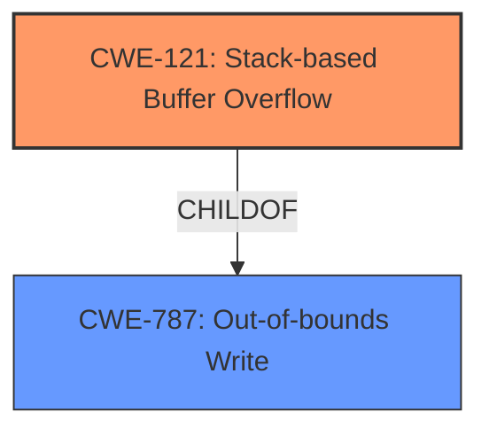

# Final Resolution for CVE-2022-25428

# Summary
| CWE ID | CWE Name | Confidence | CWE Abstraction Level | CWE Vulnerability Mapping Label | CWE-Vulnerability Mapping Notes |
|---|---|---|---|---|---|
| CWE-121 | Stack-based Buffer Overflow | 0.95 | Variant | Allowed | Primary CWE |

## Evidence and Confidence

*   **Confidence Score:** 0.95
*   **Evidence Strength:** HIGH

## Relationship Analysis
The primary relationship that influenced the decision was the ParentOf relationship between **CWE-787 (Out-of-bounds Write)** and **CWE-121 (Stack-based Buffer Overflow)**. Although **CWE-787** is a valid classification, the explicit mention of "stack overflow" in the vulnerability description makes **CWE-121** a more specific and accurate classification. The Mermaid diagram illustrates this hierarchical relationship.

## Vulnerability Chain
The vulnerability chain starts with the **root cause** being insufficient input validation in the `saveparentcontrolinfo` function, leading to a **CWE-121 (Stack-based Buffer Overflow)**. The overflow occurs when the `deviceId` parameter, which is not properly validated, is copied to a stack-allocated buffer. This can lead to arbitrary code execution if an attacker can overwrite critical data on the stack, such as return addresses.

## Summary of Analysis
The initial analysis and criticism both strongly support **CWE-121 (Stack-based Buffer Overflow)** as the primary **weakness**. The vulnerability description explicitly states a "stack overflow" via the `deviceId` parameter. This direct evidence aligns perfectly with the definition of **CWE-121**, which is a Variant of **CWE-787 (Out-of-bounds Write)**, specifying that the overflow occurs on the stack. The relationship analysis confirmed that **CWE-121** is a more specific and appropriate choice than its parent. The decision is based on direct evidence from the vulnerability description and a clear understanding of the CWE hierarchy. The selection of **CWE-121** is at the optimal level of specificity because it precisely describes the location of the buffer overflow.