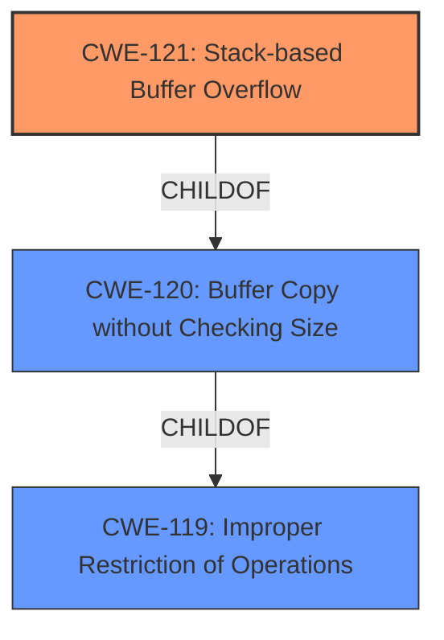

# Final Resolution for CVE-2022-25431

# Summary
| CWE ID | CWE Name | Confidence | CWE Abstraction Level | CWE Vulnerability Mapping Label | CWE-Vulnerability Mapping Notes |
|---|---|---|---|---|---|
| CWE-121 | Stack-based Buffer Overflow | 0.95 | Variant | Primary | Allowed |

## Evidence and Confidence

*   **Confidence Score:** 0.95
*   **Evidence Strength:** HIGH

## Relationship Analysis
The primary relationship considered was the parent-child relationship between CWE-119 (**CWE-119: Improper Restriction of Operations within the Bounds of a Memory Buffer**), CWE-120 (**CWE-120: Buffer Copy without Checking Size of Input ('Classic Buffer Overflow')**), and CWE-121 (**CWE-121: Stack-based Buffer Overflow**). CWE-121 is a variant of CWE-119 and CWE-120, specifically addressing stack-based overflows. Given the vulnerability description explicitly mentions "stack overflows", selecting CWE-121 provides the optimal level of specificity.

## Vulnerability Chain
The vulnerability chain starts with the lack of input validation for the NPTR, V12, V10, and V11 parameters in the Formsetqosband function. This leads to a **CWE-121 (Stack-based Buffer Overflow)** when these unchecked inputs are copied into a stack-allocated buffer. The consequence is potential arbitrary code execution due to the overwritten stack.

## Summary of Analysis
The initial analysis correctly identified **CWE-121 (Stack-based Buffer Overflow)** as the primary weakness. The criticism reinforced this decision, emphasizing the importance of specificity when classifying vulnerabilities. The vulnerability description explicitly stating "stack overflows" is the primary evidence supporting this classification.

> Vulnerability Description: Tenda AC9 v15.03.2.21 was discovered to contain multiple stack overflows via the NPTR, V12, V10 and V11 parameter in the Formsetqosband function.

The graph relationships further solidified this choice, as CWE-121 is a variant of more general buffer overflow CWEs. Selecting CWE-121 offers the most accurate and specific representation of the vulnerability. This selection aligns with the mapping guidance, which encourages using the most specific CWE available. The high confidence score (0.95) reflects the direct match between the vulnerability description and the CWE definition.