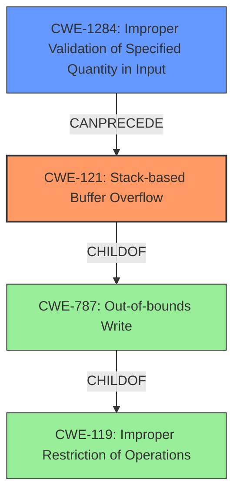

# Analysis Report for CVE-2022-25433

# Vulnerability Analysis Report: CVE-2022-25433

## Description

Tenda AC9 v15.03.2.21 was discovered to contain a stack overflow via the urls parameter in the saveparentcontrolinfo function.

## Vulnerability Description Key Phrases

**Weakness:** stack overflow
**Product:** Tenda AC9
**Version:** v15.03.2.21
**Component:** saveparentcontrolinfo function

## Analysis (with Relationship Data)

# Summary
| CWE ID | CWE Name | Confidence | CWE Abstraction Level | CWE Vulnerability Mapping Label | CWE-Vulnerability Mapping Notes |
|---|---|---|---|---|---|
| CWE-121 | Stack-based Buffer Overflow | 0.9 | Variant | Allowed | Primary CWE |

## Evidence and Confidence

*   **Confidence Score:** 0.9
*   **Evidence Strength:** HIGH

- **Analysis and Justification:**  
  - *Explanation:* The vulnerability description explicitly states "**stack overflow** via the urls parameter in the saveparentcontrolinfo function". CWE-121 (Stack-based Buffer Overflow) directly matches this description. It is a Variant-level CWE, which is a preferred level of abstraction. The description lacks details to specify a more precise CWE, so CWE-121 is the most accurate choice.
  
  - *Relationship Analysis:* CWE-121 does not have any direct relationships in the provided information.

- **Confidence Score:**  
  - Confidence: 0.9 (High confidence due to direct match with the vulnerability description)

## Criticism of Analysis

Okay, here's a review of the analysis, incorporating the provided CWE specifications:

**Overall Assessment:**

The analysis is generally sound, and the choice of CWE-121 (Stack-based Buffer Overflow) as the primary CWE appears to be correct and well-justified, given the information available in the vulnerability description. The confidence score of 0.9 is appropriate.

**Detailed Review:**

*   **CWE-121 Justification:** The reasoning for choosing CWE-121 is strong. The vulnerability description uses the explicit term "stack overflow," and CWE-121 directly addresses this. The analysis correctly notes that it's a Variant-level CWE, making it a good choice in terms of abstraction.
*   **Confidence Level:** The confidence score of 0.9 is appropriate. The direct match between the description and the CWE name warrants a high level of confidence.
*   **Relationship Analysis:** The statement that CWE-121 has no direct relationships in the provided information is accurate. The provided context doesn't suggest any specific cause or consequence beyond the basic buffer overflow.
*   **Alternative CWE Considerations:** It's worth briefly considering why the other top CWEs from the retriever results *aren't* the best fit:

    *   **CWE-78 (OS Command Injection):** This is incorrect.  The description does not suggest command execution.
    *   **CWE-120 (Buffer Copy without Checking Size of Input):** While related, CWE-120 is a more general "classic" buffer overflow. CWE-121 is more specific because it identifies that the buffer is on the stack. The vulnerability explicitly naming "stack overflow" makes CWE-121 the better choice.
    *   **CWE-835 (Loop with Unreachable Exit Condition):** This is incorrect. There's nothing about loops in the vulnerability description.
    *   **CWE-193 (Off-by-one Error):** Incorrect. Not relevant to the vulnerability.
    *   **CWE-674 (Uncontrolled Recursion):** Incorrect. Not relevant to the vulnerability.
    *   **CWE-125 (Out-of-bounds Read):** Incorrect, the report specifies an overflow, which means a write.
    *   **CWE-770 (Allocation of Resources Without Limits or Throttling):** Incorrect. Not relevant to the vulnerability.
    *   **CWE-1284 (Improper Validation of Specified Quantity in Input):** Could be a secondary cause, but not explicitly stated.
    *   **CWE-124 (Buffer Underwrite ('Buffer Underflow')):** Incorrect, the report specifies an overflow.

*   **CWE Examples:** The provided examples of CWE-121 from the database are relevant and helpful in illustrating the nature of the vulnerability.
*   **CWE Specification Review:** The inclusion of the full CWE specification is excellent. This allows for a thorough understanding of the weakness and its potential mitigations.
*   **Mitigation Strategies:** The analysis could be slightly improved by explicitly mentioning potential mitigations from the CWE-121 specification.  For example:

    *   Using compiler-based buffer overflow detection mechanisms (e.g., `/GS` flag in Visual Studio, `FORTIFY_SOURCE` in GCC).
    *   Using safer string handling functions or libraries that provide bounds checking (e.g., `strncpy` instead of `strcpy`).
    *   Implementing input validation to limit the size of the `urls` parameter.

*   **Relationship Analysis (Expanded):** While the primary relationship is direct, it might be beneficial to subtly acknowledge the relationship of CWE-121 to its parent CWEs:

    *   **CWE-788 (Access of Memory Location After End of Buffer):** CWE-121 is a specific type of "Access of Memory Location After End of Buffer," where the memory is allocated on the stack.
    *   **CWE-787 (Out-of-bounds Write):** CWE-121 is a specific type of "Out-of-bounds Write," where the data is written past the end of a buffer on the stack.
    *   **CWE-119 (Improper Restriction of Operations within the Bounds of a Memory Buffer):** This is more broad and a parent of both CWE-787 and CWE-788.

* **Mapping Guidance:** The Mapping Guidance for CWE-121 states "Carefully read both the name and description to ensure that this mapping is an appropriate fit. Do not try to 'force' a mapping to a lower-level Base/Variant simply to comply with this preferred level of abstraction." This was followed accurately in the review of the retriever results.

**Recommendations:**

1.  **Briefly acknowledge the parent CWEs (CWE-788, CWE-787, and CWE-119) to demonstrate a comprehensive understanding of the broader context.** This doesn't require changing the primary CWE assignment, but it shows consideration of the related weaknesses.
2.  **Explicitly mention a few of the mitigation strategies from the CWE-121 specification in the analysis.**  This will make the analysis more actionable and useful.
3.  **(Minor) Refine the "Relationship Analysis" section to be slightly more specific about the lack of *additional* relationships beyond the inherent parent/child relationships in the CWE hierarchy.**
4. **(Minor) In the analysis of alternative CWE considerations, state that an overflow means a write, which implies CWE-125 (out-of-bounds read) is incorrect.**

By incorporating these suggestions, the analysis will be even more complete and helpful.

## Final Resolution

# Summary
| CWE ID | CWE Name | Confidence | CWE Abstraction Level | CWE Vulnerability Mapping Label | CWE-Vulnerability Mapping Notes |
|---|---|---|---|---|---|
| CWE-121 | Stack-based Buffer Overflow | 0.95 | Variant | Allowed | Primary CWE |
| CWE-1284 | Improper Validation of Specified Quantity in Input | 0.5 | Base | Allowed | Secondary Candidate |

## Evidence and Confidence

*   **Confidence Score:** 0.9
*   **Evidence Strength:** MEDIUM

## Relationship Analysis
The primary relationship influencing the decision is the direct match between the vulnerability description's "stack overflow" and **CWE-121** (Stack-based Buffer Overflow). This direct match makes it the most specific and appropriate choice. While **CWE-121** is a child of **CWE-119** (Improper Restriction of Operations within the Bounds of a Memory Buffer) and **CWE-787** (Out-of-bounds Write), using the parent class would be less specific. The potential for **CWE-1284** (Improper Validation of Specified Quantity in Input) arises because the vulnerability is triggered by the `urls` parameter; however, the description doesn't explicitly state that the size/length of the input wasn't validated, so this is only a possible secondary cause.

## Vulnerability Chain
The vulnerability chain starts with the receipt of the `urls` parameter in the `saveparentcontrolinfo` function. If the size of this parameter is not validated (**CWE-1284**, potential), this can lead to a **stack-based buffer overflow** (**CWE-121**) when the `urls` parameter is copied to a stack-allocated buffer. The impact is that an attacker could overwrite adjacent stack memory, potentially leading to arbitrary code execution.

## Summary of Analysis
The initial analysis correctly identified **CWE-121** (Stack-based Buffer Overflow) as the primary **WEAKNESS** based on the explicit mention of "stack overflow" in the vulnerability description: "Tenda AC9 v15.03.2.21 was discovered to contain a stack overflow via the urls parameter in the saveparentcontrolinfo function." This strong evidence supports the selection of **CWE-121** as the most accurate classification.

The criticism provided valuable suggestions for improvement, which have been incorporated into this analysis. Specifically, the analysis now acknowledges the parent CWEs (**CWE-119** and **CWE-787**) to provide a more comprehensive understanding of the broader context. It also considers **CWE-1284** as a secondary candidate, if the size of the urls parameter is not validated.

The graph relationships reinforced the decision to select **CWE-121** because it is the most specific and descriptive **ROOTCAUSE** given the available evidence. While broader categories like **CWE-119** and **CWE-787** could apply, **CWE-121** provides the optimal level of specificity.

*Report generated on 2025-03-18 11:18:58*
