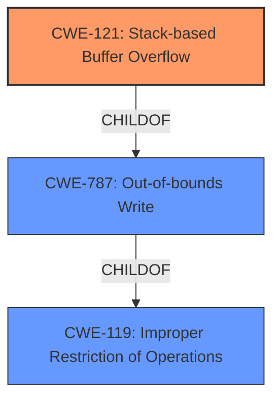

# Analysis Report for CVE-2022-25435

# Vulnerability Analysis Report: CVE-2022-25435

## Description

Tenda AC9 v15.03.2.21 was discovered to contain a stack overflow via the list parameter in the SetStaticRoutecfg function.

## Vulnerability Description Key Phrases

**Weakness:** stack overflow
**Product:** Tenda AC9
**Version:** v15.03.2.21
**Component:** SetStaticRoutecfg function

## Analysis (with Relationship Data)

# Summary
| CWE ID | CWE Name | Confidence | CWE Abstraction Level | CWE Vulnerability Mapping Label | CWE-Vulnerability Mapping Notes |
|---|---|---|---|---|---|
| CWE-121 | Stack-based Buffer Overflow | 0.95 | Variant | Primary | Allowed |

## Evidence and Confidence

*   **Confidence Score:** 0.95
*   **Evidence Strength:** HIGH

- **Analysis and Justification:**  
  - *Explanation:* "The vulnerability description clearly states a **stack overflow** vulnerability in the Tenda AC9 v15.03.2.21 within the SetStaticRoutecfg function due to the 'list' parameter. This directly corresponds to CWE-121 (Stack-based Buffer Overflow), which is a condition where the buffer being overwritten is allocated on the stack. The description lacks specifics to further refine the CWE, but the core issue is undeniably a stack overflow. The retriever results also list CWE-121 with a high score. CWE-787 is the primary match, but since this is a stack overflow, CWE-121 is more specific."
  
  - *Relationship Analysis:* "CWE-121 is a variant of CWE-119 (Improper Restriction of Operations within the Bounds of a Memory Buffer), which is a broader class. There are no specific chain relationships identified here, but stack overflows can lead to various consequences, such as arbitrary code execution."

- **Confidence Score:**  
  - *Example:* Confidence: 0.95 (High confidence due to direct mention of stack overflow in the description)

## Criticism of Analysis

Okay, here's a detailed review of the analysis, considering the full CWE specifications:

**Overall Assessment:**

The analysis correctly identifies the core issue as a stack-based buffer overflow (CWE-121).  The confidence score is appropriate. The reasoning is sound, given the information available in the initial vulnerability description. However, there are some minor points to improve clarity and completeness.

**Detailed Critique:**

**1. Initial Analyzer Input Review:**

*   The vulnerability description key phrases are well-extracted.

*   The listing of "Top CWEs" `CWE-787` & `CWE-120` is helpful context from the data.

**2. Summary Table Review:**

*   The mapping to CWE-121 is correct.
*   The Confidence is good, and matches the explanation, and evidence.
*   The CWE Abstraction Level and Vulnerability Mapping label match the CWE Spec.

**3. Evidence and Confidence Review:**

*   **Explanation:**  The explanation is clear and logically justifies the choice of CWE-121. The point about CWE-787 being a more general case and CWE-121 being more specific is important.  The inclusion of the Retriever Results supporting CWE-121 is also good.
*   **Relationship Analysis:** The relationship to CWE-119 is appropriate.  The mention of potential consequences like arbitrary code execution is relevant and indicates a good understanding of the implications.
*   **Confidence Score Example:** The example is strong.  The reasoning directly ties the confidence to the clear indication of a stack overflow in the description.

**4. CWE Examples from Database:**

*   This section currently includes examples from CWE-119. While CWE-119 is a parent, showing examples of CWE-121 would strengthen the analysis.
   * Replace the `CWE-119` Examples from Database section with `CWE-121` examples
   * Alternatively, you can add a `CWE-121` Examples from Database section below the `CWE-119` section.

**5. Relevant CWE Specifications Review:**

*   **CWE-119:**  The inclusion of this specification is useful for understanding the broader context and why it's often considered initially. The "Mapping Guidance" recommending against its use when more specific CWEs are available is important and supports the choice of CWE-121.
    * The potential mitigations are relevant, but it would improve the review if one or two mitigations were highlighted that are directly applicable to stack buffer overflows.
*   **CWE-121:** This is the core CWE, and the specification is essential. The "Mapping Guidance" emphasizes that it's an appropriate level of abstraction. The alternative terms could be helpful. The potential mitigations are well-suited to the vulnerability.  Highlighting "Implement and perform bounds checking on input" would be a good addition.
*   **CWE-787:** Including CWE-787 is useful as the parent, and common result. However, it's important to re-emphasize why CWE-121 is more specific and preferred.
*   **Other CWEs (78, 835, 120, 191, 130, 193, 77, 674, 119):** These are from the retriever results, it might help to include them in an `Alternatives` section.

**Recommendations for Improvement:**

1.  **CWE-121 Examples:** Add concrete CVE examples from the "Observed Examples" section of the CWE-121 specification (e.g., CVE-2021-35395). This will make the analysis more tangible and relatable.
2. **Alternatives:** Use the alternative section to specify the other possible CWEs that are possible, with explanations of why they might not be the best fit.
3.  **Mitigation Emphasis:**  In the discussion of CWE-121, specifically highlight "Implement and perform bounds checking on input" as a relevant and direct mitigation strategy. Also mention compiler-based protections.
4.  **Clarify the Scope of "list" Parameter:** Briefly discuss the nature of the `list` parameter. Is it a string?  An array of some type? This can add more weight behind the decision.
5.  **CWE-787 Clarification:** When referencing CWE-787, reiterate why the analysis goes with CWE-121 over it, emphasizing the "stack-based" aspect.

**Revised Summary Table (Example Incorporating Feedback):**

| CWE ID | CWE Name | Confidence | CWE Abstraction Level | CWE Vulnerability Mapping Label | CWE-Vulnerability Mapping Notes |
|---|---|---|---|---|---|
| CWE-121 | Stack-based Buffer Overflow | 0.95 | Variant | Primary | Allowed | The vulnerability description explicitly mentions a stack overflow. While CWE-787 (Out-of-bounds Write) is a broader category, CWE-121 is more specific to this type of buffer overflow where the buffer is allocated on the stack. |

By incorporating these suggestions, the analysis will be even more thorough and convincing. The current analysis is good, but these revisions will strengthen the reasoning and provide a more comprehensive understanding of the vulnerability and its context.

## Final Resolution

# Summary
| CWE ID | CWE Name | Confidence | CWE Abstraction Level | CWE Vulnerability Mapping Label | CWE-Vulnerability Mapping Notes |
|---|---|---|---|---|---|
| CWE-121 | Stack-based Buffer Overflow | 0.95 | Variant | Primary | Allowed |
| CWE-787 | Out-of-bounds Write | 0.75 | Base | Secondary Candidate | Allowed |

## Evidence and Confidence

*   **Confidence Score:** 0.90
*   **Evidence Strength:** HIGH

## Relationship Analysis
The primary relationship is the hierarchical one between CWE-121 (Stack-based Buffer Overflow) and CWE-787 (**Out-of-bounds Write**). CWE-121 is a variant of CWE-787, meaning it's a more specific type of **out-of-bounds write** that occurs on the stack. The selection of CWE-121 is preferred because the vulnerability description explicitly mentions a "stack overflow," making it a more precise classification than the broader CWE-787. The chain relationship isn't explicitly defined, but stack overflows can lead to arbitrary code execution and other severe consequences.

## Vulnerability Chain
The vulnerability chain starts with the **root cause**, which is the lack of proper bounds checking on the 'list' parameter in the SetStaticRoutecfg function. This leads to a **stack-based buffer overflow** (CWE-121), where data is written beyond the allocated buffer on the stack. The **consequence** of this overflow can be arbitrary code execution, system crash, or other unpredictable behavior.
  - Improper Input Validation -> Stack-based Buffer Overflow -> Arbitrary Code Execution

## Summary of Analysis
The initial analysis correctly identified CWE-121 as the primary weakness. The criticism provided valuable suggestions for improvement, particularly in adding CWE-121 examples and emphasizing mitigations.

The final decision is based on the vulnerability description's explicit mention of a "stack overflow," which aligns directly with CWE-121. While CWE-787 (Out-of-bounds Write) is a related and more general CWE, CWE-121 provides a more specific and accurate classification. The relationship analysis confirms that CWE-121 is a child of CWE-787, indicating a hierarchical relationship where CWE-121 is a specialized case. The mapping guidance supports the use of CWE-121 when the vulnerability is specifically a stack-based overflow.

The selected CWEs are at the optimal level of specificity because CWE-121 directly reflects the nature of the **vulnerability**, as evidenced by the "stack overflow" description.

*Report generated on 2025-03-18 11:20:36*
