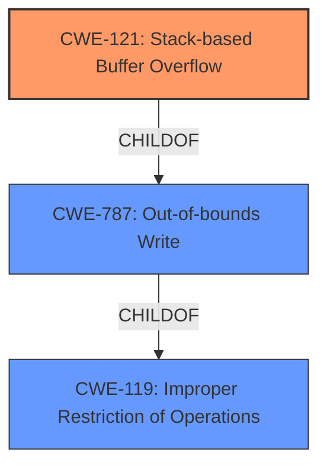

# Final Resolution for CVE-2022-25435

# Summary
| CWE ID | CWE Name | Confidence | CWE Abstraction Level | CWE Vulnerability Mapping Label | CWE-Vulnerability Mapping Notes |
|---|---|---|---|---|---|
| CWE-121 | Stack-based Buffer Overflow | 0.95 | Variant | Primary | Allowed |
| CWE-787 | Out-of-bounds Write | 0.75 | Base | Secondary Candidate | Allowed |

## Evidence and Confidence

*   **Confidence Score:** 0.90
*   **Evidence Strength:** HIGH

## Relationship Analysis
The primary relationship is the hierarchical one between CWE-121 (Stack-based Buffer Overflow) and CWE-787 (**Out-of-bounds Write**). CWE-121 is a variant of CWE-787, meaning it's a more specific type of **out-of-bounds write** that occurs on the stack. The selection of CWE-121 is preferred because the vulnerability description explicitly mentions a "stack overflow," making it a more precise classification than the broader CWE-787. The chain relationship isn't explicitly defined, but stack overflows can lead to arbitrary code execution and other severe consequences.

## Vulnerability Chain
The vulnerability chain starts with the **root cause**, which is the lack of proper bounds checking on the 'list' parameter in the SetStaticRoutecfg function. This leads to a **stack-based buffer overflow** (CWE-121), where data is written beyond the allocated buffer on the stack. The **consequence** of this overflow can be arbitrary code execution, system crash, or other unpredictable behavior.
  - Improper Input Validation -> Stack-based Buffer Overflow -> Arbitrary Code Execution

## Summary of Analysis
The initial analysis correctly identified CWE-121 as the primary weakness. The criticism provided valuable suggestions for improvement, particularly in adding CWE-121 examples and emphasizing mitigations.

The final decision is based on the vulnerability description's explicit mention of a "stack overflow," which aligns directly with CWE-121. While CWE-787 (Out-of-bounds Write) is a related and more general CWE, CWE-121 provides a more specific and accurate classification. The relationship analysis confirms that CWE-121 is a child of CWE-787, indicating a hierarchical relationship where CWE-121 is a specialized case. The mapping guidance supports the use of CWE-121 when the vulnerability is specifically a stack-based overflow.

The selected CWEs are at the optimal level of specificity because CWE-121 directly reflects the nature of the **vulnerability**, as evidenced by the "stack overflow" description.