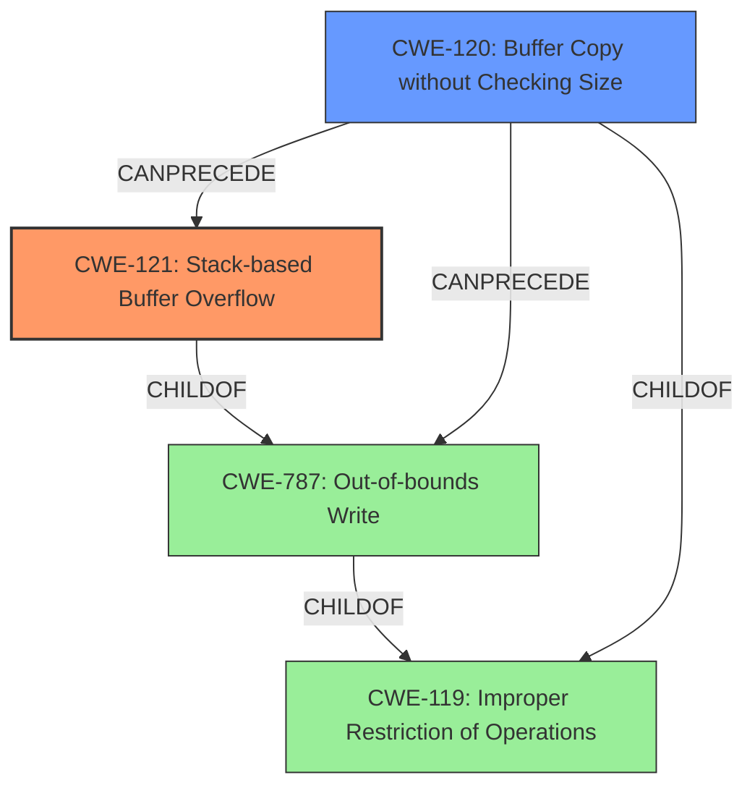

# Final Resolution for CVE-2022-25439

# Summary
| CWE ID | CWE Name | Confidence | CWE Abstraction Level | CWE Vulnerability Mapping Label | CWE-Vulnerability Mapping Notes |
|---|---|---|---|---|---|
| CWE-121 | Stack-based Buffer Overflow | 0.85 | Variant | Allowed | Primary CWE |
| CWE-120 | Buffer Copy without Checking Size of Input ('Classic Buffer Overflow') | 0.70 | Base | Allowed-with-Review | Secondary Candidate |

## Evidence and Confidence

*   **Confidence Score:** 0.85
*   **Evidence Strength:** HIGH

## Relationship Analysis
The primary relationship is the hierarchical relationship. CWE-121 **(Stack-based Buffer Overflow)** is a variant of CWE-787 **(Out-of-bounds Write)**, making CWE-121 more specific. The suggestion to replace CWE-787 with CWE-120 **(Buffer Copy without Checking Size of Input)** as a secondary CWE is based on the observation that the vulnerability description mentions the `list` parameter, implying a data copy operation without sufficient size checks, which aligns with CWE-120. CWE-120 can precede CWE-787 and CWE-121. CWE-119 **(Improper Restriction of Operations within the Bounds of a Memory Buffer)** is a parent class to CWE-121, CWE-120, and CWE-787 but is too general.

## Vulnerability Chain
The vulnerability chain starts with **CWE-120 (Buffer Copy without Checking Size of Input)**, where data is copied to the `list` parameter without proper size validation. This leads to **CWE-121 (Stack-based Buffer Overflow)**, as the unchecked copy overwrites the stack buffer. The root cause is the lack of input validation when copying the data to the buffer on the stack.

## Summary of Analysis
The initial analysis correctly identified **CWE-121 (Stack-based Buffer Overflow)** as the primary **WEAKNESS**, which aligns with the vulnerability description explicitly stating a "stack overflow." The criticism suggested replacing the initial secondary candidate CWE-787 **(Out-of-bounds Write)** with the more specific CWE-120 **(Buffer Copy without Checking Size of Input)**. This is based on the fact that the vulnerability involves copying the data to the `list` parameter without checking the size, leading to the **stack overflow**. This is more precise than the general **CWE-787**. The graph relationships support this decision, as **CWE-120** can precede **CWE-121**, creating a vulnerability chain. The MITRE mapping guidance indicates that **CWE-121** is Allowed, and **CWE-120** is Allowed-with-Review, which is acceptable. The chosen CWEs are at the optimal level of specificity, with **CWE-121** being a Variant and **CWE-120** being a Base CWE. I agree with the criticism and the final CWE selection.