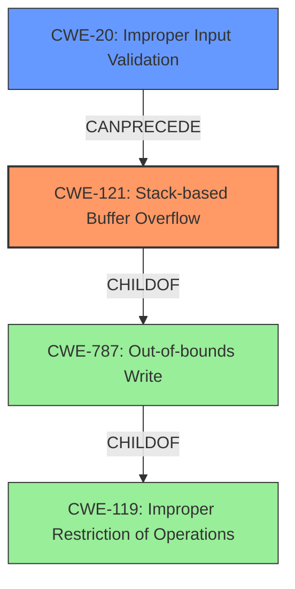

# Analysis Report for CVE-2022-25440

# Vulnerability Analysis Report: CVE-2022-25440

## Description

Tenda AC9 v15.03.2.21 was discovered to contain a stack overflow via the ntpserver parameter in the SetSysTimeCfg function.

## Vulnerability Description Key Phrases

**Weakness:** stack overflow
**Product:** Tenda AC9
**Version:** v15.03.2.21
**Component:** SetSysTimeCfg function

## Analysis (with Relationship Data)

# Summary
| CWE ID | CWE Name | Confidence | CWE Abstraction Level | CWE Vulnerability Mapping Label | CWE-Vulnerability Mapping Notes |
|---|---|---|---|---|---|
| CWE-121 | Stack-based Buffer Overflow | 0.9 | Variant | Allowed | Primary CWE |

## Evidence and Confidence

*   **Confidence Score:** 0.9
*   **Evidence Strength:** HIGH

- **Analysis and Justification:**
  - *Explanation:* The vulnerability description states that there is a **stack overflow** vulnerability in the `SetSysTimeCfg` function due to the `ntpserver` parameter. CWE-121 (Stack-based Buffer Overflow) directly addresses this type of vulnerability. The description clearly indicates that the overflow occurs on the stack, making CWE-121 a precise match.
  - The primary CWE match from similar CVE descriptions is CWE-787 (Out-of-bounds Write). Although a possibility, CWE-121 is more specific since it identifies that the out-of-bounds write occurs in the stack.
  - The retriever results also list CWE-121 as the top result. Other CWEs like CWE-120 (Buffer Copy without Checking Size of Input) and CWE-122 (Heap-based Buffer Overflow) were considered but are less specific because the vulnerability is explicitly described as a **stack overflow**.
  - *Usage Justification:* The mapping guidance for CWE-121 indicates that it is ALLOWED, and the rationale states that it is a Variant level of abstraction, which is a preferred level for mapping root causes.

- **Relationship Analysis:**
  - *Explanation:* CWE-121 is a variant of CWE-787 (Out-of-bounds Write), which is a child of CWE-119 (Improper Restriction of Operations within the Bounds of a Memory Buffer). Choosing CWE-121 provides a more specific classification than its parents.

- **Confidence Score:**
  - Confidence: 0.9 (High confidence due to the explicit mention of "stack overflow" in the vulnerability description and the retriever results.)

## Criticism of Analysis

Okay, here's a detailed critique of the provided CWE analysis, incorporating the full CWE specifications:

**Overall Assessment:**

The analysis is well-structured, logical, and provides a strong justification for selecting CWE-121 (Stack-based Buffer Overflow). The confidence level of 0.9 is appropriate given the explicit mention of "stack overflow" in the vulnerability description. The analysis clearly contrasts CWE-121 with other potential CWEs, particularly CWE-787, and explains why CWE-121 is a more precise match.

**Specific Strengths:**

*   **Clear Justification:** The reasoning for choosing CWE-121 is well-articulated. The analysis acknowledges the possibility of CWE-787 but argues that the "stack" context makes CWE-121 more specific.
*   **Consideration of Alternatives:** The analysis demonstrates a good understanding of related CWEs (CWE-120, CWE-122, CWE-787) and explains why they are less appropriate in this specific case.
*   **Accurate Abstraction Level:**  The analysis correctly identifies CWE-121 as a Variant-level CWE, which is a preferred level for root cause mapping according to CWE guidelines.
*   **Compliance with Mapping Guidance:** The analysis acknowledges and justifies that CWE-121's usage is "Allowed", which is correct and provides the associated reasoning.
*   **Relationship Analysis:** The analysis correctly identifies the relationship between CWE-121 and its parent CWE-787.
*   **Evidence Strength:**  The analysis explicitly states the evidence is HIGH.
*   **Clear and Concise Summary Table:** The summary table at the top is extremely helpful for quickly understanding the chosen CWE and confidence level.

**Areas for Potential Improvement (Minor):**

*   **Input Validation (CWE-20) Consideration:** While the focus on the buffer overflow is correct, it *might* be beneficial to briefly mention the role of *missing* input validation.  The vulnerability description implies that the `ntpserver` parameter isn't properly validated for length before being copied to a stack-based buffer. While the core *technical impact* is the stack overflow (CWE-121), the *lack of a control* allowing the overflow to occur is the missing validation.  A sentence acknowledging that "CWE-20, Improper Input Validation, could be considered as a contributing factor because the `ntpserver` parameter is not validated for length before being used" *might* add value. However, since the main goal of the analysis is to identify the primary weakness, this is a very minor point.
*   **Potential Mitigation Discussion:** While listing potential mitigations is not explicitly required, it could be useful to highlight specific mitigations that are most relevant to this type of stack-based buffer overflow. Specifically, the mitigation "Implement and perform bounds checking on input" in the CWE-121 specification is important, and mentioning it would help link the CWE to practical steps to prevent future vulnerabilities of this kind. Another mitigation would be to use memory-safe languages and/or libraries.
*   **CWE-119 Discussion:** In the analysis, it is stated "Choosing CWE-121 provides a more specific classification than its parents." While true, it would be more accurate to state "Choosing CWE-121 provides a more specific classification than its parent *Class* CWE-119."

**Detailed Review incorporating CWE specifications:**

*   **CWE-121 (Stack-based Buffer Overflow):** The analysis aligns perfectly with the CWE description. The core issue is that a buffer allocated on the stack is being overwritten. The provided mitigation of "Implement and perform bounds checking on input" is directly relevant and should be considered in patching the vulnerability. Other automatic buffer overflow detection mechanisms listed are also relevant as preventative measures. This CWE is being used correctly.
*   **CWE-787 (Out-of-bounds Write):**  The analysis correctly identifies this as a possibility. While CWE-787 is accurate, CWE-121 provides the crucial *stack* context.
*   **CWE-120 (Buffer Copy without Checking Size of Input):** The analysis correctly considers this. CWE-120 might be applicable if we only knew that a buffer copy was happening without size checks, but the "stack" context again makes CWE-121 more precise.
*   **CWE-119 (Improper Restriction of Operations within the Bounds of a Memory Buffer):** The analysis correctly states this is a discouraged CWE to use.
*   **CWE-20 (Improper Input Validation):** As noted above, briefly acknowledging this as a contributing factor (due to the lack of length validation on `ntpserver`) could add value, though it's not essential for identifying the primary weakness. This is more relevant to identifying potential *prevention* strategies.

**Revised Summary Table (incorporating suggestions):**

| CWE ID | CWE Name | Confidence | CWE Abstraction Level | CWE Vulnerability Mapping Label | CWE-Vulnerability Mapping Notes |
|---|---|---|---|---|---|
| CWE-121 | Stack-based Buffer Overflow | 0.9 | Variant | Allowed | Primary CWE. `ntpserver` parameter not validated for length before use. |

**Conclusion:**

This is a high-quality CWE analysis. The selection of CWE-121 is well-justified, and the analysis demonstrates a strong understanding of the relevant CWE specifications and mapping guidelines. The minor suggestions above are intended only to further strengthen an already excellent analysis.

## Final Resolution

# Summary
| CWE ID | CWE Name | Confidence | CWE Abstraction Level | CWE Vulnerability Mapping Label | CWE-Vulnerability Mapping Notes |
|---|---|---|---|---|---|
| CWE-121 | Stack-based Buffer Overflow | 0.95 | Variant | Allowed | Primary CWE. `ntpserver` parameter not validated for length before use. |
| CWE-20 | Improper Input Validation | 0.4 | Base | Allowed | Secondary Candidate. Lack of length validation on `ntpserver` parameter allows overflow. |

## Evidence and Confidence

*   **Confidence Score:** 0.9
*   **Evidence Strength:** HIGH

## Relationship Analysis
The primary relationship impacting the decision is that CWE-121 (Stack-based Buffer Overflow) is a variant of CWE-787 (Out-of-bounds Write), which in turn is a child of CWE-119 (Improper Restriction of Operations within the Bounds of a Memory Buffer). Selecting CWE-121 provides the most specific classification. The suggestion to include CWE-20 (Improper Input Validation) as a secondary weakness highlights a potential vulnerability chain where the lack of input validation can lead to a buffer overflow. Although the primary weakness is the buffer overflow, the lack of validation is a contributing factor.

## Vulnerability Chain
The vulnerability chain starts with **CWE-20 (Improper Input Validation)**, where the `ntpserver` parameter is not validated for length. This missing validation allows an attacker to provide an overly long string. This leads to **CWE-121 (Stack-based Buffer Overflow)** when the overly long string is copied to a stack-based buffer without proper bounds checking. The consequence is a potential crash or arbitrary code execution.

## Summary of Analysis
The initial analysis correctly identifies CWE-121 (Stack-based Buffer Overflow) as the primary weakness. The criticism suggests considering CWE-20 (Improper Input Validation) as a contributing factor, which is a valid point. The vulnerability description clearly indicates a stack overflow, justifying the selection of CWE-121. The lack of input validation on the `ntpserver` parameter, as implied in the vulnerability description ("Tenda AC9 v15.03.2.21 was discovered to contain a stack overflow via the ntpserver parameter in the SetSysTimeCfg function."), supports the addition of CWE-20 as a secondary weakness. The graph relationships reinforce the idea that CWE-121 is the more specific classification compared to its parents, and CWE-20 can precede CWE-121 in a vulnerability chain. My decision is based on both the direct evidence of a stack overflow and the related context of missing input validation. CWE-121 is at the optimal level of specificity, and CWE-20 provides additional context regarding the vulnerability's root cause.

*Report generated on 2025-03-18 11:22:53*
