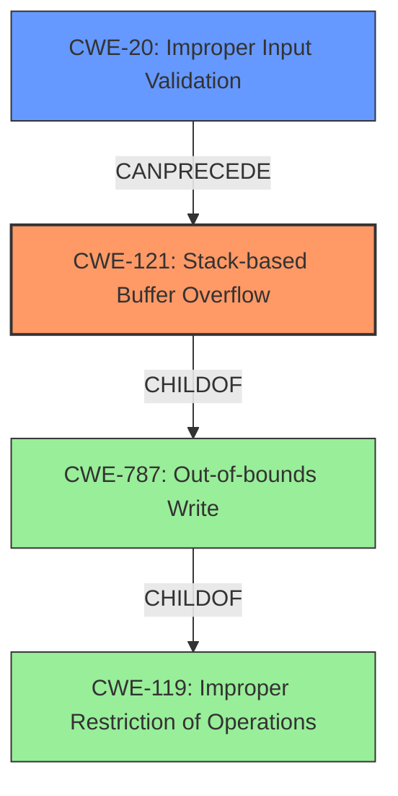

# Final Resolution for CVE-2022-25440

# Summary
| CWE ID | CWE Name | Confidence | CWE Abstraction Level | CWE Vulnerability Mapping Label | CWE-Vulnerability Mapping Notes |
|---|---|---|---|---|---|
| CWE-121 | Stack-based Buffer Overflow | 0.95 | Variant | Allowed | Primary CWE. `ntpserver` parameter not validated for length before use. |
| CWE-20 | Improper Input Validation | 0.4 | Base | Allowed | Secondary Candidate. Lack of length validation on `ntpserver` parameter allows overflow. |

## Evidence and Confidence

*   **Confidence Score:** 0.9
*   **Evidence Strength:** HIGH

## Relationship Analysis
The primary relationship impacting the decision is that CWE-121 (Stack-based Buffer Overflow) is a variant of CWE-787 (Out-of-bounds Write), which in turn is a child of CWE-119 (Improper Restriction of Operations within the Bounds of a Memory Buffer). Selecting CWE-121 provides the most specific classification. The suggestion to include CWE-20 (Improper Input Validation) as a secondary weakness highlights a potential vulnerability chain where the lack of input validation can lead to a buffer overflow. Although the primary weakness is the buffer overflow, the lack of validation is a contributing factor.

## Vulnerability Chain
The vulnerability chain starts with **CWE-20 (Improper Input Validation)**, where the `ntpserver` parameter is not validated for length. This missing validation allows an attacker to provide an overly long string. This leads to **CWE-121 (Stack-based Buffer Overflow)** when the overly long string is copied to a stack-based buffer without proper bounds checking. The consequence is a potential crash or arbitrary code execution.

## Summary of Analysis
The initial analysis correctly identifies CWE-121 (Stack-based Buffer Overflow) as the primary weakness. The criticism suggests considering CWE-20 (Improper Input Validation) as a contributing factor, which is a valid point. The vulnerability description clearly indicates a stack overflow, justifying the selection of CWE-121. The lack of input validation on the `ntpserver` parameter, as implied in the vulnerability description ("Tenda AC9 v15.03.2.21 was discovered to contain a stack overflow via the ntpserver parameter in the SetSysTimeCfg function."), supports the addition of CWE-20 as a secondary weakness. The graph relationships reinforce the idea that CWE-121 is the more specific classification compared to its parents, and CWE-20 can precede CWE-121 in a vulnerability chain. My decision is based on both the direct evidence of a stack overflow and the related context of missing input validation. CWE-121 is at the optimal level of specificity, and CWE-20 provides additional context regarding the vulnerability's root cause.