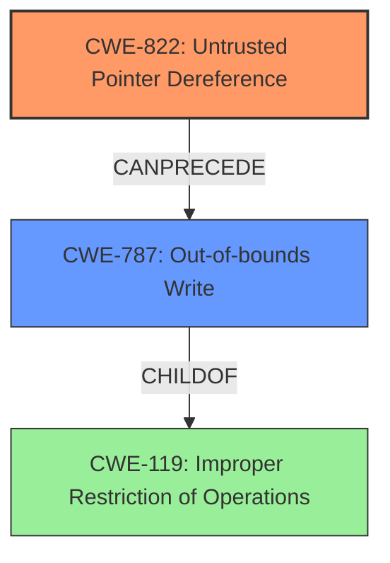

# Analysis Report for CVE-2022-25661

# Vulnerability Analysis Report: CVE-2022-25661

## Description

Memory corruption due to untrusted pointer dereference in kernel in Snapdragon Auto, Snapdragon Compute, Snapdragon Consumer IOT, Snapdragon Industrial IOT, Snapdragon Mobile

## Vulnerability Description Key Phrases

**Rootcause:** untrusted pointer dereference
**Impact:** Memory corruption
**Product:** Snapdragon Auto, Snapdragon Compute, Snapdragon Consumer IOT, Snapdragon Industrial IOT, Snapdragon Mobile
**Component:** kernel

## Analysis (with Relationship Data)

# Summary
| CWE ID | CWE Name | Confidence | CWE Abstraction Level | CWE Vulnerability Mapping Label | CWE-Vulnerability Mapping Notes |
|---|---|---|---|---|---|
| CWE-822 | Untrusted Pointer Dereference | 0.95 | Base | Allowed | Root cause of the vulnerability. |
| CWE-119 | Improper Restriction of Operations within the Bounds of a Memory Buffer | 0.6 | Class | Allowed-with-Review | Could result from the untrusted pointer dereference if the pointer points to an invalid memory location. |

## Evidence and Confidence

*   **Confidence Score:** 0.9
*   **Evidence Strength:** HIGH

- **Analysis and Justification:**  
  - *Explanation:* The vulnerability description clearly states that the **root cause** is an **untrusted pointer dereference**, leading to memory corruption. CWE-822, "Untrusted Pointer Dereference," directly matches this description. The product obtains a value (the pointer) from an untrusted source and dereferences it, which is exactly what CWE-822 describes. The impact of this is memory corruption as stated in the description. CWE-822 is a Base level CWE, which is the preferred level. The retriever results also list CWE-822 as the top candidate with a high score. The mapping guidance for CWE-822 indicates it is ALLOWED.

  - *Relationship Analysis:* While CWE-822 doesn't have direct relationships listed, it can lead to memory corruption if the dereferenced pointer points to an invalid memory location or outside the bounds of a valid buffer. This aligns with broader memory safety issues.

- **Confidence Score:**  
  - Confidence: 0.95 (High confidence due to direct match with the vulnerability description and retriever results)

---
- **Analysis and Justification:**  
  - *Explanation:* The **impact** of **untrusted pointer dereference** is that it leads to memory corruption. This can be broadly categorized as CWE-119, which is "Improper Restriction of Operations within the Bounds of a Memory Buffer" (Class). Dereferencing an untrusted pointer could lead to reads or writes outside the intended buffer. The retriever results does not directly list CWE-119, but some of the lower ranked items like CWE-787 (Out-of-bounds Write), CWE-126 (Buffer Over-read) are child of CWE-119. Given the general nature of the impact (memory corruption), and lack of detail, this is a secondary candidate.

  - *Relationship Analysis:* CWE-119 is a parent of several more specific buffer overflow/underflow CWEs (e.g., CWE-121, CWE-122, CWE-124, CWE-787). While those specific CWEs are not directly supported by the description, the high-level impact aligns with CWE-119.

- **Confidence Score:**  
  - Confidence: 0.6 (Medium confidence as it is an indirect consequence)

## Criticism of Analysis

Okay, here's a breakdown of the analysis provided, with a focus on the CWE specifications and potential improvements:

**Overall Assessment:**

The analysis is generally good and demonstrates a solid understanding of CWEs. The primary mapping to CWE-822 is correct and well-justified. The secondary mapping to CWE-119 is reasonable as a high-level consequence, but as the analysis points out, the CWE mapping guidance discourages this.  The confidence levels are appropriate.

**Detailed Review:**

*   **CWE-822: Untrusted Pointer Dereference**

    *   **Confidence:** 0.95 - This is a high and appropriate confidence level. The explanation is clear and compelling. The vulnerability description explicitly mentions "untrusted pointer dereference," making CWE-822 a direct fit.  The retriever results strongly support this mapping.
    *   **Justification:** The justification is thorough, and the relationship analysis is accurate. The analysis explicitly mentions that the product obtains a value from an untrusted source, converts it to a pointer, and dereferences it - the exact definition of CWE-822. The impact of memory corruption aligns with the potential consequences of this CWE.
    *   **Mapping Guidance:** Conforms to CWE-822's mapping guidance (ALLOWED).
    *   **Mitigation Considerations:** The potential mitigations for CWE-822 involve robust input validation and sanitization techniques for pointer values, which should be enforced to ensure that the input pointer values are valid before being used to access memory. This could involve techniques such as range checking, bounds checking, and type checking. Also, consider using memory-safe languages or libraries that provide automatic memory management and prevent the dereferencing of invalid pointers.
    *   **Observed Examples:** It would be beneficial to include some observed examples of CWE-822 and how it affected real-world systems.

*   **CWE-119: Improper Restriction of Operations within the Bounds of a Memory Buffer**

    *   **Confidence:** 0.6 - The confidence is correctly lower here. While memory corruption is a *possible* outcome of an untrusted pointer dereference, it's not the *only* one. A read might expose sensitive data without corrupting anything, or the dereference could cause a crash without touching other data structures.
    *   **Justification:** The justification notes that dereferencing the untrusted pointer *could* lead to reads or writes outside the intended buffer. This is a true statement, but it's not as definitive as the connection to CWE-822. The analysis accurately notes that the Retriever results do not directly list CWE-119, and its usage is discouraged by the CWE specifications.
    *   **Mapping Guidance:**  Acknowledges the "Discouraged" usage of CWE-119.
    *   **Better Alternatives (based on CWE-119's guidance):**  Instead of CWE-119, the analysis should consider *specific* consequences like CWE-787 (Out-of-bounds Write), or CWE-125 (Out-of-bounds Read), but *only* if the vulnerability description provided enough information to strongly support them. Since the description only says "memory corruption" and not how the memory corruption manifests, it is difficult to assign any child of CWE-119 confidently.
         *   **If the dereference leads to writing data past the end, or before the beginning of the intended buffer**, then **CWE-787 (Out-of-bounds Write)** would be a more appropriate and specific choice with medium-low confidence.
         *   **If the dereference leads to reading data past the end, or before the beginning of the intended buffer**, then **CWE-126 (Buffer Over-read)** would be a more appropriate and specific choice with medium-low confidence.
         *   **If the dereference leads to accessing memory that has been freed**, then **CWE-416 (Use After Free)** would be a more appropriate and specific choice with medium-low confidence.
    *   **Mitigation Considerations:** If a specific child of CWE-119 were chosen, the mitigations would be geared towards buffer overflow protection or proper access control.
    *   **Observed Examples:** It would be beneficial to provide some observed examples of the potential vulnerabilities such as out-of-bounds write or out-of-bounds read and how it can affect real-world systems.

**Recommendations:**

1.  **Remove CWE-119 or replace with a more specific consequence CWE:** Given the CWE mapping guidance discouraging the use of CWE-119, and the lack of detail in the description to suggest a more specific memory corruption manifestation, the analysis would be stronger by either removing CWE-119, or replacing it with either CWE-787 or CWE-126, or CWE-416, and including a rationale for the decision. If a more specific CWE is chosen, the confidence should remain low.
2.  **Expand on Mitigation Strategies for CWE-822:** While the primary mapping to CWE-822 is correct, providing specific mitigation strategies, tailored to the context of untrusted pointer dereferences, would be a nice addition.
3.  **Observed Examples:** For both CWE-822 and the more specific CWEs, where applicable, it would be beneficial to provide some observed examples of how these vulnerabilities have affected real-world systems.

By implementing these changes, the analysis can become even stronger and more informative.

## Final Resolution

# Summary
| CWE ID | CWE Name | Confidence | CWE Abstraction Level | CWE Vulnerability Mapping Label | CWE-Vulnerability Mapping Notes |
|---|---|---|---|---|---|
| CWE-822 | **Untrusted Pointer Dereference** | 0.95 | Base | Allowed | Primary CWE: **Root cause** of the vulnerability. |
| CWE-787 | **Out-of-bounds Write** | 0.3 | Base | Allowed | Secondary Candidate: Possible consequence of the **untrusted pointer dereference**, leading to memory corruption via out-of-bounds write. |

## Evidence and Confidence

*   **Confidence Score:** 0.8
*   **Evidence Strength:** MEDIUM

## Relationship Analysis
The primary relationship is that CWE-787 (Out-of-bounds Write) can be a consequence of CWE-822 (**Untrusted Pointer Dereference**). CWE-787 is a child of CWE-119 (Improper Restriction of Operations within the Bounds of a Memory Buffer), however, using CWE-119 is discouraged, so we select the child CWE-787. The abstraction levels influenced my selection by favoring the more specific Base level CWEs.

## Vulnerability Chain
The vulnerability chain starts with the **root cause**, CWE-822 (**Untrusted Pointer Dereference**). The product obtains a pointer from an untrusted source and dereferences it. This can lead to CWE-787 (**Out-of-bounds Write**) if the pointer points to a memory location outside the intended buffer, leading to memory corruption. The vulnerability description directly indicates memory corruption as a result.

## Summary of Analysis
I agree with the initial analysis that CWE-822 (**Untrusted Pointer Dereference**) is the primary **root cause** with high confidence. The vulnerability description explicitly states "untrusted pointer dereference" which directly aligns with CWE-822's description: "The product obtains a value from an untrusted source, converts this value to a pointer, and dereferences the resulting pointer."

I am replacing the initial secondary candidate CWE-119 with CWE-787 (**Out-of-bounds Write**). The criticism correctly noted that CWE-119 is discouraged. The vulnerability description mentions "memory corruption" as a consequence of the **untrusted pointer dereference**. Given that the **untrusted pointer dereference** could lead to writing to an unintended memory location, CWE-787 is a plausible, more specific, consequence. However, since the vulnerability description does not explicitly mention an out-of-bounds write, the confidence remains low.

*Report generated on 2025-03-18 11:35:39*
