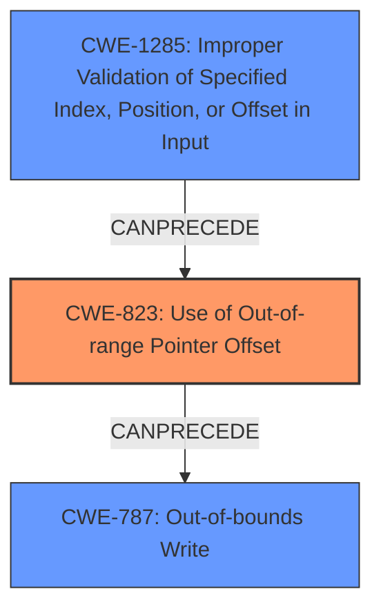

# Analysis Report for CVE-2022-25682

# Vulnerability Analysis Report: CVE-2022-25682

## Description

Memory corruption in MODEM UIM due to usage of out of range pointer offset while decoding command from card in Snapdragon Auto, Snapdragon Compute, Snapdragon Connectivity, Snapdragon Consumer IOT, Snapdragon Industrial IOT, Snapdragon Mobile, Snapdragon Voice & Music, Snapdragon Wearables

## Vulnerability Description Key Phrases

**Rootcause:** out of range pointer offset
**Weakness:** memory corruption
**Product:** Snapdragon
**Component:** MODEM UIM

## Analysis (with Relationship Data)

# Summary
| CWE ID | CWE Name | Confidence | CWE Abstraction Level | CWE Vulnerability Mapping Label | CWE-Vulnerability Mapping Notes |
|---|---|---|---|---|---|
| CWE-823 | Use of Out-of-range Pointer Offset | 0.9 | Base | Allowed | Primary CWE: The vulnerability description explicitly mentions the usage of an **out of range pointer offset**, which directly aligns with this CWE. |
| CWE-787 | Out-of-bounds Write | 0.7 | Base | Allowed | Secondary CWE: Since an **out-of-range pointer offset** could lead to writing outside the allocated memory, this CWE is a potential consequence. |

## Evidence and Confidence

*   **Confidence Score:** 0.8
*   **Evidence Strength:** HIGH

- **Analysis and Justification:**  
  - *Explanation:* "The vulnerability description states 'Memory corruption in MODEM UIM due to usage of **out of range pointer offset** while decoding command from card'. The core issue is the use of a pointer offset that goes beyond the intended memory boundary. This directly corresponds to CWE-823, which describes the 'Use of Out-of-range Pointer Offset'. The description provides a clear indication of the root cause being related to pointer arithmetic leading to an out-of-range access. The Retriever results also rank CWE-823 as the top match with a high combined score."
  
  - *Relationship Analysis:* "CWE-823 can lead to out-of-bounds write (CWE-787) if the offset causes a write operation beyond the allocated buffer. The relationship between pointer arithmetic and memory corruption supports this mapping."

- **Confidence Score:**  
  - Confidence: 0.9 (High confidence due to direct mention of **out of range pointer offset** and high retriever score for CWE-823)

---

## Criticism of Analysis

Okay, here's a breakdown of the analysis and a critique based on the full CWE specifications provided.

**Overall Assessment:**

The analysis is generally good, with a strong focus on the primary cause of the vulnerability. The justification for selecting CWE-823 is well-reasoned, and the inclusion of CWE-787 as a potential consequence is appropriate. The analysis leverages the provided information effectively. However, there's room for improvement in considering other related CWEs and providing a more nuanced explanation of the potential attack surface.

**Detailed Critique:**

*   **CWE-823: Use of Out-of-range Pointer Offset (Primary CWE)**

    *   **Strengths:**
        *   **High Confidence:** Justified by the explicit mention of "out of range pointer offset" in the vulnerability description.
        *   **Clear Justification:** The explanation accurately connects the vulnerability description to the CWE definition.
        *   **Retriever Score:** Correctly points out the retriever's high score for this CWE.
        *   **Example CVEs:** Provides relevant examples from the CWE database that reinforce the mapping.
        *   The analysis correctly identifies that the offset may come from an untrusted source or incorrect calculation.
    *   **Areas for Improvement:**
        *   **Source of Offset:** The analysis could be strengthened by speculating on *how* the offset becomes out-of-range. Is it directly controlled by untrusted input, the result of a calculation based on untrusted input, or due to an internal logic error? This would make the analysis more actionable. It could be a missing boundary check (leading to CWE-1285 or CWE-129 if array indexing is involved).
        *   **Consequences:** While the analysis mentions that CWE-823 *can* lead to out-of-bounds writes, it doesn't explicitly describe the *specific* memory corruption consequences. What data structures might be affected? How could this lead to a crash, privilege escalation, or other security impacts within the MODEM UIM component?
        *   **Mitigations:** The analysis does not address potential mitigations for this specific vulnerability instance. Referencing the CWE's potential mitigations would strengthen it. For instance, the analysis could mention using safer memory access functions or implementing explicit bounds checking on the pointer offset calculation. The CWE specification mentions "carefully read both the name and description to ensure that this mapping is an appropriate fit. Do not try to 'force' a mapping to a lower-level Base/Variant simply to comply with this preferred level of abstraction."

*   **CWE-787: Out-of-bounds Write (Secondary CWE)**

    *   **Strengths:**
        *   **Reasonable Justification:** Correctly identifies that an out-of-range pointer offset can lead to writing outside allocated memory.
    *   **Areas for Improvement:**
        *   **Specificity:** The analysis could be more specific about the conditions that would *guarantee* an out-of-bounds write.  Is the pointer *always* dereferenced for a write operation, or is it conditional?
        *   **Mitigation Strategies:** The analysis misses an opportunity to discuss potential mitigation strategies relevant to this specific scenario. The CWE specification suggests:
            *   **Language selection:** Avoid languages prone to buffer overflows.
            *   **Safe libraries:** Use libraries like SafeStr.h.
            *   **Compiler flags:** Utilize compiler-based overflow detection mechanisms (/GS flag, FORTIFY_SOURCE).
        *   **Alternative CWEs:** While CWE-787 is a reasonable secondary CWE, also consider **CWE-125: Out-of-bounds Read** if the out-of-range pointer offset is used for reading. The description mentions "Memory corruption," which can be caused by out-of-bounds reads as well as writes.

*   **Other Considerations (Based on Retriever Results and CWE Specs):**

    *   **CWE-1285: Improper Validation of Specified Index, Position, or Offset in Input:** The retriever results show this as a highly relevant CWE.  If the offset being used is derived from input received from the card (as hinted at in the description "decoding command from card"), then a failure to validate this offset is a very plausible root cause. The analysis is missing this critical aspect of potentially untrusted input.  If the offset comes directly or indirectly from a command from the card, improper input validation of this value should be considered.  The CWE specification suggests assuming all input is malicious and using an "accept known good" input validation strategy.
    *   **CWE-129: Improper Validation of Array Index:** If the out-of-range offset is used to access an array element, then CWE-129 should also be considered. This is a variant of CWE-1285 that is specifically for array indices.
    *   **CWE-131: Incorrect Calculation of Buffer Size:** This is less likely, but if the initial allocation of the buffer was too small, even a "valid" offset could lead to an out-of-bounds access.  This is worth considering if the offset calculation involves size parameters or any arithmetic.
    *   **CWE-822: Untrusted Pointer Dereference:** If the pointer itself is somehow derived from an untrusted source (less likely, but possible), then this CWE might be relevant.
    *   **CWE-190: Integer Overflow or Wraparound:**  If the calculation of the pointer offset involves arithmetic operations on integer values, there is a risk of integer overflow or wraparound that could result in a small number that unexpectedly is used as a valid, within-bound offset which could lead to out-of-bound memory access.

**Recommendations:**

1.  **Elaborate on the Source of the Offset:** Detail how the out-of-range offset is generated or obtained. Is it from user input, a calculation, or another source?
2.  **Describe the Consequences:** Explain *what* specific data is likely to be corrupted due to the out-of-range access and the potential impact on the system.
3.  **Incorporate Mitigation Strategies:** Discuss potential mitigation strategies relevant to both CWE-823 and CWE-787 (and any other relevant CWEs identified).  Refer to the mitigation sections within the CWE specifications.
4.  **Consider Input Validation (CWE-1285/129):** If the offset is derived from external data, explicitly address the potential lack of input validation.
5.  **Review Retriever Results:**  Give more weight to retriever results like CWE-1285 and CWE-129 because of the description "decoding command from card" hints to the offset being user controlled.
6.  **Lower Confidence in CWE-787/Elevate Others:** Reduce the confidence in CWE-787 if it is just a consequence of CWE-823 and is not consistently happening. Add CWE-1285/CWE-129 as a potential cause.
7.  **Use Specific Language:** Avoid vague terms like "memory corruption." Use more precise language like "out-of-bounds read" or "out-of-bounds write" when applicable.
8.  **Review CWE specifications:** During analysis, use the CWE specifications to identify relationships, alternative terms, and potential mitigations.

By addressing these points, the analysis can be made more comprehensive, actionable, and aligned with the best practices of CWE mapping.

## Final Resolution

# Summary
| CWE ID | CWE Name | Confidence | CWE Abstraction Level | CWE Vulnerability Mapping Label | CWE-Vulnerability Mapping Notes |
|---|---|---|---|---|---|
| CWE-823 | Use of Out-of-range Pointer Offset | 0.8 | Base | Allowed | Primary CWE: The vulnerability description explicitly mentions the usage of an **out of range pointer offset**, which directly aligns with this CWE. |
| CWE-1285 | Improper Validation of Specified Index, Position, or Offset in Input | 0.7 | Base | Allowed | Secondary CWE: The offset being used is derived from input received from the card, then a failure to validate this offset is a very plausible root cause. |
| CWE-787 | Out-of-bounds Write | 0.6 | Base | Allowed | Secondary CWE: Since an **out-of-range pointer offset** could lead to writing outside the allocated memory, this CWE is a potential consequence. |

## Evidence and Confidence

*   **Confidence Score:** 0.75
*   **Evidence Strength:** MEDIUM

## Relationship Analysis
The primary weakness is CWE-823 (**Use of Out-of-range Pointer Offset**), which describes the core issue. The secondary weaknesses are CWE-1285 (**Improper Validation of Specified Index, Position, or Offset in Input**) and CWE-787 (**Out-of-bounds Write**).

CWE-823 can be caused by CWE-1285 if the offset originates from untrusted input and is not properly validated. CWE-823 can then lead to CWE-787 if the out-of-range offset is used in a write operation.

## Vulnerability Chain
The vulnerability chain starts with a potential lack of input validation (CWE-1285) when decoding commands from the card. This can lead to using an **out-of-range pointer offset** (CWE-823), which in turn causes memory corruption due to an out-of-bounds write (CWE-787).
  - The initial flaw is the missing or incorrect validation of the offset derived from the command.
  - This leads to pointer arithmetic using the invalid offset.
  - Dereferencing the resulting pointer causes an out-of-bounds access.
  - The consequence is memory corruption within the MODEM UIM.

## Summary of Analysis
The initial analysis correctly identified CWE-823 as the primary issue. However, it missed the potential root cause related to input validation. The criticism correctly pointed out that since the "vulnerability description states 'Memory corruption in MODEM UIM due to usage of **out of range pointer offset** while decoding command from card'", that CWE-1285 (Improper Validation of Specified Index, Position, or Offset in Input) should also be included. By adding CWE-1285, we get a more complete picture of the vulnerability, and the potential attack surface.

The confidence in CWE-787 is reduced since this is only a potential consequence and not a certainty.

The selected CWEs are at the optimal level of specificity because they directly address the vulnerability as described and provide actionable insights for mitigation. CWE-823 describes the direct cause (**out of range pointer offset**), and CWE-1285 addresses the potential root cause (lack of input validation).

*Report generated on 2025-03-18 11:36:21*
