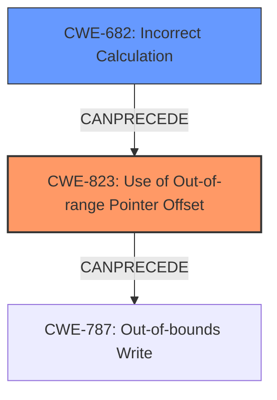

# Final Resolution for CVE-2022-25694

# Summary
| CWE ID | CWE Name | Confidence | CWE Abstraction Level | CWE Vulnerability Mapping Label | CWE-Vulnerability Mapping Notes |
|---|---|---|---|---|---|
| CWE-823 | Use of Out-of-range Pointer Offset | 0.9 | Base | Allowed | Primary CWE |
| CWE-682 | Incorrect Calculation | 0.4 | Pillar | Discouraged | Secondary Candidate CWE |

## Evidence and Confidence

*   **Confidence Score:** 0.8
*   **Evidence Strength:** MEDIUM

## Relationship Analysis
The primary CWE is CWE-823 (**Use of Out-of-range Pointer Offset**), a Base level CWE. The initial analysis considered CWE-119 (**Improper Restriction of Operations within the Bounds of a Memory Buffer**) as a secondary candidate, but it was determined that CWE-823 is sufficiently specific. I've added CWE-682 (**Incorrect Calculation**) as a potential root cause, as there must be a reason why the offset is out of range. CWE-682 is a Pillar, so I am less confident in this relationship.

## Vulnerability Chain
The chain of weaknesses begins with a potential **ROOTCAUSE** of CWE-682 (**Incorrect Calculation**), which leads to CWE-823 (**Use of Out-of-range Pointer Offset**). This, in turn, results in CWE-787 (**Out-of-bounds Write**) and ultimately memory corruption. There's a missing link: What input is used to cause the incorrect calculation?

## Summary of Analysis
I agree with the initial analysis that CWE-823 (**Use of Out-of-range Pointer Offset**) is the most appropriate primary CWE, as the vulnerability description specifically mentions "usage of Out-of-range pointer offset." The evidence is strong, as the description directly aligns with the CWE description. The criticism's recommendation to remove CWE-119 is valid because CWE-823 provides a more specific classification.

The graph relationships support this decision, as CWE-823 is a Base level CWE, which is preferred over the Class level CWE-119. I've added CWE-682 (**Incorrect Calculation**) as a potential **ROOTCAUSE**, since the out-of-range offset is likely the result of a calculation error. However, since CWE-682 is a Pillar, it's a less specific classification, and my confidence is lower.

The selected CWEs are at the optimal level of specificity based on the available evidence. While there might be underlying causes, the description focuses on the out-of-range pointer offset itself, making CWE-823 the most accurate primary classification.