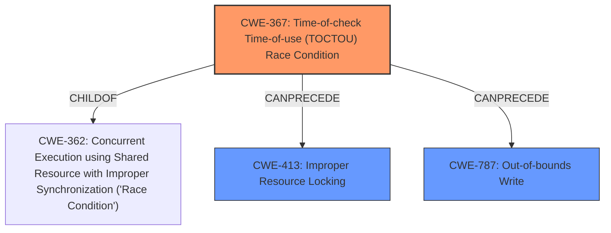

# Final Resolution for CVE-2022-25696

# Summary
| CWE ID | CWE Name | Confidence | CWE Abstraction Level | CWE Vulnerability Mapping Label | CWE-Vulnerability Mapping Notes |
|---|---|---|---|---|---|
| CWE-367 | Time-of-check Time-of-use (TOCTOU) Race Condition | 0.95 | Base | Allowed | Primary CWE |
| CWE-787 | Out-of-bounds Write | 0.70 | Base | Allowed | Secondary Candidate |
| CWE-413 | Improper Resource Locking | 0.60 | Base | Allowed | Secondary Candidate |

## Evidence and Confidence

*   **Confidence Score:** 0.85
*   **Evidence Strength:** MEDIUM

## Relationship Analysis
The primary weakness is a **CWE-367** Time-of-check Time-of-use (TOCTOU) **race condition**. **CWE-367** is a Base level CWE and a child of **CWE-362** (Concurrent Execution using Shared Resource with Improper Synchronization ('**Race Condition**')). The analysis includes **CWE-413** (Improper Resource Locking) as a secondary candidate. A potential consequence of the **CWE-367 race condition** is an **CWE-787** (Out-of-bounds Write), given that the vulnerability description mentions "memory corruption."

## Vulnerability Chain
The vulnerability chain starts with the **CWE-367** Time-of-check Time-of-use (TOCTOU) **race condition**. This can lead to **CWE-413** Improper Resource Locking if the concurrent access is not properly synchronized. Furthermore, the **race condition** can result in memory corruption through **CWE-787** Out-of-bounds Write if a write occurs to a memory location that is no longer valid due to reallocation. The description indicates "memory corruption," suggesting that **CWE-787** is a likely consequence.

## Summary of Analysis
The initial analysis correctly identified **CWE-367** as the primary weakness due to the explicit mention of a "time-of-check time-of-use **race condition**" in the vulnerability description. The inclusion of **CWE-413** is reasonable because the **race condition** implies potential issues with resource synchronization and locking. The retriever results and criticism also highlighted other potential consequences.

The analysis has been updated to include **CWE-787** (Out-of-bounds Write) as a secondary candidate due to the reported "memory corruption" which can result from a **race condition** where a write occurs to an invalid memory address, indicating an out-of-bounds write.

The confidence score is slightly lower (0.85) because while the description strongly points to **CWE-367**, the relationship to **CWE-787** and **CWE-413** are inferred rather than explicitly stated.

The selected CWEs are at the optimal level of specificity. **CWE-367** directly captures the **TOCTOU race condition**, and **CWE-787** represents a likely consequence ("memory corruption") while **CWE-413** signifies the potential for improper locking.