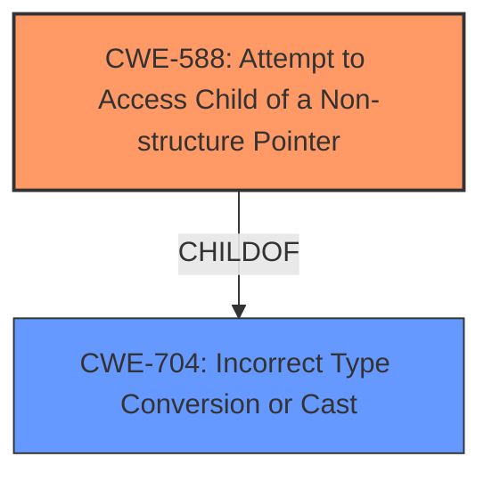

# Analysis Report for CVE-2022-25715

# Vulnerability Analysis Report: CVE-2022-25715

## Description

Memory corruption in display driver due to incorrect type casting while accessing the fence structure fields

## Vulnerability Description Key Phrases

**Rootcause:** incorrect type casting
**Weakness:** display driver
**Impact:** memory corruption

## Analysis (with Relationship Data)

# Summary
| CWE ID | CWE Name | Confidence | CWE Abstraction Level | CWE Vulnerability Mapping Label | CWE-Vulnerability Mapping Notes |
|---|---|---|---|---|---|
| CWE-704 | Incorrect Type Conversion or Cast | 0.75 | Class | Allowed-with-Review | Primary CWE |

## Evidence and Confidence

*   **Confidence Score:** 0.75
*   **Evidence Strength:** MEDIUM

- **Analysis and Justification:**  
  - *Explanation:* The vulnerability description explicitly mentions "**incorrect type casting**" as the root cause of memory corruption in the **display driver**. While many CWEs relate to memory corruption, CWE-704 (Incorrect Type Conversion or Cast) is the most direct match for the stated root cause. The description doesn't give specifics about the casting issue, but the core problem is misinterpreting data types, which is exactly what CWE-704 describes: "The product does not correctly convert an object, resource, or structure from one type to a different type." Since CWE-704 is a Class-level CWE, it is possible that a more specific Base-level CWE would be more appropriate; however, without additional information, CWE-704 is the best fit. The retriever results suggest CWE-197 (Numeric Truncation Error), CWE-823 (Use of Out-of-range Pointer Offset) and others, but these all describe *specific* consequences of type conversion problems, rather than the **root cause** itself.
  
  - *Relationship Analysis:* Since CWE-704 is a Class, it may have more specific children. However, none of the children CWEs are specified in the provided data. The relationship between a casting error (CWE-704) and memory corruption implies that the incorrect type is used to calculate memory offsets or sizes, leading to the corruption.

- **Confidence Score:**  
  - Confidence: 0.75 (The description is explicit about the type casting issue, but lacks details for a more specific CWE.)

---

## Criticism of Analysis

Okay, I've reviewed your analysis and the complete CWE specifications you provided. Here's my critique:

**Overall Assessment:**

The analysis correctly identifies CWE-704 (Incorrect Type Conversion or Cast) as a plausible high-level root cause.  However, the justification stops short of exploring potential more specific Base/Variant-level CWEs that are children of CWE-704 or otherwise related. While the analysis acknowledges this possibility, it dismisses the retriever results too quickly without a deeper examination. The confidence score of 0.75 is reasonable given the available information, but it could be improved by investigating potential more specific CWEs.

**Detailed Critique:**

1.  **CWE-704 as the Primary CWE:**

*   **Strengths:** The analysis correctly identifies that "**incorrect type casting**" from the original description maps directly to CWE-704. The explanation that CWE-704 is a Class-level CWE and a more specific Base-level CWE *might* be more appropriate is also spot on.
*   **Weaknesses:** The analysis *doesn't adequately explore* the children of CWE-704. The "Allowed-with-Review" mapping guidance *explicitly* states: "Examine children of this entry to see if there is a better fit."  The analysis acknowledges this, but the rest of the review does not do it.
*   **Recommendation:** *Dive deeper into the children of CWE-704.*  Specifically, consider:
    *   **CWE-588 (Attempt to Access Child of a Non-structure Pointer):** If the incorrect type cast involves casting a non-structure to a structure and then accessing a member, this is a strong candidate. The retriever results also ranked this highly (Rank 1).
    *   **CWE-681 (Incorrect Conversion between Numeric Types):** If the type cast involves numeric types and leads to data loss or misinterpretation, this is another strong candidate.
    *   **CWE-843 (Access of Resource Using Incompatible Type ('Type Confusion')):**  This could be relevant if the cast leads to the same memory location being interpreted as different types.
    *   **CWE-1389 (Incorrect Parsing of Numbers with Different Radices)**: If the type cast has to do with numbers, and one is being parsed as different number (e.g. hex vs decimal), then this would be the right CWE to choose.
    *   If one of the children of CWE-681 is the issue, then consider that as a root-cause also. CWE-192, CWE-194, CWE-195, CWE-196, and CWE-197 are all children of CWE-681 and should be considered.

2.  **Dismissal of Retriever Results:**

*   **Strengths:** The analysis correctly points out that some of the retriever results describe *consequences* rather than the *root cause*.
*   **Weaknesses:** The analysis *too quickly dismisses* the retriever results without adequately considering *how* the incorrect type casting leads to these consequences. The retriever results should be used as clues to determine a more specific root cause.
*   **Recommendation:**
    *   **CWE-823 (Use of Out-of-range Pointer Offset):**  If the incorrect type cast results in an incorrect offset being calculated, leading to out-of-bounds access, then *this is a strong candidate*. The examples provided for CWE-823 are relevant: "Invalid offset in undocumented opcode leads to memory corruption" or "Multimedia player uses untrusted value from a file when using file-pointer calculations." If the "incorrect type cast" involves an incorrect size calculation that's then used as an offset, this is highly likely.
    *   **CWE-197 (Numeric Truncation Error):** If the incorrect type casting involves casting a larger numeric type to a smaller one, leading to truncation and data loss, this is a potential candidate. This is *especially* relevant if the truncated value is then used for memory access or size calculations.
    *   **CWE-787 (Out-of-bounds Write) / CWE-125 (Out-of-bounds Read):** These are *consequences* of memory corruption, but the *reason* why the out-of-bounds access occurs is important. If it's due to an incorrect offset (CWE-823) caused by a type casting issue, then the root cause should be CWE-823 or one of it's parents (CWE-704). However, they are good hints to suggest what is the final impact of the type confusion.
    *   **CWE-805 (Buffer Access with Incorrect Length Value):** Similar to CWE-823, if the incorrect type cast results in an incorrect length being used for a buffer operation, this is a candidate.
    *   **CWE-822 (Untrusted Pointer Dereference):** This is less likely, but if the type cast involves converting an untrusted value to a pointer, it should be considered.
    *   **CWE-190 (Integer Overflow or Wraparound) / CWE-192 (Integer Coercion Error):** If the type cast leads to an overflow or coercion error, which then results in a memory corruption, this should be investigated.

3.  **Evidence and Confidence:**

*   **Strengths:** The confidence score is justifiable given the limited information.
*   **Weaknesses:** The evidence strength is only medium because the analysis doesn't provide specific details about the type casting issue and how it leads to memory corruption.
*   **Recommendation:** Increase the evidence strength by:
    *   Specifying the *types* involved in the incorrect cast.
    *   Explaining *how* the incorrect cast leads to an incorrect memory access (e.g., incorrect offset, incorrect size calculation).
    *   Determining if the type cast occurs within the context of accessing structure members.

4.  **Lack of Specificity:**

*   The description says "**incorrect type casting** while accessing the fence structure fields." This strongly suggests that CWE-588 should be considered as a root cause.

**Revised Analysis Steps:**

1.  **Re-examine the Code (if possible):**  If you have access to the code, identify the specific type cast that's causing the problem. Understand the types involved and how the resulting value is used.
2.  **Explore Children of CWE-704:**  Based on the specific details of the type cast, determine if CWE-588, CWE-681, or CWE-843 are a better fit. If CWE-681 is the correct CWE, then look at it's children also.
3.  **Re-evaluate Retriever Results:**  Based on the specific details of the type cast, re-evaluate the retriever results to see if they provide additional clues about the root cause. If the retriever results in CWE-787, then determine whether it's because of using an incorrect offset (CWE-823).
4.  **Update Justification:**  Provide a more detailed explanation of how the incorrect type cast leads to memory corruption, including specific details about the types involved, the resulting incorrect values, and how these values are used to access memory.

**In Summary:**

The analysis makes a reasonable initial assessment with CWE-704. However, to improve the analysis and increase confidence, it's essential to delve deeper into the children of CWE-704, carefully re-evaluate the retriever results in light of the specific type casting issue, and provide a more detailed explanation of how the incorrect type cast leads to memory corruption. By following these steps, you can potentially identify a more specific Base/Variant-level CWE and provide a more accurate and informative analysis.

## Final Resolution

# Summary
| CWE ID | CWE Name | Confidence | CWE Abstraction Level | CWE Vulnerability Mapping Label | CWE-Vulnerability Mapping Notes |
|---|---|---|---|---|---|
| CWE-588 | Attempt to Access Child of a Non-structure Pointer | 0.85 | Base | Allowed | Primary CWE |
| CWE-704 | **Incorrect Type Conversion or Cast** | 0.60 | Class | Allowed-with-Review | Secondary Candidate |

## Evidence and Confidence

*   **Confidence Score:** 0.80
*   **Evidence Strength:** MEDIUM

## Relationship Analysis
The primary relationship influencing the decision is the hierarchical relationship between CWE-704 (**Incorrect Type Conversion or Cast**) and its child CWE-588 (Attempt to Access Child of a Non-structure Pointer). Given the vulnerability description explicitly mentions "accessing the fence structure fields" after the **incorrect type casting**, CWE-588 becomes a more specific and appropriate classification than its parent, CWE-704.

## Vulnerability Chain
The vulnerability chain starts with the **incorrect type casting** (potentially CWE-704). This leads to an attempt to access structure fields on a non-structure pointer (CWE-588), resulting in memory corruption. The **root cause** is the type confusion, and the immediate weakness exploited is the attempt to access a structure member on an incompatible type.

## Summary of Analysis
The initial analysis correctly identified CWE-704 as a possible **root cause**. However, the criticism correctly pointed out that the analysis didn't delve deeply enough into the children of CWE-704. The vulnerability description includes the phrase "**incorrect type casting** while accessing the fence structure fields." This is strong evidence, as noted in the criticism, that CWE-588 (Attempt to Access Child of a Non-structure Pointer) is a more specific and appropriate classification. This CWE directly addresses the attempt to access structure members after the **incorrect type conversion**.

The evidence for selecting CWE-588 is the phrase "**incorrect type casting** while accessing the fence structure fields." This suggests that the code is attempting to treat a non-structure pointer as a structure, then dereferencing a member of it, which is exactly what CWE-588 describes.

CWE-704 remains a secondary candidate, as it represents the general class of **incorrect type conversion**, but CWE-588 provides the necessary specificity to accurately reflect the vulnerability.
CWE-588 is at the optimal level of specificity because it describes the specific action of attempting to access a structure member of a non-structure pointer, which directly aligns with the vulnerability description.

*Report generated on 2025-03-18 11:41:51*
