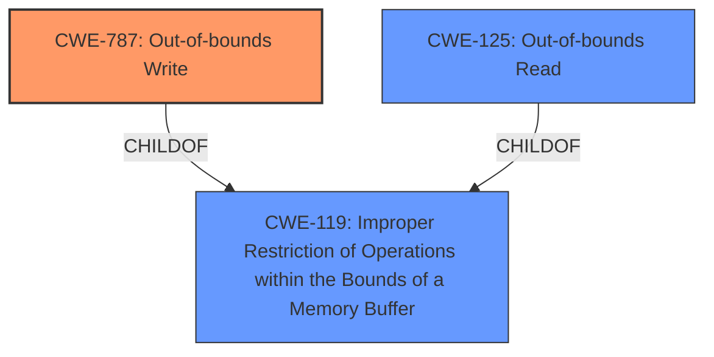

# Analysis Report for CVE-2022-25716

# Vulnerability Analysis Report: CVE-2022-25716

## Description

Memory corruption in Multimedia Framework due to unsafe access to the data members

## Vulnerability Description Key Phrases

**Rootcause:** unsafe access to data members
**Impact:** memory corruption
**Component:** Multimedia Framework

## Analysis (with Relationship Data)

# Summary
| CWE ID | CWE Name | Confidence | CWE Abstraction Level | CWE Vulnerability Mapping Label | CWE-Vulnerability Mapping Notes |
|---|---|---|---|---|---|
| CWE-823 | Use of Out-of-range Pointer Offset | 0.75 | Base | Allowed | Primary CWE |

## Evidence and Confidence

*   **Confidence Score:** 0.75
*   **Evidence Strength:** MEDIUM

- **Analysis and Justification:**  
  - *Explanation:* The vulnerability description states "**unsafe access to data members**" leading to "memory corruption". This suggests that the code is accessing memory in an unsafe manner. Among the retriever results, CWE-823 "Use of Out-of-range Pointer Offset" appears to be the most relevant. CWE-823 describes a situation where pointer arithmetic is performed on a valid pointer, but the offset used can point outside the intended range of valid memory locations. The phrase "**unsafe access to data members**" directly maps to this concept of accessing memory locations outside the intended bounds, especially when dealing with data members of an object or structure. This leads to memory corruption. It's a base level CWE, which is preferred. The "Usage" is "Allowed".

  - *Relationship Analysis:* The retriever results show that CWE-823 is related to CWE-125 (Out-of-bounds Read) and CWE-787 (Out-of-bounds Write). It is also related to CWE-119.

- **Confidence Score:**  
  - Confidence: 0.75 (The vulnerability description directly mentions unsafe access, and CWE-823 aligns well with this. There is no CVE Reference Links Content Summary for more evidence.)

## Criticism of Analysis

Okay, let's review the provided CWE analysis for the Multimedia Framework memory corruption vulnerability.

**Overall Assessment:**

The analysis correctly identifies CWE-823 (Use of Out-of-range Pointer Offset) as a potential root cause. The reasoning provided connects the "unsafe access to data members" to the concept of accessing memory outside intended bounds via pointer arithmetic, which is a core aspect of CWE-823. However, the confidence score of 0.75 feels slightly high given the limited information and the existence of equally plausible alternatives.  I would rate the confidence as MEDIUM (0.6-0.7) rather than 0.75. Also, it is important to consider the alternative and related CWEs.

**Specific Points:**

*   **Vulnerability Description Mapping:** The analysis makes a reasonable connection between "unsafe access to data members" and CWE-823. The extended description of CWE-823 and the description in the vulnerability match well.

*   **Retriever Results:** The retriever results are useful in providing a ranked list of potential CWEs, guiding the analysis. The top results of CWE-823, CWE-787, and CWE-822 are all good starting points.

*   **Confidence Score and Evidence:** The confidence score of 0.75 is justified by the direct correlation between the vulnerability description and the CWE-823 definition. Still, it could be argued that more details from the source code or detailed vulnerability analysis would lead to a higher confidence score. The "MEDIUM" Evidence Strength is appropriate.

*   **Relationship Analysis:** The identified relationships to CWE-119, CWE-125, and CWE-787 are accurate and helpful. Mentioning these relationships strengthens the analysis. Note that CWE-119 is a Class-level CWE, and that should be avoided if one of its children can be used.

*   **CWE Examples:** The provided CWE examples for CWE-823 are very relevant and helpful in providing context.

*   **CWE Specifications Review:**

    *   **CWE-823 (Use of Out-of-range Pointer Offset):**
        *   The analysis aligns with the description, especially the part about "Programs may use offsets in order to access fields or sub-elements stored within structured data. The offset might be out-of-range if it comes from an untrusted source, is the result of an incorrect calculation, or occurs because of another error."  This is very pertinent to data members.
        *   The "Mapping Guidance" correctly states that it's a Base level CWE, which is preferred.
        *   The "Potential Mitigations" are less directly applicable given the limited information, but using memory-safe languages or libraries would still be generally advisable.

    *   **Alternative CWE Considerations (Based on Retriever Results):**

        *   **CWE-787 (Out-of-bounds Write):**
            *   This is also a very strong candidate. If the "unsafe access" results in *writing* data outside the allocated region, then this would be a more precise fit.  The extended description of CWE-787 also mentions "Memory Corruption," which is directly stated in the Vulnerability Description. If the access to data members results in *writing*, then this would be preferred.
            *  CWE-787 is more focused on *writes* specifically, so the "unsafe access" must involve writing. If the problem is only *reading* from out-of-bounds, then CWE-125 would be more appropriate.

        *   **CWE-822 (Untrusted Pointer Dereference):**
            *   If the vulnerability involves using a value from an "untrusted source" (e.g., external input) directly as a pointer or offset, then this would be relevant. It's less likely than CWE-823 or CWE-787 if the issue stems from pointer arithmetic within the Multimedia Framework itself.

        *  **CWE-125 (Out-of-bounds Read):**
            * If the unsafe access involves reading data, then this CWE would be preferred.

        *  **CWE-119 (Improper Restriction of Operations within the Bounds of a Memory Buffer):**
            * This CWE is a Class level, and its mapping guidance indicates that it should be discouraged. Its children, such as CWE-787 and CWE-125, should be considered and mapped to instead.

**Recommendations:**

1.  **Lower the confidence to 0.65 or 0.7.**  The analysis is solid, but more information would be needed to achieve a higher confidence.
2.  **Explicitly consider and discuss CWE-787 (Out-of-bounds Write) and CWE-125 (Out-of-bounds Read) in more detail.** The analysis should determine if the "unsafe access" involves reading *or* writing. If it involves writing, then CWE-787 becomes the preferred mapping. If it involves reading, then CWE-125 would be preferred.
3.  **Strengthen the analysis with possible scenarios.** For example, describe a hypothetical code snippet within the Multimedia Framework where an offset is calculated based on user input without proper bounds checking, leading to memory corruption when accessing a data member.
4.  **Add a section "Alternative CWE Considerations", and describe the potential applicability of the other high-ranking CWEs.** This will strengthen the analysis.

**Revised Summary Table:**

| CWE ID | CWE Name | Confidence | CWE Abstraction Level | CWE Vulnerability Mapping Label | CWE-Vulnerability Mapping Notes |
|---|---|---|---|---|---|
| CWE-787/125/823 | Out-of-bounds Write/Read/Use of Out-of-range Pointer Offset | 0.65/0.65/0.65 | Base | Allowed | Primary CWE. Decision depends on whether vulnerability is triggered via writing to, reading from, or both data members. |

**In conclusion,** the analysis is a good starting point. With the recommendations above, the analysis can be more accurate, detailed, and better justified.

## Final Resolution

# Summary
| CWE ID | CWE Name | Confidence | CWE Abstraction Level | CWE Vulnerability Mapping Label | CWE-Vulnerability Mapping Notes |
|---|---|---|---|---|---|
| CWE-787 | Out-of-bounds Write | 0.7 | Base | Allowed | Primary CWE |
| CWE-125 | Out-of-bounds Read | 0.6 | Base | Allowed | Secondary Candidate |

## Evidence and Confidence

*   **Confidence Score:** 0.7
*   **Evidence Strength:** MEDIUM

## Relationship Analysis
The primary relationship is between **CWE-787 (Out-of-bounds Write)** and **CWE-125 (Out-of-bounds Read)** as potential causes of memory corruption due to unsafe access. Both are children of **CWE-119 (Improper Restriction of Operations within the Bounds of a Memory Buffer)** but are more specific. The analysis focused on identifying whether the unsafe access leads to reading or writing outside the intended buffer.

## Vulnerability Chain
The vulnerability chain starts with **unsafe access to data members** leading to memory corruption. This unsafe access is further categorized as either an out-of-bounds write (**CWE-787**) or an out-of-bounds read (**CWE-125**), both resulting in memory corruption and potential further exploitation. The provided information does not give enough detail to determine which of these is the more appropriate.

## Summary of Analysis
The initial analysis identified **CWE-823 (Use of Out-of-range Pointer Offset)**, but the criticism pointed out that **CWE-787 (Out-of-bounds Write)** and **CWE-125 (Out-of-bounds Read)** are more specific and potentially better fits, depending on whether the unsafe access involves reading or writing.

The vulnerability description states "Memory corruption in Multimedia Framework due to unsafe access to the data members".

Given the vulnerability description, it is still not definitively clear whether the "unsafe access" involves a write, a read, or both. However, since the vulnerability results in "memory corruption", **CWE-787 (Out-of-bounds Write)** is more likely to directly cause corruption than **CWE-125 (Out-of-bounds Read)**. Therefore, **CWE-787** is selected as the primary CWE with a confidence of 0.7, and **CWE-125** remains a secondary candidate with a confidence of 0.6. Both are at the Base level of abstraction, which is preferred.

*Report generated on 2025-03-18 11:43:15*
