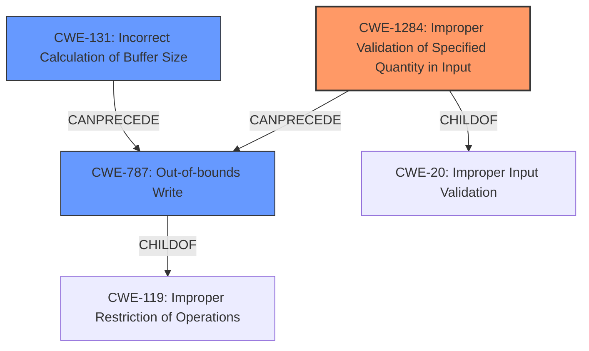

# Final Resolution for CVE-2022-25727

# Summary
| CWE ID | CWE Name | Confidence | CWE Abstraction Level | CWE Vulnerability Mapping Label | CWE-Vulnerability Mapping Notes |
|---|---|---|---|---|---|
| CWE-1284 | Improper Validation of Specified Quantity in Input | 0.8 | Base | Allowed | Primary CWE |
| CWE-787 | Out-of-bounds Write | 0.75 | Base | Allowed | Secondary Candidate |
| CWE-131 | Incorrect Calculation of Buffer Size | 0.6 | Base | Allowed | Secondary Candidate |

## Evidence and Confidence

*   **Confidence Score:** 0.8
*   **Evidence Strength:** MEDIUM

## Relationship Analysis
The primary weakness is **CWE-1284 (Improper Validation of Specified Quantity in Input)**, as the vulnerability description explicitly mentions an "improper length check." This can lead to **CWE-787 (Out-of-bounds Write)** if the unchecked length is used in a copy operation, causing data to be written beyond the buffer boundaries. **CWE-131 (Incorrect Calculation of Buffer Size)** is a potential contributing factor, as an incorrectly calculated buffer size, possibly based on an improper length from the input, could also result in **CWE-787**.

The relationships are as follows: CWE-1284 *CanPrecede* CWE-787, and CWE-131 *CanPrecede* CWE-787. CWE-1284 is a child of **CWE-20 (Improper Input Validation)**, while CWE-787 is a child of **CWE-119 (Improper Restriction of Operations within the Bounds of a Memory Buffer)**. The analysis considers the hierarchical relationships to ensure specificity. The chosen CWEs are at the Base level, which is preferred for vulnerability mapping.

## Vulnerability Chain
The vulnerability chain starts with the lack of proper input validation (**CWE-1284**) on the length field. This leads to the use of an invalid length value, potentially compounded by an incorrect buffer size calculation (**CWE-131**). Finally, the unchecked length is used in a memory copy operation, resulting in an out-of-bounds write (**CWE-787**) and memory corruption. The root cause is **CWE-1284**, and the immediate impact is **CWE-787**.

## Summary of Analysis
The initial analysis and the criticism provided a solid foundation for the final decision. The vulnerability description explicitly mentions an "improper length check," which strongly supports the selection of **CWE-1284 (Improper Validation of Specified Quantity in Input)** as the primary **WEAKNESS**. The criticism's suggestion to increase the confidence score for **CWE-787 (Out-of-bounds Write)** due to its direct relationship with **CWE-1284** was taken into account. The relationship analysis helped confirm the vulnerability chain, with **CWE-1284** leading to **CWE-787**. The potential role of **CWE-131 (Incorrect Calculation of Buffer Size)** was also considered, making it a secondary candidate. Alternative CWEs, such as **CWE-822** and **CWE-823**, were deemed less likely given the available information. The analysis is primarily based on the provided vulnerability description: "Memory Corruption in modem due to **improper length check** while copying into memory". This clearly points to an input validation **ROOTCAUSE** related to length. The selected CWEs are at the optimal level of specificity (Base) for mapping the vulnerability.