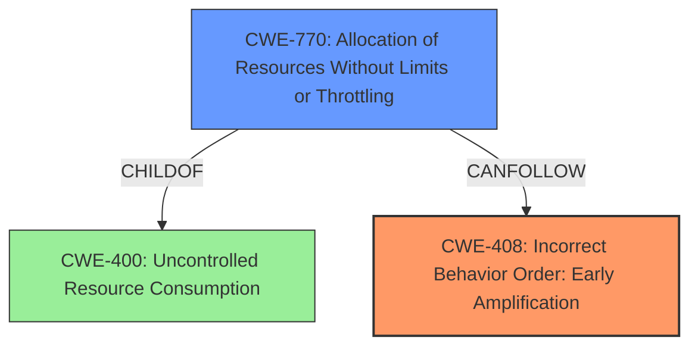

# Final Resolution for CVE-2022-2576

# Summary
| CWE ID | CWE Name | Confidence | CWE Abstraction Level | CWE Vulnerability Mapping Label | CWE-Vulnerability Mapping Notes |
|---|---|---|---|---|---|
| CWE-408 | Incorrect Behavior Order: Early Amplification | 0.95 | Base | Primary | Allowed | Root cause of the vulnerability; the server performs the expensive full handshake before authentication. |
| CWE-770 | Allocation of Resources Without Limits or Throttling | 0.65 | Base | Secondary | Allowed | Contributing factor; the server allocates resources for full handshakes without proper throttling, exacerbating the DoS. A consequence of CWE-408. |

## Evidence and Confidence

*   **Confidence Score:** 0.9
*   **Evidence Strength:** HIGH

## Relationship Analysis
The primary CWE, CWE-408 (**Incorrect Behavior Order: Early Amplification**), is at the Base level, offering a specific description of the vulnerability's root cause. The secondary CWE, CWE-770 (**Allocation of Resources Without Limits or Throttling**), is also at the Base level and is a child of CWE-400 (**Uncontrolled Resource Consumption**), indicating that CWE-770 is a more specific instance of the broader resource consumption issue.

## Vulnerability Chain
The vulnerability chain begins with the **ROOTCAUSE** CWE-408 (**Incorrect Behavior Order: Early Amplification**), where the DTLS resumption handshake falls back to a full handshake without proper authentication. This leads to the weakness CWE-770 (**Allocation of Resources Without Limits or Throttling**), as the server allocates resources for full handshakes without limits. The final impact is a Denial of Service (DoS) due to message amplification and high CPU load.

## Summary of Analysis
The initial analysis and criticism are both sound and well-reasoned. The vulnerability description explicitly states the "expensive operation" (full handshake) occurring *before* the "authentication/authorization" check (HelloVerifyRequest), which maps perfectly to the definition of CWE-408 (**Incorrect Behavior Order: Early Amplification**). The secondary CWE, CWE-770 (**Allocation of Resources Without Limits or Throttling**), is a contributing factor to the vulnerability. The server allocates resources for full handshakes without proper throttling, exacerbating the DoS.

The graph relationships influenced the selection by confirming that CWE-408 is the **ROOTCAUSE** and CWE-770 is a consequence. Both CWEs are at the optimal level of specificity, being at the Base level of abstraction. The selected CWEs are at the optimal level of specificity because they directly address the vulnerability's root cause (CWE-408) and contributing factor (CWE-770).