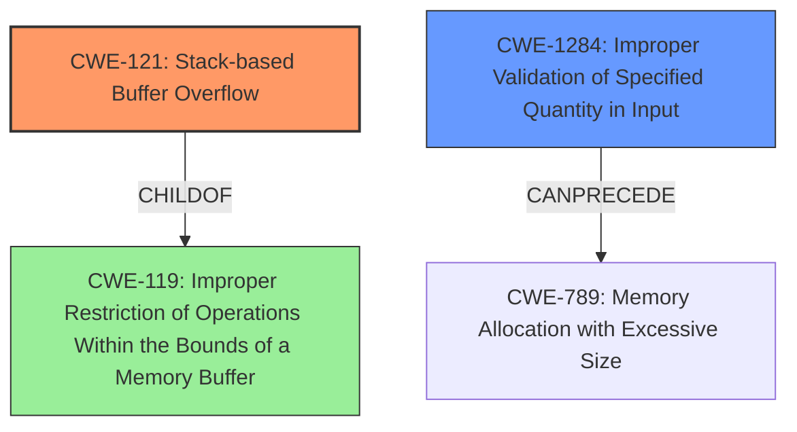

# Final Resolution for CVE-2022-25793

# Summary
| CWE ID | CWE Name | Confidence | CWE Abstraction Level | CWE Vulnerability Mapping Label | CWE-Vulnerability Mapping Notes |
|---|---|---|---|---|---|
| CWE-121 | Stack-based Buffer Overflow | 0.95 | Variant | Primary | Allowed |
| CWE-1284 | Improper Validation of Specified Quantity in Input | 0.75 | Base | Secondary Candidate | Allowed |

## Evidence and Confidence

*   **Confidence Score:** 0.95
*   **Evidence Strength:** HIGH

## Relationship Analysis
The primary relationship is the child-parent relationship between CWE-121 (Stack-based Buffer Overflow) and CWE-119 (Improper Restriction of Operations Within the Bounds of a Memory Buffer). CWE-121 is a variant of CWE-119, providing a more specific classification. CWE-1284 (Improper Validation of Specified Quantity in Input) CanPrecede CWE-789(Memory Allocation with Excessive Size). We consider the relationships to CWE-190, CWE-125, and CWE-787. The abstraction levels (Variant for CWE-121, Base for CWE-1284) were appropriate.

## Vulnerability Chain
The vulnerability chain starts with **CWE-1284 (Improper Validation of Specified Quantity in Input)**, where the application fails to validate the length of user-supplied data. This leads to **CWE-121 (Stack-based Buffer Overflow)** when the application copies the unchecked data to a fixed-size stack buffer, resulting in an out-of-bounds write and potential arbitrary code execution.

## Summary of Analysis
The initial analysis and criticism are sound. The vulnerability description explicitly states a "**Stack-based Buffer Overflow**" due to the "**lack of proper validation of the length of user-supplied data**," aligning perfectly with CWE-121. The **root cause** of the issue is the "**lack of proper validation of the length of user-supplied data**" which maps to CWE-1284.

The choice of CWE-121 is based on the explicit mention of "Stack-based" in the vulnerability description. The inclusion of CWE-1284 is justified by the lack of input validation.

The retriever scores also support these decisions, with CWE-1284 at 0.6332 and CWE-121 at 0.5727.
CWE-121 and CWE-1284 are at the optimal level of specificity.