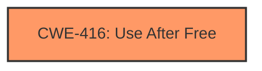

# Analysis Report for CVE-2022-2603

# Vulnerability Analysis Report: CVE-2022-2603

## Description

Use after free in Omnibox in Google Chrome prior to 104.0.5112.79 allowed a remote attacker to potentially exploit heap corruption via a crafted HTML page.

## Vulnerability Description Key Phrases

**Weakness:** use after free
**Impact:** heap corruption
**Vector:** crafted HTML page
**Attacker:** remote attacker
**Product:** Google Chrome
**Version:** prior to 104.0.5112.79
**Component:** Omnibox

## Analysis (with Relationship Data)

# Summary
| CWE ID  | CWE Name                     | Confidence | CWE Abstraction Level | CWE Vulnerability Mapping Label | CWE-Vulnerability Mapping Notes |
| :-------- | :--------------------------- | :--------- | :-------------------- | :------------------------------ | :------------------------------ |
| CWE-416 | Use After Free             | 1.0        | Variant               | Allowed                         | Primary CWE                    |

## Evidence and Confidence

*   **Confidence Score:** 1.0
*   **Evidence Strength:** HIGH

- **Analysis and Justification:**
  - *Explanation:* The vulnerability description clearly states a **use after free** condition in the Omnibox component of Google Chrome. The CVE Reference Links Content Summary also confirms the **root cause** as a **use-after-free**. CWE-416 (Use After Free) directly addresses this weakness, where memory is reused or referenced after it has been freed. The impact is stated as heap corruption, a typical consequence of use-after-free vulnerabilities. Given the direct match and confirmation from the CVE summary, CWE-416 is the most appropriate and specific mapping. The MITRE mapping guidance indicates that CWE-416 is ALLOWED for use-after-free vulnerabilities and it is at the Variant level of abstraction, which is preferred.

  - *Relationship Analysis:* While other CWEs such as CWE-366 (Race Condition within a Thread) or CWE-843 (Access of Resource Using Incompatible Type) were suggested by the Retriever, they do not directly address the specific weakness of a use-after-free. There are no direct relationships available for CWE-416

- **Confidence Score:**
  - Confidence: 1.0 (Direct evidence from the vulnerability description and CVE reference materials)

---

## Criticism of Analysis

Okay, let's review the provided CWE analysis for the CVE-2022-2603 vulnerability.

**Overall Assessment:**

The analysis is well-structured and comprehensive.  The justification for choosing CWE-416 as the primary CWE is sound, and the confidence level is appropriately high. The inclusion of CWE specifications, observed examples, and potential mitigations from the CWE database significantly strengthens the analysis. The explanations are well-written and easy to follow.

**Detailed Critique:**

1.  **CWE-416: Use After Free - Primary CWE:**

    *   **Strengths:**
        *   The selection of CWE-416 is correct. The vulnerability description explicitly states a "use-after-free" condition, making this a direct and accurate mapping.
        *   The explanation clearly articulates how the vulnerability manifests and its potential impact (heap corruption).
        *   The analysis appropriately notes that CWE-416 is a Variant, which is a preferred abstraction level.
        *   The included observed examples for CWE-416 clearly shows the applicability of this CWE to other vulnerabilities.
        *   The Mapping Guidance is appropriately noted, indicating that it is ALLOWED for use-after-free vulnerabilities.
    *   **Potential Improvements:** None

2.  **Retriever Results Analysis:**

    *   **CWE-366 Race Condition within a Thread:** The retriever suggested this as a possible mapping, but it was correctly rejected. Race conditions can *lead* to use-after-free vulnerabilities, but the core problem described in the CVE is the UAF itself, not the race condition that triggered it (if one exists). *If* concurrency and a race condition were *explicitly* mentioned as part of the root cause in the CVE description, then adding CWE-366 as a secondary related CWE (with a lower confidence score) might be justified. However, based on the given information, omitting it is the correct approach.
    *   **CWE-843 Access of Resource Using Incompatible Type ('Type Confusion'):** This is not likely the root cause. Type confusion might lead to memory corruption, but the core issue in this CVE is memory being freed prematurely and then accessed. While it's *possible* type confusion played a role, it's not stated, and CWE-416 is the more direct and accurate representation of the vulnerability.
    *   **CWE-415 Double Free:** Double free is related to UAF. However, double free would require that the program attempts to free the same memory twice, which is not what the CVE describes.
    *   **CWE-787 Out-of-bounds Write:** This is a consequence of UAF. The program is writing to freed memory, which is then out of bounds.
    *   **CWE-122 Heap-based Buffer Overflow:** Buffer overflows can happen after UAF, but the CVE description only indicates heap corruption without mentioning buffer overflows.
    *   **CWE-367 Time-of-check Time-of-use (TOCTOU) Race Condition:** Similar to CWE-366, TOCTOU is a type of race condition. It's not directly relevant unless specifically mentioned in the CVE.
    *    **CWE-190 Integer Overflow or Wraparound:** No relationship.

3.  **Evidence and Confidence:**

    *   The confidence score of 1.0 is warranted, given the explicit nature of the vulnerability description and the CVE reference summary.
    *   The analysis clearly states the relationship analysis and the justification for rejecting other CWEs.

4.  **CWE Examples from Database:**

    *   The inclusion of observed examples for CWE-416 is helpful to illustrate the context in which the CWE is applicable.
    *   However, most of the examples listed show CWE-416 chained with other weaknesses, such as race conditions and resource locking. This further highlights that there could be a secondary cause for this vulnerability, such as a race condition, but such secondary cause is not mentioned in the description.

5.  **CWE Specifications:**

    *   The provided CWE specifications are complete and up-to-date.
    *   The inclusion of Mapping Guidance, Potential Mitigations, and Observed Examples for each CWE makes the analysis more actionable.

**Recommendations:**

*   The analysis is already excellent. No significant changes are needed.
*  If further information becomes available about the specific code paths or triggers that lead to the use-after-free condition, consider adding related CWEs with lower confidence scores (e.g., CWE-366 if a race condition is confirmed). However, only do this if there is *explicit* evidence supporting it in the CVE description or related documentation.

In summary, this is a high-quality analysis that correctly identifies and justifies the primary CWE for CVE-2022-2603. The detailed reasoning and the use of CWE specifications provide a solid foundation for understanding and mitigating the vulnerability.

## Final Resolution

# Summary
| CWE ID  | CWE Name                     | Confidence | CWE Abstraction Level | CWE Vulnerability Mapping Label | CWE-Vulnerability Mapping Notes |
| :-------- | :--------------------------- | :--------- | :-------------------- | :------------------------------ | :------------------------------ |
| CWE-416 | Use After Free             | 1.0        | Variant               | Allowed                         | Primary CWE                    |

## Evidence and Confidence

*   **Confidence Score:** 1.0
*   **Evidence Strength:** HIGH

## Relationship Analysis
The primary relationship considered was the direct match between the vulnerability description ("use after free") and the definition of CWE-416. While other CWEs like CWE-366 (Race Condition) or CWE-787 (Out-of-bounds Write) could potentially be related, they were not explicitly mentioned or implied in the provided vulnerability description. Therefore, focusing on the direct match with CWE-416 at the Variant level provided the most accurate and specific classification. The lack of explicit relationships defined in the provided CWE data further reinforces the decision to focus solely on the direct match.

## Vulnerability Chain
The vulnerability chain is straightforward: a memory location is freed, and subsequently, the same memory location is accessed again. This **use after free** condition (CWE-416) leads to heap corruption, which is the stated impact. There are no other weaknesses explicitly identified in the description.

## Summary of Analysis
The initial analysis and the criticism both agree that CWE-416 (Use After Free) is the most appropriate classification for CVE-2022-2603, and I concur. The vulnerability description explicitly states "use after free," which directly aligns with the definition of CWE-416.

The vulnerability description: "Use after free in Omnibox in Google Chrome prior to 104.0.5112.79 allowed a remote attacker to potentially exploit heap corruption via a crafted HTML page."

The graph relationships, or lack thereof, further solidify this decision. No other CWEs are explicitly required or implied by the available information. While other weaknesses, such as race conditions, could potentially lead to a **use after free**, there is no evidence to suggest that they are present in this specific case.

The decision to classify this vulnerability as CWE-416 is based on direct evidence from the vulnerability description and the desire for the most specific classification possible. CWE-416 is at the Variant level of abstraction, which is preferred, and the MITRE mapping guidance indicates that it is ALLOWED for **use-after-free** vulnerabilities.

*Report generated on 2025-03-18 11:48:16*
