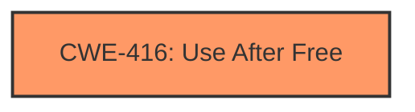

# Final Resolution for CVE-2022-2603

# Summary
| CWE ID  | CWE Name                     | Confidence | CWE Abstraction Level | CWE Vulnerability Mapping Label | CWE-Vulnerability Mapping Notes |
| :-------- | :--------------------------- | :--------- | :-------------------- | :------------------------------ | :------------------------------ |
| CWE-416 | Use After Free             | 1.0        | Variant               | Allowed                         | Primary CWE                    |

## Evidence and Confidence

*   **Confidence Score:** 1.0
*   **Evidence Strength:** HIGH

## Relationship Analysis
The primary relationship considered was the direct match between the vulnerability description ("use after free") and the definition of CWE-416. While other CWEs like CWE-366 (Race Condition) or CWE-787 (Out-of-bounds Write) could potentially be related, they were not explicitly mentioned or implied in the provided vulnerability description. Therefore, focusing on the direct match with CWE-416 at the Variant level provided the most accurate and specific classification. The lack of explicit relationships defined in the provided CWE data further reinforces the decision to focus solely on the direct match.

## Vulnerability Chain
The vulnerability chain is straightforward: a memory location is freed, and subsequently, the same memory location is accessed again. This **use after free** condition (CWE-416) leads to heap corruption, which is the stated impact. There are no other weaknesses explicitly identified in the description.

## Summary of Analysis
The initial analysis and the criticism both agree that CWE-416 (Use After Free) is the most appropriate classification for CVE-2022-2603, and I concur. The vulnerability description explicitly states "use after free," which directly aligns with the definition of CWE-416.

The vulnerability description: "Use after free in Omnibox in Google Chrome prior to 104.0.5112.79 allowed a remote attacker to potentially exploit heap corruption via a crafted HTML page."

The graph relationships, or lack thereof, further solidify this decision. No other CWEs are explicitly required or implied by the available information. While other weaknesses, such as race conditions, could potentially lead to a **use after free**, there is no evidence to suggest that they are present in this specific case.

The decision to classify this vulnerability as CWE-416 is based on direct evidence from the vulnerability description and the desire for the most specific classification possible. CWE-416 is at the Variant level of abstraction, which is preferred, and the MITRE mapping guidance indicates that it is ALLOWED for **use-after-free** vulnerabilities.