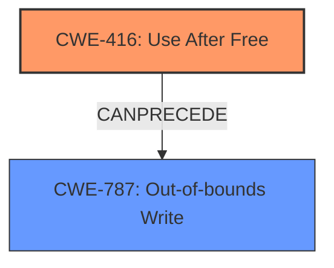

# Final Resolution for CVE-2022-2604

# Summary
| CWE ID | CWE Name | Confidence | CWE Abstraction Level | CWE Vulnerability Mapping Label | CWE-Vulnerability Mapping Notes |
|---|---|---|---|---|---|
| CWE-416 | Use After Free | 1.0 | Variant | Primary CWE | Allowed |
| CWE-787 | Out-of-bounds Write | 0.4 | Base | Secondary Candidate | Allowed |

## Evidence and Confidence

*   **Confidence Score:** 0.9
*   **Evidence Strength:** MEDIUM

## Relationship Analysis
The primary relationship that influenced the decision was the potential for **CWE-416 (Use After Free)** to lead to **CWE-787 (Out-of-bounds Write)**, as the freed memory could be reallocated and subsequently corrupted via a dangling pointer. The initial analysis focused solely on **CWE-416**, but the criticism highlighted that the vulnerability description mentioned heap corruption. Given this, **CWE-787** was added as a secondary candidate, recognizing that a **use-after-free** can *lead* to writing to an invalid memory location, resulting in an out-of-bounds write.

## Vulnerability Chain
The vulnerability chain starts with the **root cause** of a **CWE-416 (Use After Free)** condition. This occurs when memory is freed but a pointer to that memory is still in use. Subsequently, if the freed memory is reallocated, any write operations using the dangling pointer can corrupt the heap, leading to **CWE-787 (Out-of-bounds Write)**. The final impact is remote code execution via a crafted HTML page.

**Chain:** **CWE-416** --> Heap Corruption (via dangling pointer) --> **CWE-787** --> Remote Code Execution

## Summary of Analysis
The initial analysis correctly identified **CWE-416 (Use After Free)** as the primary **weakness**, based on the explicit mention of "use after free" in the vulnerability description. The criticism pointed out that the description also mentioned heap corruption, which led to the consideration of **CWE-787 (Out-of-bounds Write)**. The final decision is to classify the vulnerability as primarily **CWE-416**, with **CWE-787** as a secondary **weakness** that results from the **use-after-free** condition.

The evidence supporting this decision is the vulnerability description: "Use after free in Safe Browsing in Google Chrome prior to 104.0.5112.79 allowed a remote attacker to potentially exploit heap corruption via a crafted HTML page." This statement directly supports the inclusion of both **CWE-416** and **CWE-787**.

The graph relationships influenced the final selection by highlighting how **CWE-416** can *lead* to **CWE-787**. The **CANPRECEDE** relationship from **CWE-416** to **CWE-787** shows the progression of the vulnerability.

The selected CWEs are at the optimal level of specificity because **CWE-416** directly addresses the **root cause**, while **CWE-787** describes the immediate consequence of the **use-after-free** condition, which is heap corruption via an out-of-bounds write.