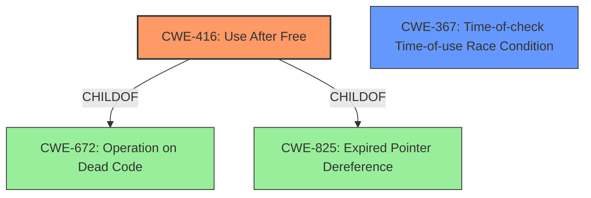

# Final Resolution for CVE-2022-2609

# Summary

| CWE ID | CWE Name | Confidence | CWE Abstraction Level | CWE Vulnerability Mapping Label | CWE-Vulnerability Mapping Notes |
|---|---|---|---|---|---|
| CWE-416 | Use After Free | 1.0 | Variant | Allowed | Primary CWE. The vulnerability description explicitly states "Use after free" |
| CWE-367 | Time-of-check Time-of-use (TOCTOU) Race Condition | 0.4 | Base | Allowed | Secondary Candidate. Requires further investigation. |

## Evidence and Confidence

*   **Confidence Score:** 0.95
*   **Evidence Strength:** HIGH

## Relationship Analysis

The primary relationship that impacted my decision was the direct match of "Use After Free" to CWE-416. CWE-416 is a variant of several class-level CWEs like CWE-672 (Operation on Dead Code), and CWE-825 (Expired Pointer Dereference). The analysis considered CWE-367 (Time-of-check Time-of-use (TOCTOU) Race Condition) as a possible secondary CWE, and while the connection is speculative, it acknowledges the UI interaction component mentioned in the description. The hierarchical relationship informs the selection of the variant-level CWE-416 over its more general parent classes, providing greater specificity.

## Vulnerability Chain

The vulnerability chain starts with the **ROOTCAUSE**, **CWE-416 (Use After Free)**. A memory location is freed but later accessed again. This leads to **heap corruption**, as stated in the vulnerability description. The "specific UI interactions" likely trigger the use-after-free condition.

## Summary of Analysis

The initial analysis correctly identified **CWE-416 (Use After Free)** as the primary **WEAKNESS**, as it is explicitly mentioned in the vulnerability description: "Use after free in Nearby Share in Google Chrome on Chrome OS...allowed a remote attacker...to potentially exploit **heap corruption** via specific UI interactions." This direct match, coupled with the Retriever Results listing CWE-416 as the top candidate, strongly supports this classification.

The criticism suggested considering UI-related CWEs as alternatives to CWE-366. Based on the information, I have revised the secondary candidate to **CWE-367 (Time-of-check Time-of-use (TOCTOU) Race Condition)**, acknowledging the role of "specific UI interactions." However, the connection is still speculative, as the description does not provide explicit details about a race condition.

The selection of **CWE-416 (Use After Free)** is at the optimal level of specificity because it is a variant-level CWE that directly corresponds to the vulnerability description.