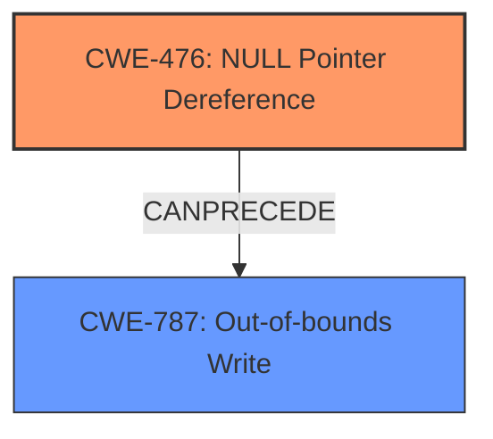

# Final Resolution for CVE-2022-26093

# Summary
| CWE ID | CWE Name | Confidence | CWE Abstraction Level | CWE Vulnerability Mapping Label | CWE-Vulnerability Mapping Notes |
|---|---|---|---|---|---|
| CWE-476 | NULL Pointer Dereference | 1.0 | Base | Allowed | Acceptable-Use |
| CWE-787 | Out-of-bounds Write | 0.7 | Base | Allowed | Acceptable-Use. Consequence of the **NULL pointer dereference**. |

## Evidence and Confidence

*   **Confidence Score:** 0.9
*   **Evidence Strength:** HIGH

## Relationship Analysis
The primary relationship is that CWE-476 (**NULL Pointer Dereference**) can precede CWE-787 (**Out-of-bounds Write**). The **NULL Pointer Dereference** leads to the **Out-of-bounds Write**.

## Vulnerability Chain
The vulnerability chain starts with a **NULL Pointer Dereference** (**CWE-476**), which then leads to an **Out-of-bounds Write** (**CWE-787**). This indicates a sequence where a failure to validate a pointer results in memory corruption.

## Summary of Analysis
The initial analysis and the criticism are both sound. The vulnerability description clearly states a "**Null pointer dereference**" which maps directly to **CWE-476 (NULL Pointer Dereference)**. The description also indicates an "**out of bounds write**" as the *impact* of this **null pointer dereference**, suggesting **CWE-787 (Out-of-bounds Write)** as a secondary weakness.

The relationship analysis confirms that **CWE-476** can precede **CWE-787**. The abstraction levels are appropriate, as both are Base level CWEs. The mapping guidance allows the usage of both.

The confidence score for **CWE-787** is lower (0.7) than that of **CWE-476** (1.0) because the vulnerability description explicitly mentions the **NULL pointer dereference** as the root cause, while the **out-of-bounds write** is described as a consequence.

I agree with the proposed changes from the criticism to strengthen the relationship explanation, refine the confidence score justification, and mention mitigation awareness.

The selected CWEs are at the optimal level of specificity because they accurately reflect the root cause and impact of the vulnerability, based on the available evidence.