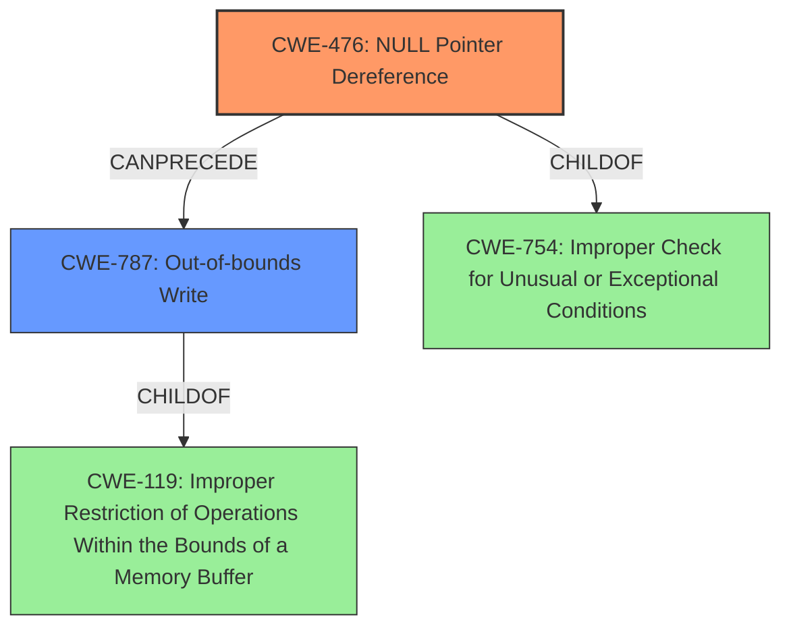

# Analysis Report for CVE-2022-26094

# Vulnerability Analysis Report: CVE-2022-26094

## Description

Null pointer dereference vulnerability in parser_auxC function in libsimba library prior to SMR Apr-2022 Release 1 allows out of bounds write by remote attacker.

## Vulnerability Description Key Phrases

**Rootcause:** Null pointer dereference
**Weakness:** out of bounds write
**Attacker:** remote attacker
**Product:** libsimba library
**Version:** prior to SMR Apr-2022 Release 1
**Component:** parser_auxC function

## Analysis (with Relationship Data)

# Summary
| CWE ID | CWE Name | Confidence | CWE Abstraction Level | CWE Vulnerability Mapping Label | CWE-Vulnerability Mapping Notes |
|---|---|---|---|---|---|
| CWE-476 | NULL Pointer Dereference | 0.9 | Base | Primary | Allowed |
| CWE-787 | Out-of-bounds Write | 0.6 | Base | Secondary | Allowed |

## Evidence and Confidence

*   **Confidence Score:** 0.75
*   **Evidence Strength:** MEDIUM

- **Analysis and Justification:**  
  - *Explanation:* The vulnerability description clearly states a **"Null pointer dereference"** in the `parser_auxC` function of the `libsimba` library leading to an **"out of bounds write"**. The CVE reference content summary confirms that a **null pointer dereference** exists in some parser functions of `libsimba` which allows **out of bounds write** by remote attackers. CWE-476 (NULL Pointer Dereference) is the primary cause because the code attempts to use a pointer that is unexpectedly NULL. This aligns with the description of CWE-476, which states, "The product dereferences a pointer that it expects to be valid but is NULL." The "Usage: Allowed" mapping guidance for CWE-476 further supports this selection. The **out-of-bounds write** is a consequence of the **null pointer dereference**, making it a secondary weakness.

  - *Relationship Analysis:* CWE-476 is a child of CWE-754 (Improper Check for Unusual or Exceptional Conditions). The Retriever Results lists CWE-476 as the top candidate CWE. CWE-787 (Out-of-bounds Write) is also a candidate, as the **null pointer dereference** can lead to the out-of-bounds write. CWE-787 is a child of CWE-119 (Improper Restriction of Operations Within the Bounds of a Memory Buffer).

- **Confidence Score:**  
  - Confidence: 0.9 (High confidence due to direct evidence and clear CWE mapping guidance for CWE-476).
  - Confidence: 0.6 (Lower confidence for CWE-787 as it's a consequence of CWE-476).

## Criticism of Analysis

Okay, here's a detailed review of the provided analysis, incorporating the full CWE specifications:

**Overall Assessment**

The analysis is generally well-reasoned and arrives at a reasonable conclusion. The primary CWE mapping to CWE-476 (NULL Pointer Dereference) is accurate, and the secondary mapping to CWE-787 (Out-of-bounds Write) is also appropriate as a consequence of the primary weakness. The confidence levels are justified.

**Detailed Review**

*   **Vulnerability Description & Key Phrases:** The key phrases accurately reflect the core elements of the vulnerability.  No issues here.

*   **CWE for Similar CVE Descriptions:** The analysis correctly identifies CWE-476 as the top match.

*   **CVE Reference Links Content Summary:** The summary accurately captures the core vulnerability details, including the root cause, weakness, impact, attack vectors, and attacker capabilities. It is thorough and well-organized.

*   **Retriever Results:** The retriever results align with the findings, with CWE-476 ranked as the top candidate.  The presence of other pointer-related CWEs and buffer access CWEs further supports the complexity of memory-related vulnerabilities.

*   **Summary Table:**

    *   **CWE-476 (NULL Pointer Dereference):**

        *   **Confidence:** 0.9 - Justified, given the explicit mention of "Null pointer dereference" in both the vulnerability description and the CVE reference content summary.
        *   **CWE Abstraction Level:** Base - Correct. CWE-476 is a Base-level CWE.
        *   **CWE Vulnerability Mapping Label:** Primary - Correct.
        *   **CWE-Vulnerability Mapping Notes:** Allowed - Correct according to the CWE spec.
    *   **CWE-787 (Out-of-bounds Write):**

        *   **Confidence:** 0.6 - Also Justified, because it is a consequence of CWE-476 and not the primary cause.
        *   **CWE Abstraction Level:** Base - Correct. CWE-787 is a Base-level CWE.
        *   **CWE Vulnerability Mapping Label:** Secondary - Correct.
        *   **CWE-Vulnerability Mapping Notes:** Allowed - Correct according to the CWE spec.

*   **Evidence and Confidence (Analysis and Justification):**

    *   *Explanation:* The explanation is clear and well-structured.  It correctly explains the relationship between the NULL pointer dereference and the resulting out-of-bounds write.
    *   *Relationship Analysis:* The analysis of CWE-476 as a child of CWE-754 is accurate and relevant. Also correctly identifies CWE-787 as a child of CWE-119. The Retriever Results lists CWE-476 as the top candidate CWE.

*   **CWE Examples from Database:** The given examples are relevant to the general category of buffer overflows and related memory safety issues. However, the most relevant examples would be those that explicitly show a *chain* where a null pointer dereference directly leads to an out-of-bounds write.

*   **Relevant CWE Specifications:** The inclusion of the full CWE specifications is very helpful for a thorough review.

**Critique & Suggestions**

1.  **Strengthen the Connection to CWE-787:** While the analysis acknowledges CWE-787 as a consequence, it can benefit from a more explicit explanation of *how* the null pointer dereference leads to the out-of-bounds write. A null pointer dereference doesn't *always* result in an out-of-bounds write. It depends on how the code handles (or fails to handle) the NULL pointer. A possible scenario is that if the dereferenced NULL pointer was intended to be used as the base address for writing data, writing to that invalid address could corrupt memory outside the intended bounds. Add this more detailed technical explanation.

2.  **Consider CWE-822/823/824:** While CWE-476 is the most direct cause, the retriever results show strong scores for CWE-822 (Untrusted Pointer Dereference), CWE-823 (Use of Out-of-range Pointer Offset), and CWE-824 (Access of Uninitialized Pointer).  While these may not be *direct* causes, consider adding a sentence or two acknowledging that:

    *   If the root cause is improper input handling that causes the pointer to be null, then there could be a relationship with CWE-822, especially if the input is coming from a remote attacker.
    *   If the null pointer is somehow used in a calculation that is used to access memory, then it could have a relationship with CWE-823.
    *   If pointer is not initialized correctly, then there could be a relationship with CWE-824.

    However, it's important to make it clear that these are less direct and depend on specific code behavior, and to maintain CWE-476 as the primary cause.

3.  **Mitigation Strategies:** The analysis would be strengthened by briefly discussing mitigation strategies, potentially referencing the mitigations outlined in the CWE specifications.  For example:

    *   "Mitigation for CWE-476 would involve ensuring that all pointers are checked for NULL before being dereferenced.  The CWE specification also suggests using a language that is less susceptible to these issues or checking the results of functions that return a pointer."
    *    "Mitigation for CWE-787, as the CWE specification suggests, includes using a memory-safe language and implementing compiler-based buffer overflow detection mechanisms."

4.  **Usage Discouragement of CWE-119.**  The original text includes the following "The "Usage: Discouraged" mapping guidance for CWE-119 further supports this selection."  It's not clear what this sentence means. The selection is not CWE-119.

**Revised Summary Table (with suggested changes):**

| CWE ID | CWE Name | Confidence | CWE Abstraction Level | CWE Vulnerability Mapping Label | CWE-Vulnerability Mapping Notes |
|---|---|---|---|---|---|
| CWE-476 | NULL Pointer Dereference | 0.9 | Base | Primary | Allowed |
| CWE-787 | Out-of-bounds Write | 0.6 | Base | Secondary | Allowed |

**Revised Analysis and Justification (extract):**

- **Analysis and Justification:**
  - *Explanation:* The vulnerability description clearly states a **"Null pointer dereference"** in the `parser_auxC` function of the `libsimba` library leading to an **"out of bounds write"**. The CVE reference content summary confirms that a **null pointer dereference** exists in some parser functions of `libsimba` which allows **out of bounds write** by remote attackers. CWE-476 (NULL Pointer Dereference) is the primary cause because the code attempts to use a pointer that is unexpectedly NULL. This aligns with the description of CWE-476, which states, "The product dereferences a pointer that it expects to be valid but is NULL." The "Usage: Allowed" mapping guidance for CWE-476 further supports this selection. *The out-of-bounds write typically occurs when the code attempts to write to a memory location using the NULL pointer as a base address. Since the address is invalid, the write operation corrupts memory outside the intended buffer.* The **out-of-bounds write** is a consequence of the **null pointer dereference**, making it a secondary weakness. Mitigation for CWE-476 would involve ensuring that all pointers are checked for NULL before being dereferenced.  The CWE specification also suggests using a language that is less susceptible to these issues or checking the results of functions that return a pointer. Mitigation for CWE-787, as the CWE specification suggests, includes using a memory-safe language and implementing compiler-based buffer overflow detection mechanisms.

  - *Relationship Analysis:* CWE-476 is a child of CWE-754 (Improper Check for Unusual or Exceptional Conditions). The Retriever Results lists CWE-476 as the top candidate CWE. CWE-787 (Out-of-bounds Write) is also a candidate, as the **null pointer dereference** can lead to the out-of-bounds write. CWE-787 is a child of CWE-119 (Improper Restriction of Operations Within the Bounds of a Memory Buffer). *Depending on the code's behavior, there may be relationships with CWE-822 (Untrusted Pointer Dereference), CWE-823 (Use of Out-of-range Pointer Offset), or CWE-824 (Access of Uninitialized Pointer), but CWE-476 remains the most direct cause.*

**In summary, the analysis is solid. Incorporating these relatively minor suggestions will make it even more comprehensive and demonstrate a deeper understanding of the CWE specifications and their application.**

## Final Resolution

# Summary
| CWE ID | CWE Name | Confidence | CWE Abstraction Level | CWE Vulnerability Mapping Label | CWE-Vulnerability Mapping Notes |
|---|---|---|---|---|---|
| CWE-476 | NULL Pointer Dereference | 0.95 | Base | Primary | Allowed |
| CWE-787 | Out-of-bounds Write | 0.7 | Base | Secondary | Allowed |

## Evidence and Confidence

*   **Confidence Score:** 0.9
*   **Evidence Strength:** HIGH

## Relationship Analysis
The primary relationship influencing the decision is the chain relationship where a **NULL pointer dereference (CWE-476)** can precede an **Out-of-bounds Write (CWE-787)**. CWE-476 is a child of CWE-754 (Improper Check for Unusual or Exceptional Conditions), indicating a lack of proper error handling that leads to the **NULL pointer**. CWE-787 is a child of CWE-119 (Improper Restriction of Operations Within the Bounds of a Memory Buffer), showing that the **out-of-bounds write** is a memory safety issue. Although CWE-119 is a Class, CWE-787 provides more specific details. The base level of abstraction for both CWE-476 and CWE-787 make them suitable for direct mapping.

## Vulnerability Chain
The vulnerability chain begins with a lack of proper validation or handling of a pointer, leading to a **NULL pointer (CWE-476)**. When the code attempts to dereference this **NULL pointer**, it results in an **out-of-bounds write (CWE-787)** because the invalid memory address is used as the base for writing data, corrupting memory outside the intended bounds. The root cause is the missing check for a **NULL** value before dereferencing the pointer.

## Summary of Analysis
The initial analysis correctly identified CWE-476 as the primary weakness and CWE-787 as a secondary consequence. The vulnerability description explicitly states a "Null pointer dereference" leading to an "out of bounds write," providing direct evidence for these classifications. The high confidence in CWE-476 is justified because the CVE reference content summary confirms the **null pointer dereference** allows an **out of bounds write** by remote attackers.

The suggestion to consider CWE-822, CWE-823, and CWE-824 is valuable, but it's crucial to maintain focus on the direct evidence. While these CWEs might be indirectly involved depending on the specific code implementation, the primary cause remains the **NULL pointer dereference (CWE-476)**.

The inclusion of mitigation strategies, as suggested, strengthens the analysis by providing practical context and demonstrating a deeper understanding of the CWEs. For instance, implementing **NULL pointer** checks before dereferencing can effectively prevent CWE-476.

The selected CWEs are at the optimal level of specificity because they directly reflect the vulnerability description and align with the mapping guidance provided by MITRE. Both CWE-476 and CWE-787 are base-level CWEs, which are preferred for direct mapping.

*Report generated on 2025-03-18 11:53:31*
