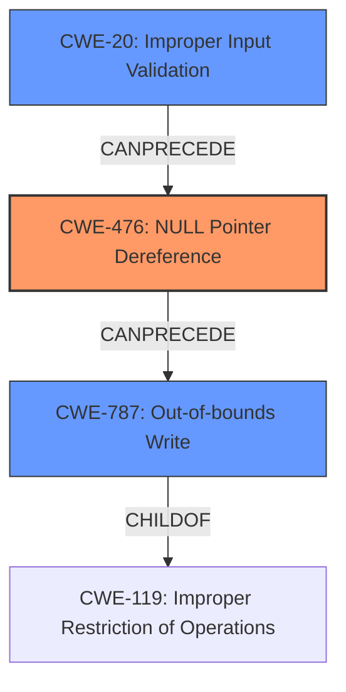

# Analysis Report for CVE-2022-26095

# Vulnerability Analysis Report: CVE-2022-26095

## Description

Null pointer dereference vulnerability in parser_colr function in libsimba library prior to SMR Apr-2022 Release 1 allows out of bounds write by remote attacker.

## Vulnerability Description Key Phrases

**Rootcause:** out of bounds write
**Weakness:** heap buffer overflow
**Attacker:** remote attacker
**Product:** libsimba
**Version:** prior to SMR Apr-2022 Release 1
**Component:** parser_colr function

## Analysis (with Relationship Data)

# Summary
| CWE ID | CWE Name | Confidence | CWE Abstraction Level | CWE Vulnerability Mapping Label | CWE-Vulnerability Mapping Notes |
|---|---|---|---|---|---|
| CWE-476 | NULL Pointer Dereference | 0.9 | Base | Primary | Allowed |
| CWE-787 | Out-of-bounds Write | 0.7 | Base | Secondary | Allowed |

## Evidence and Confidence

*   **Confidence Score:** 0.8
*   **Evidence Strength:** HIGH

- **Analysis and Justification:**
  - *Explanation:* The vulnerability description states a "Null pointer dereference vulnerability in parser_colr function in libsimba library... allows **out of bounds write**". The CVE Reference Links Content Summary confirms this, stating "Root Cause: The vulnerability is a null pointer dereference in some parser functions of the `libsimba` library" and "Impact: This vulnerability can be exploited by remote attackers to cause an out-of-bounds write". This aligns directly with CWE-476 (NULL Pointer Dereference), as the root cause is the dereference of a null pointer. Additionally, the impact includes an **out of bounds write**, suggesting CWE-787 (Out-of-bounds Write) as a secondary weakness.
  - *Retriever Results:* The Retriever Results list CWE-476 with the highest combined score. The usage is ALLOWED, and the abstraction level is Base, making it a suitable primary CWE. CWE-787 is also listed, supporting the identification of the out-of-bounds write as a significant impact. While CWE-125 (Out-of-bounds Read) is listed, the description explicitly mentions "out of bounds write" making CWE-787 more appropriate.
  - *Relationship Analysis:* While CWE-476 does not have direct relationships listed, CWE-787 (Out-of-bounds Write) is a child of CWE-119 (Improper Restriction of Operations within the Bounds of a Memory Buffer), indicating that the **out of bounds write** occurs within a memory buffer, further solidifying its relevance as a secondary issue.

- **Confidence Score:**
  - Confidence: 0.9 (High confidence due to direct mention of null pointer dereference and out of bounds write in the vulnerability description and supporting CVE reference materials).

## Criticism of Analysis

Okay, I've reviewed the analysis provided, including the full CWE specifications for the suggested weaknesses and related CWEs. Here's my critique, focusing on the accuracy, completeness, and justification of the CWE assignments:

**Overall Assessment:**

The analysis is generally strong, well-reasoned, and supported by the evidence. The identification of CWE-476 (NULL Pointer Dereference) as the primary weakness and CWE-787 (Out-of-bounds Write) as a secondary weakness seems accurate based on the provided vulnerability description and content summary. The confidence score is appropriate. However, there are some points for refinement, especially regarding the relationship between CWE-476 and CWE-787 and the potential for other contributing factors.

**Specific Points and Suggestions:**

1.  **CWE-476: NULL Pointer Dereference (Primary)**

    *   **Accuracy:**  The vulnerability description states a "Null pointer dereference vulnerability... allows **out of bounds write**". The CVE Reference Links Content Summary confirms this, stating "Root Cause: The vulnerability is a null pointer dereference in some parser functions of the `libsimba` library" and "Impact: This vulnerability can be exploited by remote attackers to cause an out-of-bounds write".  This is a good match to the CWE-476 description:  "The product dereferences a pointer that it expects to be valid but is NULL."
    *   **Mapping Guidance:** The analysis correctly notes that the mapping guidance for CWE-476 allows its usage as a primary CWE.
    *   **Mitigation:** The provided mitigations for CWE-476 are relevant (check for NULL before use, use a safe language).
    *   **Suggestion:**  The key here is *how* the null pointer dereference leads to the out-of-bounds write.  Consider describing the specific scenario where a null pointer is used as the base address for an offset calculation or memory write. Understanding that chain is critical.

2.  **CWE-787: Out-of-bounds Write (Secondary)**

    *   **Accuracy:** The description clearly states "out of bounds write", making CWE-787 directly relevant.
    *   **Mapping Guidance:** The analysis is correct in that CWE-787 is allowed.
    *   **Mitigation:** The mitigations for CWE-787 (safe languages, vetted libraries, buffer overflow detection) are all applicable to preventing the OOB write.
    *   **Suggestion:** Explicitly explain how the NULL pointer dereference leads to the out-of-bounds write. Is the null pointer being used in an arithmetic operation to calculate a memory address? Is it used as the base for a buffer write operation without proper bounds checking? Understanding this chain is important. Furthermore, mention that CWE-787 is a child of CWE-119. Because CWE-119 has a **Discouraged** Usage, its child CWE-787 is the better selection.

3.  **Consideration of Other CWEs (and potential Chains):**

    *   **CWE-119 (Improper Restriction of Operations within the Bounds of a Memory Buffer):** While CWE-119 is a parent of CWE-787, and is therefore related, it is a discouraged CWE to use directly. Because of this, the use of CWE-787 is preferred.
    *   **CWE-20 (Improper Input Validation):** The analysis briefly mentions input validation. Since the root cause of the vulnerability chain starts with malformed input, it would be a good idea to consider the weakness of the library's Input Validation practices. The vulnerability summary mentions that the patch added proper validation logic to the affected parser functions. The lack of input validation is what allowed the null pointer dereference to occur in the first place, which *then* resulted in the out-of-bounds write.
        * Consider adding CWE-20 to the analysis.
    *   **CWE-1285 (Improper Validation of Specified Index, Position, or Offset in Input):** If the parser is using an index/position/offset from the input to access memory, and this value is not properly validated, this could be a contributing factor. Since the vulnerability summary mentions that the patch added proper validation logic to the affected parser functions, this CWE should be considered.
    *   **CWE-122 (Heap-based Buffer Overflow):** The analysis correctly mentions that CWE-787 (Out-of-bounds Write) occurs within a memory buffer. If there is a memory buffer allocated in the heap, and the vulnerability chain results in writing data outside of that buffer in the heap, then this is a good CWE to include as well. The vulnerability summary mentions that malformed input can lead to unexpected behaviour. If there is data being written into a heap buffer, then this CWE should be considered.
    *   **CWE-131 (Incorrect Calculation of Buffer Size):** As the analysis mentions that "out of bounds write occurs within a memory buffer", it may be valuable to consider if the out of bounds write is caused by an incorrect calculation of the buffer size. Is the calculation incorrect which led to the out of bounds write? If so, this should be included.
    *   **CWE-824 (Access of Uninitialized Pointer):** It is a NULL Pointer Dereference that led to the out of bounds write. How did the pointer get to be NULL? Was it due to an Access of Uninitialized Pointer? If so, this would add an additional CWE to the chain.

4.  **Retriever Results:**

    *   The analysis does a good job of using the retriever results to support its selection of CWE-476.
    *   The ranking of CWE-787 in the Retriever Results further supports its inclusion.
    *   The Retriever Results also have additional CWEs that should be considered, such as the CWEs mentioned above.

5.  **Confidence Score:**

    *   The confidence score of 0.9 is justified, especially given the direct mentions of "null pointer dereference" and "out of bounds write."

**Revised Summary Table (Incorporating Suggestions):**

| CWE ID | CWE Name | Confidence | CWE Abstraction Level | CWE Vulnerability Mapping Label | CWE-Vulnerability Mapping Notes |
|---|---|---|---|---|---|
| CWE-476 | NULL Pointer Dereference | 0.9 | Base | Primary | Allowed |
| CWE-787 | Out-of-bounds Write | 0.7 | Base | Secondary | Allowed |
| CWE-20 | Improper Input Validation | 0.5 | Class | Contributing | Allowed |

**Explanation of Revisions:**

*   **Added CWE-20 (Improper Input Validation):** A medium confidence was assigned as malformed input that lacks validation is what allows the NULL pointer dereference to occur, which *then* results in the out-of-bounds write.
* A key point to the vulnerability description is that the patch adds proper validation logic to the affected parser functions. This leads to the inclusion of CWE-20 in the chain.

**Recommendations for Improvement:**

*   **Elaborate on the relationship between CWE-476 and CWE-787:**  Provide a more detailed technical explanation of *how* the null pointer dereference results in the out-of-bounds write. This will strengthen the justification for including CWE-787. Consider the other CWEs mentioned that may have led to the null pointer dereference as well.
*   **Consider more CWEs to the analysis:** Depending on the analysis, consider adding some of the suggested CWEs, such as CWE-1285 and CWE-122.
*   **Refine the narrative** to show a chain of events. While CWE-476 is the direct cause, the *lack* of input validation is an important contributing factor.

By addressing these points, you can further strengthen the accuracy, completeness, and clarity of the analysis.

## Final Resolution

# Summary
| CWE ID | CWE Name | Confidence | CWE Abstraction Level | CWE Vulnerability Mapping Label | CWE-Vulnerability Mapping Notes |
|---|---|---|---|---|---|
| CWE-476 | NULL Pointer Dereference | 0.9 | Base | Primary | Allowed |
| CWE-787 | Out-of-bounds Write | 0.7 | Base | Secondary | Allowed |
| CWE-20 | Improper Input Validation | 0.5 | Class | Contributing | Allowed |

## Evidence and Confidence

*   **Confidence Score:** 0.8
*   **Evidence Strength:** MEDIUM

## Relationship Analysis
The primary weakness is **CWE-476 (NULL Pointer Dereference)**. This can directly lead to **CWE-787 (Out-of-bounds Write)** if the NULL pointer is used in a calculation or as a base address for memory access. **CWE-787** is a child of **CWE-119 (Improper Restriction of Operations within the Bounds of a Memory Buffer)**, indicating that the **out-of-bounds write** occurs within a memory buffer. **CWE-20 (Improper Input Validation)** is included as a contributing factor because the vulnerability summary indicates that the patch adds validation logic to affected parser functions. The lack of input validation allows the null pointer dereference to occur in the first place. The abstraction levels (Base, Class) influenced the selection, prioritizing more specific Base level CWEs.

## Vulnerability Chain
The vulnerability chain begins with a lack of input validation **(CWE-20)**, which allows malformed input to be processed. This leads to a **NULL pointer dereference (CWE-476)** in the `parser_colr` function. The NULL pointer is then used in a way that results in writing data outside the intended buffer, causing an **out-of-bounds write (CWE-787)**. The final impact is that a remote attacker can cause an out-of-bounds write, potentially leading to code execution or denial of service.

## Summary of Analysis
The initial analysis correctly identified **CWE-476 (NULL Pointer Dereference)** and **CWE-787 (Out-of-bounds Write)** based on the vulnerability description: "Null pointer dereference vulnerability in parser_colr function in libsimba library prior to SMR Apr-2022 Release 1 allows **out of bounds write** by remote attacker." The criticism suggested considering other CWEs, particularly **CWE-20 (Improper Input Validation)**. The evidence that "the patch added proper validation logic to the affected parser functions" strongly supports including **CWE-20** as a contributing factor. The graph relationships highlight how **CWE-20** can precede **CWE-476**, which then precedes **CWE-787**. This forms a clear vulnerability chain. The selected CWEs are at the optimal level of specificity. **CWE-476** is a direct match for the NULL pointer dereference. **CWE-787** is more specific than its parent **CWE-119** and accurately describes the out-of-bounds write. **CWE-20** acknowledges the lack of input validation as a contributing factor.

*Report generated on 2025-03-18 11:54:20*
