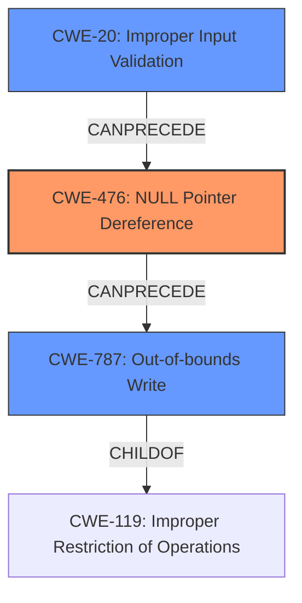

# Final Resolution for CVE-2022-26095

# Summary
| CWE ID | CWE Name | Confidence | CWE Abstraction Level | CWE Vulnerability Mapping Label | CWE-Vulnerability Mapping Notes |
|---|---|---|---|---|---|
| CWE-476 | NULL Pointer Dereference | 0.9 | Base | Primary | Allowed |
| CWE-787 | Out-of-bounds Write | 0.7 | Base | Secondary | Allowed |
| CWE-20 | Improper Input Validation | 0.5 | Class | Contributing | Allowed |

## Evidence and Confidence

*   **Confidence Score:** 0.8
*   **Evidence Strength:** MEDIUM

## Relationship Analysis
The primary weakness is **CWE-476 (NULL Pointer Dereference)**. This can directly lead to **CWE-787 (Out-of-bounds Write)** if the NULL pointer is used in a calculation or as a base address for memory access. **CWE-787** is a child of **CWE-119 (Improper Restriction of Operations within the Bounds of a Memory Buffer)**, indicating that the **out-of-bounds write** occurs within a memory buffer. **CWE-20 (Improper Input Validation)** is included as a contributing factor because the vulnerability summary indicates that the patch adds validation logic to affected parser functions. The lack of input validation allows the null pointer dereference to occur in the first place. The abstraction levels (Base, Class) influenced the selection, prioritizing more specific Base level CWEs.

## Vulnerability Chain
The vulnerability chain begins with a lack of input validation **(CWE-20)**, which allows malformed input to be processed. This leads to a **NULL pointer dereference (CWE-476)** in the `parser_colr` function. The NULL pointer is then used in a way that results in writing data outside the intended buffer, causing an **out-of-bounds write (CWE-787)**. The final impact is that a remote attacker can cause an out-of-bounds write, potentially leading to code execution or denial of service.

## Summary of Analysis
The initial analysis correctly identified **CWE-476 (NULL Pointer Dereference)** and **CWE-787 (Out-of-bounds Write)** based on the vulnerability description: "Null pointer dereference vulnerability in parser_colr function in libsimba library prior to SMR Apr-2022 Release 1 allows **out of bounds write** by remote attacker." The criticism suggested considering other CWEs, particularly **CWE-20 (Improper Input Validation)**. The evidence that "the patch added proper validation logic to the affected parser functions" strongly supports including **CWE-20** as a contributing factor. The graph relationships highlight how **CWE-20** can precede **CWE-476**, which then precedes **CWE-787**. This forms a clear vulnerability chain. The selected CWEs are at the optimal level of specificity. **CWE-476** is a direct match for the NULL pointer dereference. **CWE-787** is more specific than its parent **CWE-119** and accurately describes the out-of-bounds write. **CWE-20** acknowledges the lack of input validation as a contributing factor.