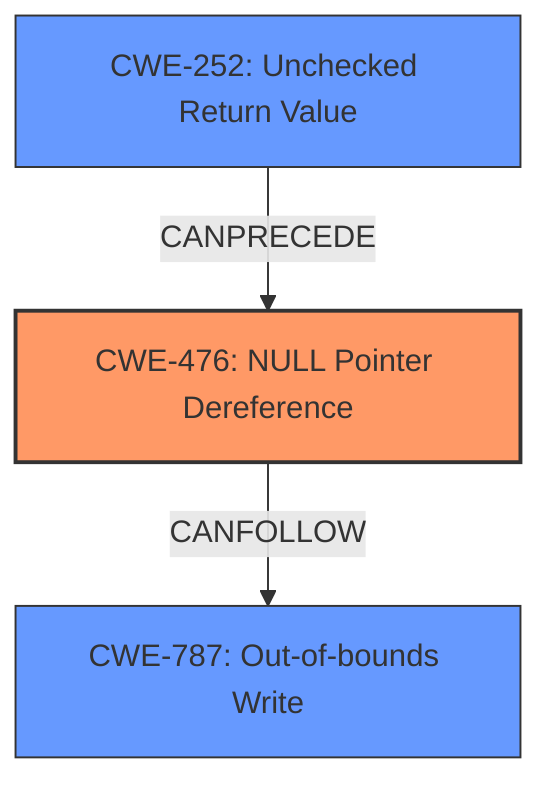

# Final Resolution for CVE-2022-26096

# Summary
| CWE ID | CWE Name | Confidence | CWE Abstraction Level | CWE Vulnerability Mapping Label | CWE-Vulnerability Mapping Notes |
|---|---|---|---|---|---|
| CWE-476 | NULL Pointer Dereference | 0.9 | Base | Allowed | Primary CWE |
| CWE-787 | Out-of-bounds Write | 0.6 | Base | Allowed | Secondary Candidate |
| CWE-252 | Unchecked Return Value | 0.4 | Base | Allowed | Secondary Candidate |

## Evidence and Confidence

*   **Confidence Score:** 0.8
*   **Evidence Strength:** MEDIUM

## Relationship Analysis
The primary weakness is CWE-476 (**NULL** Pointer Dereference), which can lead to CWE-787 (**Out-of-bounds Write**). CWE-476 is a base-level CWE, which is the preferred level of abstraction. The analysis also considered CWE-252 (**Unchecked Return Value**) as a potential contributing factor if a failed function call results in the **NULL** pointer. These CWEs are related through the chain of events leading to the vulnerability.

## Vulnerability Chain
The vulnerability chain starts with a potential **root cause**, such as an unchecked return value (CWE-252), leading to a **NULL** pointer. The dereference of this **NULL** pointer (CWE-476) results in an **out-of-bounds write** (CWE-787).

## Summary of Analysis
The initial analysis correctly identified CWE-476 as the primary weakness due to the explicit mention of "**NULL** pointer dereference" in the vulnerability description. The criticism suggested removing CWE-416 due to lack of evidence and replacing CWE-119 with CWE-787. It also recommended investigating the cause of the **NULL** pointer to increase the confidence score.

Based on the evidence, CWE-416 was removed. CWE-119 was replaced with CWE-787, since the vulnerability description mentions an "**out of bounds write**" as a consequence of the **NULL** pointer dereference.

To further investigate the cause of the **NULL** pointer, CWE-252 (**Unchecked Return Value**) was added as a secondary candidate, assuming that the **NULL** pointer could be the result of a failed function call. However, without further information, this remains speculative.

The selected CWEs are at the optimal level of specificity, with CWE-476 being the direct cause, CWE-787 being a consequence, and CWE-252 being a possible contributing factor.

Confidence was increased to 0.9 for CWE-476 and 0.6 for CWE-787 as the secondary weakness. A lower confidence of 0.4 was assigned to CWE-252, as it is speculative.

The analysis is based on the provided evidence and the relationships between CWEs. The selection of CWEs reflects the optimal level of specificity based on available information.