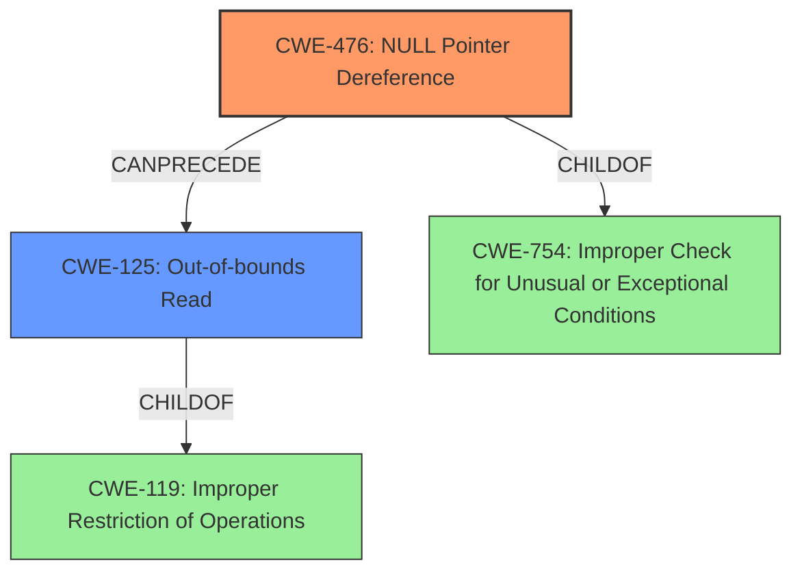

# Analysis Report for CVE-2022-26099

# Vulnerability Analysis Report: CVE-2022-26099

## Description

Null pointer dereference vulnerability in parser_infe function of libsimba library prior to SMR Apr-2022 Release 1 allows out of bounds read by remote attackers.

## Vulnerability Description Key Phrases

**Rootcause:** Null pointer dereference
**Impact:** out of bounds read
**Attacker:** remote attacker
**Product:** libsimba library
**Version:** prior to SMR Apr-2022 Release 1
**Component:** parser_infe function

## Analysis (with Relationship Data)

# Summary
| CWE ID | CWE Name | Confidence | CWE Abstraction Level | CWE Vulnerability Mapping Label | CWE-Vulnerability Mapping Notes |
|---|---|---|---|---|---|
| CWE-476 | NULL Pointer Dereference | 1.0 | Base | Allowed | Primary CWE |
| CWE-125 | Out-of-bounds Read | 0.4 | Base | Allowed | Secondary Candidate |

## Evidence and Confidence

*   **Confidence Score:** 0.9
*   **Evidence Strength:** HIGH

- **Analysis and Justification:**  
  - *Explanation:* The vulnerability description explicitly states "**Null pointer dereference** vulnerability" in the `parser_infe` function, which directly aligns with CWE-476 (NULL Pointer Dereference). The CVE Reference Links Content Summary reinforces this by stating the "root_cause" is "Null pointer dereference vulnerability". CWE-476 is a Base level CWE, which is a preferred level of abstraction. The usage is ALLOWED according to MITRE mapping guidance. The impact of the vulnerability is an "out of bounds read", but the root cause is the **null pointer dereference**, making CWE-476 the more appropriate primary mapping. The retriever results give CWE-476 the highest score, reinforcing this decision.

  - *Relationship Analysis:* CWE-476 is a child of CWE-754 (Improper Check for Unusual or Exceptional Conditions). While CWE-754 is a broader category, the description specifically mentions a null pointer, making the more specific CWE-476 a better fit.

- **Confidence Score:**  
  - Confidence: 1.0 (Direct match between vulnerability description and CWE definition)

---

- **Analysis and Justification:**  
  - *Explanation:* The vulnerability description indicates that the **null pointer dereference** leads to an "out of bounds read". CWE-125 (Out-of-bounds Read) describes a scenario where the product reads data past the end, or before the beginning, of the intended buffer. While the root cause is the null pointer dereference (CWE-476), the resulting impact is the out-of-bounds read. Because the vulnerability description highlights the out-of-bounds read as the immediate consequence of the null pointer dereference, I'm including CWE-125 as a secondary candidate. However, since the root cause is well-defined, I am classifying CWE-476 as the primary weakness.

  - *Relationship Analysis:* CWE-125 is a child of CWE-119 (Improper Restriction of Operations within the Bounds of a Memory Buffer), which is a Class-level CWE. CWE-125 is more specific and provides a better characterization of the vulnerability's impact.

- **Confidence Score:**  
  - Confidence: 0.4 (Moderate confidence due to the impact being described, but rootcause is the primary driver)

## Criticism of Analysis

Okay, I've reviewed the analysis against the provided full CWE specifications. Here's my critique, focusing on the accuracy, completeness, and justification of the CWE mappings, along with considerations for the mapping guidance and potential mitigations of the selected CWEs.

**Overall Assessment:**

The analysis is generally good and well-reasoned. The primary mapping to CWE-476 (NULL Pointer Dereference) is highly appropriate and strongly justified. The secondary mapping to CWE-125 (Out-of-bounds Read) is also reasonable, although its lower confidence is correctly reflected. The evidence provided for each mapping is clear and relevant.

**Detailed Critique:**

**1. CWE-476: NULL Pointer Dereference (Primary Mapping)**

*   **Accuracy:** Excellent. The vulnerability description explicitly states "Null pointer dereference," making this a direct and accurate match. The CVE Reference Links Content Summary reinforces this.
*   **Completeness:** Very Good. The analysis acknowledges the relationship to the broader CWE-754 (Improper Check for Unusual or Exceptional Conditions), but correctly argues for the more specific CWE-476.
*   **Justification:**  The justification is clear and well-articulated, emphasizing the explicit mention of "Null pointer dereference" in the vulnerability description, the reinforcement from the CVE summary, and the base-level abstraction.
*   **Mapping Guidance:** The analysis correctly notes that CWE-476 is at the Base level of abstraction, which is preferred. The analysis also accurately reflects the Allowed Usage.
*   **Potential Mitigations:** The analysis doesn't specifically mention mitigations, which could be seen as a very minor issue. However, the focus is on the root cause, and the mitigations for CWE-476 are fairly standard (null checks, language selection). While not necessary, the analysis could mention a mitigation such as: "Implementing null checks before dereferencing pointers within the `parser_infe` function can prevent this vulnerability."
*   **Confidence Score:** The confidence score of 1.0 is justified, given the direct match.

**2. CWE-125: Out-of-bounds Read (Secondary Mapping)**

*   **Accuracy:** Good. The "impact" of the null pointer dereference is indeed an out-of-bounds read.  This makes CWE-125 a relevant consequence, but not the root cause.
*   **Completeness:** Good. The analysis acknowledges that CWE-125 is a consequence and not the direct cause.
*   **Justification:** The justification clearly explains the "chain" of events: the null pointer dereference *leads to* an out-of-bounds read. This distinguishes it from cases where the out-of-bounds read is caused by something else, like an incorrect index calculation.
*   **Mapping Guidance:**  The analysis correctly implies that CWE-125 is an acceptable mapping as it's at the Base level of abstraction.
*   **Potential Mitigations:** Similar to CWE-476, the analysis could mention potential mitigations.  For CWE-125, input validation is particularly relevant. For example, "Ensuring proper input validation to prevent unexpected null pointers can mitigate the out-of-bounds read that arises from the null pointer dereference."

*   **Relationship Analysis:** The analysis mentions that CWE-125 is a child of CWE-119, and is more specific, which is appropriate.
*   **Confidence Score:** The confidence score of 0.4 is appropriate, as it's a secondary effect. The root cause is clearly the null pointer dereference.

**Minor Suggestions:**

*   **Mitigation Considerations:** While the analysis focuses on root cause, briefly mentioning potential mitigations for both CWEs (as suggested above) would strengthen the analysis. This demonstrates a holistic understanding of the vulnerability and potential solutions.
*   **Consider Chaining:** Although the analysis correctly identifies the individual weaknesses, explicitly framing them as a *chain* could be beneficial. For example: "This vulnerability can be viewed as a chain: CWE-476 (NULL Pointer Dereference) *leads to* CWE-125 (Out-of-bounds Read)." This emphasizes the causal relationship.

**Retriever Results:**

The analysis aligns well with the Retriever Results, which gave CWE-476 the highest score.

**Conclusion:**

The analysis is well-structured, accurate, and thoroughly justified. The selection of CWE-476 as the primary mapping is correct, and the inclusion of CWE-125 as a secondary candidate demonstrates a good understanding of the vulnerability's impact. Incorporating the minor suggestions regarding mitigations and explicitly stating the chain relationship would further enhance the analysis.

## Final Resolution

# Summary
| CWE ID | CWE Name | Confidence | CWE Abstraction Level | CWE Vulnerability Mapping Label | CWE-Vulnerability Mapping Notes |
|---|---|---|---|---|---|
| CWE-476 | **NULL Pointer Dereference** | 1.0 | Base | Allowed | Primary CWE |
| CWE-125 | **Out-of-bounds Read** | 0.4 | Base | Allowed | Secondary Candidate |

## Evidence and Confidence

*   **Confidence Score:** 0.95
*   **Evidence Strength:** HIGH

## Relationship Analysis
The primary relationship influencing the decision is the chain relationship where the **CWE-476 (NULL Pointer Dereference)** directly leads to **CWE-125 (Out-of-bounds Read)**. **CWE-476** is a child of **CWE-754 (Improper Check for Unusual or Exceptional Conditions)**, but **CWE-476** is more specific and directly reflects the vulnerability description. **CWE-125** is a child of **CWE-119 (Improper Restriction of Operations within the Bounds of a Memory Buffer)**, and its inclusion captures the impact of the **null pointer dereference**.

## Vulnerability Chain
The vulnerability chain starts with a **NULL Pointer Dereference (CWE-476)**. The product attempts to dereference a pointer that is unexpectedly NULL. This leads directly to an **Out-of-bounds Read (CWE-125)** because the program attempts to access memory at an invalid address, resulting in the program reading data from outside the intended buffer.

## Summary of Analysis
The initial analysis and criticism both align well. The vulnerability description explicitly mentions "**Null pointer dereference** vulnerability," which strongly supports the selection of **CWE-476**. The description also states that this **null pointer dereference** leads to an "out of bounds read", which is why **CWE-125** is a secondary candidate. The graph relationships reinforce this by showing how **CWE-476** can directly precede **CWE-125**. Both CWEs are at the Base level of abstraction, as recommended by MITRE's mapping guidance. The final decision is based on the evidence from the vulnerability description and is supported by the retriever results, making the selected CWEs the most appropriate and specific. The suggested addition of mitigations strengthens the analysis, demonstrating a more complete understanding of the vulnerability and potential solutions.

*   Evidence: "Null pointer dereference vulnerability in parser_infe function of libsimba library prior to SMR Apr-2022 Release 1 allows out of bounds read by remote attackers."

*Report generated on 2025-03-18 11:57:00*
