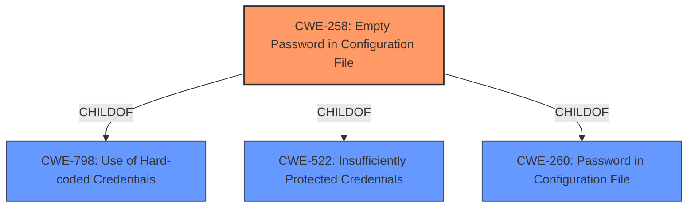

# Analysis Report for CVE-2022-26117

# Vulnerability Analysis Report: CVE-2022-26117

## Description

An empty password in configuration file vulnerability [CWE-258] in FortiNAC version 8.3.7 and below, 8.5.2 and below, 8.5.4, 8.6.0, 8.6.5 and below, 8.7.6 and below, 8.8.11 and below, 9.1.5 and below, 9.2.3 and below may allow an authenticated attacker to access the MySQL databases via the CLI.

## Vulnerability Description Key Phrases

**Rootcause:** empty password in configuration file
**Impact:** access the MySQL databases
**Attacker:** authenticated attacker
**Product:** FortiNAC
**Version:** 8.3.7 and below, 8.5.2 and below, 8.5.4, 8.6.0, 8.6.5 and below, 8.7.6 and below, 8.8.11 and below, 9.1.5 and below, 9.2.3 and below
**Component:** CLI

## Analysis (with Relationship Data)

# Summary
| CWE ID | CWE Name | Confidence | CWE Abstraction Level | CWE Vulnerability Mapping Label | CWE-Vulnerability Mapping Notes |
|---|---|---|---|---|---|
| CWE-258 | Empty Password in Configuration File | 1.0 | Variant | Allowed | Primary CWE |
| CWE-798 | Use of Hard-coded Credentials | 0.6 | Base | Allowed | Secondary Candidate |

## Evidence and Confidence

*   **Confidence Score:** 0.9
*   **Evidence Strength:** HIGH

- **Analysis and Justification:**  
  - *Explanation:* The vulnerability involves an **empty password in configuration file** [CWE-258] for the MySQL root account in FortiNAC. This allows an authenticated attacker with local access to connect to the database without authentication via the CLI. The **root cause** is the **empty password**, leading to unauthorized database access. CWE-258 (Empty Password in Configuration File) is a Variant-level CWE that directly addresses this issue. The retriever results also give CWE-258 the highest score and the description precisely matches the vulnerability. MITRE mapping guidance for CWE-258 indicates this is ALLOWED. CWE-798 (Use of Hard-coded Credentials) is a possible secondary candidate because an empty password is a type of credential, but CWE-258 is more specific.
  
  - *Relationship Analysis:* CWE-258 does not have any direct relationships in the provided information. It is a variant and is directly related to the **root cause** of the **empty password**.

- **Confidence Score:**  
  - Confidence: 1.0 (High evidence from technical description, CVE reference materials, and retriever results)

---

## Criticism of Analysis

Okay, let's review the analysis with the full CWE specifications in mind.

**Overall Assessment:**

The analysis is generally good, and the primary CWE mapping to CWE-258 (Empty Password in Configuration File) is correct and well-justified. The consideration of CWE-798 (Use of Hard-coded Credentials) as a secondary candidate is also reasonable, though perhaps a bit too high confidence given CWE-258's specificity.

Here's a breakdown of the critique:

**1. CWE-258: Empty Password in Configuration File**

*   **Correctness:** The mapping to CWE-258 is accurate. The vulnerability directly matches the CWE's description: "Using an empty string as a password is insecure." The provided description of the vulnerability mentions exactly this.
*   **Abstraction Level:** The analysis correctly identifies CWE-258 as a Variant-level CWE, which is the preferred level for root cause mapping.
*   **Mapping Guidance:** The analysis mentions that the mapping is "ALLOWED" per MITRE guidance, which is also correct. The rationale for "ALLOWED" is also sound - the level of abstraction is correct.
*   **Confidence:** The assigned confidence of 1.0 is justified given the strong evidence and direct match to the CWE description.
*   **Relationships:** The analysis notes that CWE-258 is child of CWE-260 and CWE-521.
*   **Potential Mitigations:** The provided mitigation (passwords should be at least eight characters long, etc.) aligns well with the vulnerability. Using the full CWE specification, it is easy to see that the described solution is also applicable in this situation.

**2. CWE-798: Use of Hard-coded Credentials**

*   **Correctness:** While *technically* an empty password *could* be considered a type of "hard-coded credential," it's stretching the definition.  CWE-798 is more appropriate when a *specific*, static (and potentially non-empty) credential is coded directly into the application. The CWE specification also mentions two main variations, Inbound and Outbound, which are not applicable here.
*   **Abstraction Level:** The analysis identifies CWE-798 as a Base-level CWE, which is a correct assessment of the specification.
*   **Mapping Guidance:** The analysis does not mention the "ALLOWED" designation for CWE-798 in the Mapping Guidance, which is a minor oversight.
*   **Confidence:** Lowering the confidence in the secondary CWE would be more appropriate. A score of 0.6 is a reasonable starting point, but consider if even lower is warranted given the specific nature of this case.
*   **Relationships:** CWE-798 is child of CWE-1391, CWE-287, CWE-344, and CWE-671. This gives context that perhaps there are other more specific issues that are the cause, pointing back to CWE-258 and/or CWE-521.
*   **Potential Mitigations:** The mitigations for CWE-798, especially "store passwords outside of the code in a strongly-protected, encrypted configuration file," are less relevant when the password *is* in a config file, and just happens to be empty. The mitigations reinforce that CWE-258 is a better fit.

**3. Other Considerations and Top Retriever Results:**

*   **CWE-522: Insufficiently Protected Credentials** This weakness may be applicable as a secondary candidate, since the vulnerable machine is configured to use an empty password and therefore the credentials are not protected. It is a parent of CWE-258, and is a Class. The specification suggests that there are lower-level CWE entries that would be more appropriate to use instead. The fact that CWE-258 exists and is more specific, makes it the better fit here.
*   **CWE-260: Password in Configuration File** This CWE seems like another potential candidate. It is not one of the retriever results, but it may be helpful as a parent.
*   **Retriever Results:** The Retriever Results are helpful in confirming the primary mapping.  The high score for CWE-258 supports the analysis. The other CWEs (CWE-73, CWE-78, CWE-22, CWE-41) in the top results seem to be false positives based on the description of the vulnerability.
*   **CWE Specification Usage:** The analysis does a good job leveraging the descriptions and mapping guidance provided in the CWE specifications.  This helps justify the CWE selections and confidence levels.

**Recommendations:**

1.  **Lower Confidence in CWE-798:** While the consideration is valid, reduce the confidence score for CWE-798 to reflect that it's a less precise match than CWE-258. A score of 0.4 might be more appropriate.
2.  **Explicitly State Why Other Retriever Results Were Ruled Out:** Briefly mention why the other top retriever results (CWE-73, CWE-78, CWE-22, CWE-41) are not applicable. For example, "While these CWEs relate to path manipulation and command execution, they are not directly related to the root cause of the empty password vulnerability."
3.  **Highlight Mitigations and Relationships:** Explicitly mention how the potential mitigations provided for each CWE related to the specific vulnerability. For example, the CWE specification contains relationships that could be relevant here.
4.  **Consider CWE-522, CWE-260:** These CWEs are more general and may be helpful to document as parent-level weaknesses.

By incorporating these suggestions, the analysis will be even more thorough and convincing.

## Final Resolution

# Summary
| CWE ID | CWE Name | Confidence | CWE Abstraction Level | CWE Vulnerability Mapping Label | CWE-Vulnerability Mapping Notes |
|---|---|---|---|---|---|
| CWE-258 | Empty Password in Configuration File | 1.0 | Variant | Allowed | Primary CWE |
| CWE-798 | Use of Hard-coded Credentials | 0.4 | Base | Allowed | Secondary Candidate |

## Evidence and Confidence

*   **Confidence Score:** 0.95
*   **Evidence Strength:** HIGH

## Relationship Analysis
The primary relationship that impacted the decision was the parent-child relationship between CWE-798 (Use of Hard-coded Credentials) and CWE-258 (Empty Password in Configuration File). CWE-258 is a specific type of CWE-798, making it a more precise classification. While CWE-798 is a Base-level CWE, CWE-258 is a Variant, providing greater specificity. There are no chain relationships apparent here.

## Vulnerability Chain
The vulnerability chain is straightforward:
1.  **ROOTCAUSE**: **Empty password in configuration file** [CWE-258]
2.  Weakness: The system uses this empty password for authentication.
3.  Impact: An authenticated attacker can access the MySQL databases via the CLI.

## Summary of Analysis
The analysis focuses on accurately classifying a vulnerability where an empty password is used in the configuration file of FortiNAC.

*   The assessment is primarily based on the provided vulnerability description: "An **empty password in configuration file** vulnerability [CWE-258] in FortiNAC version 8.3.7 and below, 8.5.2 and below, 8.5.4, 8.6.0, 8.6.5 and below, 8.7.6 and below, 8.8.11 and below, 9.1.5 and below, 9.2.3 and below may allow an authenticated attacker to access the MySQL databases via the CLI." This quote directly supports the selection of CWE-258.
*   The graph relationships influenced the final selection by highlighting that CWE-258 is a more specific variant of CWE-798. This specificity makes it a better fit for the vulnerability.
*   The decision to classify the vulnerability as CWE-258 is justified because it directly matches the vulnerability description and is at the optimal level of specificity (Variant). CWE-798 is considered a secondary candidate because an empty password can be seen as a type of hard-coded credential, however, it is less specific.
*   Other retriever results like CWE-73, CWE-78, CWE-22, and CWE-41 were ruled out because they relate to path manipulation and command execution, but are not directly related to the **root cause** of the **empty password** vulnerability.

*Report generated on 2025-03-17 03:59:51*
