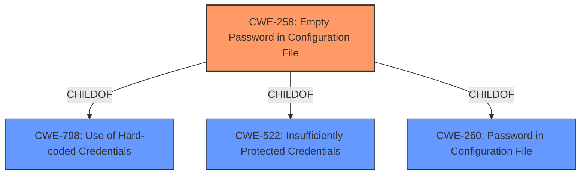

# Final Resolution for CVE-2022-26117

# Summary
| CWE ID | CWE Name | Confidence | CWE Abstraction Level | CWE Vulnerability Mapping Label | CWE-Vulnerability Mapping Notes |
|---|---|---|---|---|---|
| CWE-258 | Empty Password in Configuration File | 1.0 | Variant | Allowed | Primary CWE |
| CWE-798 | Use of Hard-coded Credentials | 0.4 | Base | Allowed | Secondary Candidate |

## Evidence and Confidence

*   **Confidence Score:** 0.95
*   **Evidence Strength:** HIGH

## Relationship Analysis
The primary relationship that impacted the decision was the parent-child relationship between CWE-798 (Use of Hard-coded Credentials) and CWE-258 (Empty Password in Configuration File). CWE-258 is a specific type of CWE-798, making it a more precise classification. While CWE-798 is a Base-level CWE, CWE-258 is a Variant, providing greater specificity. There are no chain relationships apparent here.

## Vulnerability Chain
The vulnerability chain is straightforward:
1.  **ROOTCAUSE**: **Empty password in configuration file** [CWE-258]
2.  Weakness: The system uses this empty password for authentication.
3.  Impact: An authenticated attacker can access the MySQL databases via the CLI.

## Summary of Analysis
The analysis focuses on accurately classifying a vulnerability where an empty password is used in the configuration file of FortiNAC.

*   The assessment is primarily based on the provided vulnerability description: "An **empty password in configuration file** vulnerability [CWE-258] in FortiNAC version 8.3.7 and below, 8.5.2 and below, 8.5.4, 8.6.0, 8.6.5 and below, 8.7.6 and below, 8.8.11 and below, 9.1.5 and below, 9.2.3 and below may allow an authenticated attacker to access the MySQL databases via the CLI." This quote directly supports the selection of CWE-258.
*   The graph relationships influenced the final selection by highlighting that CWE-258 is a more specific variant of CWE-798. This specificity makes it a better fit for the vulnerability.
*   The decision to classify the vulnerability as CWE-258 is justified because it directly matches the vulnerability description and is at the optimal level of specificity (Variant). CWE-798 is considered a secondary candidate because an empty password can be seen as a type of hard-coded credential, however, it is less specific.
*   Other retriever results like CWE-73, CWE-78, CWE-22, and CWE-41 were ruled out because they relate to path manipulation and command execution, but are not directly related to the **root cause** of the **empty password** vulnerability.