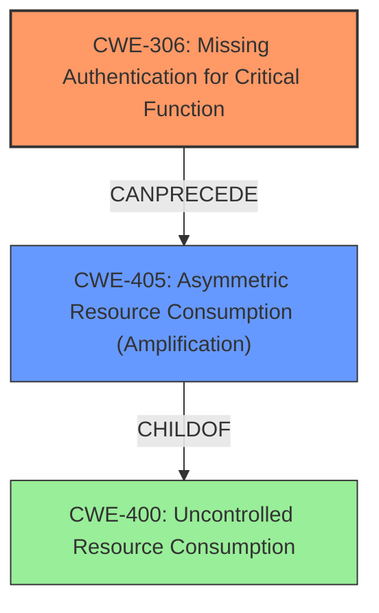

# Analysis Report for CVE-2022-26143

# Vulnerability Analysis Report: CVE-2022-26143

## Description

The TP-240 (aka tp240dvr) component in Mitel MiCollab before 9.4 SP1 FP1 and MiVoice Business Express through 8.1 allows remote attackers to obtain sensitive information and cause a denial of service (performance degradation and excessive outbound traffic). This was exploited in the wild in February and March 2022 for the TP240PhoneHome DDoS attack.

## Vulnerability Description Key Phrases

**Rootcause:** improper access control
**Impact:** denial of service, information disclosure
**Product:** ['Mitel MiCollab', 'MiVoice Business Express']
**Version:** MiCollab before 9.4 SP1 FP1, MiVoice Business Express through 8.1
**Component:** TP-240 (aka tp240dvr) component

## Analysis (with Relationship Data)

# Summary
| CWE ID | CWE Name | Confidence | CWE Abstraction Level | CWE Vulnerability Mapping Label | CWE-Vulnerability Mapping Notes |
|---|---|---|---|---|---|
| CWE-306 | Missing Authentication for Critical Function | 0.95 | Base | Allowed | Primary CWE |
| CWE-400 | Uncontrolled Resource Consumption | 0.70 | Class | Discouraged | Secondary Candidate |
| CWE-200 | Information Exposure | 0.60 | Class | Discouraged | Secondary Candidate |

## Evidence and Confidence

*   **Confidence Score:** 0.85
*   **Evidence Strength:** HIGH

- **Analysis and Justification:**  
  - *Explanation:* The vulnerability description and CVE reference links content summary clearly point to a **lack of authentication** for a critical function, specifically the system test facility in the "tp240dvr" service. This allows unauthenticated attackers to access and abuse the service. This directly aligns with CWE-306 [Missing Authentication for Critical Function], which is a Base level CWE and has an Allowed usage. The CVE summary explicitly states, "Unauthenticated Access: The system test facility, which was not designed for public access, was exposed to the internet without authentication requirements."
  - While the attack leads to a denial-of-service due to the **amplification** of traffic, the root cause is the missing authentication that allows the abuse to occur in the first place. Therefore, CWE-306 is the primary weakness.
  - CWE-400 [Uncontrolled Resource Consumption] is a Class level CWE and is DISCOURAGED. Although the vulnerability leads to resource exhaustion, the primary cause is the missing authentication. CWE-400 would be a secondary consequence, not the root cause.
  - CWE-200 [Information Exposure] is also a Class level CWE and is DISCOURAGED. The vulnerability description mentions "sensitive information" being obtained, but the primary impact is a denial of service. Therefore, CWE-200 would be a secondary consequence.

  - *Relationship Analysis:* CWE-306 [Missing Authentication for Critical Function] is a Base level CWE. The other CWEs considered (CWE-400, CWE-200) are Class level CWEs. CWE-306 is the most precise representation of the **root cause** of the vulnerability, as it describes the lack of authentication that allows the attack to occur.

- **Confidence Score:**
  - Confidence: 0.95 (High confidence due to the direct evidence from the vulnerability description and CVE reference summary, combined with the allowed usage of CWE-306 and its accurate representation of the root cause.)

## Criticism of Analysis

Okay, here's a review of the provided analysis, considering the full CWE specifications:

**Overall Assessment:**

The analysis is strong and well-reasoned. The primary CWE mapping to `CWE-306: Missing Authentication for Critical Function` is accurate and well-supported by the provided evidence.  The analysis correctly identifies why `CWE-400` and `CWE-200` are secondary consequences rather than root causes. The confidence score of 0.95 is justified.

**Detailed Critique:**

1.  **CWE-306: Missing Authentication for Critical Function:**

    *   **Accuracy:** This is the most accurate mapping. The core problem is the lack of authentication for a debug/performance testing facility that should never have been exposed publicly. The description of `CWE-306` perfectly aligns with this: "The product does not perform any authentication for functionality that requires a provable user identity or consumes a significant amount of resources."  The single-threaded nature of the service and its 14 hour attack duration make it meet the "consumes a significant amount of resources" aspect of this definition. The fact that the attack can be launched via a single spoofed packet underscores that authentication is completely absent.
    *   **CWE Specification Alignment:**
        *   **Abstraction Level:** Correctly identified as a Base-level CWE, which is preferred.
        *   **Mapping Guidance:** Aligns with the 'Allowed' usage. The analysis avoids forcing a lower-level mapping and accurately represents the root cause.
        *   **Mitigations:** The suggested mitigations in the CWE specification (dividing software into areas, using centralized authentication, avoiding custom authentication routines) are directly relevant to preventing this type of vulnerability. Specifically, "Identify all potential communication channels...to ensure that all channels are appropriately protected, including those channels that are assumed to be accessible only by authorized parties" is particularly relevant. Mitel's fix of disabling public access directly addresses this.
    *   **Confidence:** The high confidence is warranted due to the direct and explicit evidence.

2.  **CWE-400: Uncontrolled Resource Consumption:**

    *   **Accuracy:** This is a valid *consequence* of the vulnerability, but not the *root cause*.  The analysis correctly identifies that the missing authentication allows the resource consumption to occur.
    *   **CWE Specification Alignment:**
        *   **Usage:** Correctly identified as 'Discouraged'. The analysis acknowledges that `CWE-400` is often misused and that a more precise mapping of the *cause* of the resource consumption is needed.
        *   **Comments:** The analysis correctly points out that a child or descendant of CWE-400 might be applicable, such as CWE-770: Allocation of Resources Without Limits or Throttling, or CWE-405: Asymmetric Resource Consumption (Amplification).
        *   **Mitigations:** While the mitigations for CWE-400 (throttling mechanisms, request rate tracking) would help *reduce* the impact, they don't address the fundamental problem of unauthorized access.
    *   **Suggestion:** If including `CWE-400`, consider mentioning `CWE-405: Asymmetric Resource Consumption (Amplification)` in the notes, as it more directly reflects the nature of the DDoS attack. However, note that this is still a *consequence*, not the root cause.

3.  **CWE-200: Exposure of Sensitive Information to an Unauthorized Actor:**

    *   **Accuracy:**  This is the weakest mapping of the three. While the vulnerability *could* potentially expose some sensitive information (e.g., internal system status, debugging data), the primary impact is denial of service. The "sensitive information" aspect is not the main driver of the vulnerability.
    *   **CWE Specification Alignment:**
        *   **Usage:** Correctly identified as 'Discouraged'. The analysis acknowledges that `CWE-200` is often misused when confidentiality loss is a technical impact.
        *   **Comments:** The analysis correctly suggests looking at improper authorization or authentication as starting points for alternative mappings. In this case, the absence of authentication is the primary weakness.
        *   **Mitigations:** The mitigations for `CWE-200` (compartmentalization, privilege separation) are less directly applicable than those for `CWE-306`.
    *   **Recommendation:**  It's better to exclude `CWE-200` entirely, as it distracts from the primary root cause.  The vulnerability is not fundamentally about mishandling or exposing specific data, but about a lack of control over who can access a resource.

**Retriever Results Review**

The Retriever Results show some interesting, even if imperfect, suggestions.
*   **CWE-306:** A solid choice that aligns to the full analysis.
*   **CWE-250 Execution with Unnecessary Privileges:** This is not related, as it is not a vulnerability based on running a function with a higher privilege than expected.
*   **CWE-321 Use of Hard-coded Cryptographic Key & CWE-259 Use of Hard-coded Password:** This is not related, as the vulnerability has nothing to do with hardcoded secrets.
*   **CWE-22 Path Traversal:** This is not related, as it does not relate to path restrictions.
*   **CWE-732 Incorrect Permission Assignment for Critical Resource:** This could be related in the sense that you could view the service as having overly-permissive access restrictions.
*   **CWE-400 Uncontrolled Resource Consumption:** As discussed, this is a consequence of the vulnerability, but not a root cause.
*   **CWE-287 Improper Authentication:** A good option as it aligns with authentication issues, but less specific than CWE-306.
*   **CWE-269 Improper Privilege Management:** This is not applicable.
*   **CWE-20 Improper Input Validation:** This is not applicable.

**Recommendations:**

*   **Maintain the focus on CWE-306 as the primary mapping.**  The analysis already does a good job of justifying this.
*   **Remove CWE-200.** It's not a strong fit and can dilute the analysis.
*   **Consider adding CWE-405** in the notes when describing why CWE-400 is present.

By following these recommendations, the analysis will be even more focused and accurate in its representation of the vulnerability.

## Final Resolution

# Summary
| CWE ID | CWE Name | Confidence | CWE Abstraction Level | CWE Vulnerability Mapping Label | CWE-Vulnerability Mapping Notes |
|---|---|---|---|---|---|
| **CWE-306** | **Missing Authentication for Critical Function** | 0.95 | Base | Allowed | Primary CWE |
| **CWE-405** | **Asymmetric Resource Consumption (Amplification)** | 0.70 | Base | Allowed | Secondary Candidate |

## Evidence and Confidence

*   **Confidence Score:** 0.95
*   **Evidence Strength:** HIGH

## Relationship Analysis
The primary CWE is **CWE-306** [**Missing Authentication for Critical Function**], which is a Base level CWE, preferred for its specificity. **CWE-405** [**Asymmetric Resource Consumption (Amplification)**] is also a Base level CWE, and represents the amplification aspect of the denial-of-service attack, which is a consequence of the missing authentication. **CWE-200** [**Information Exposure**] was considered but discarded as the exposure of sensitive information is not the primary driver of the vulnerability.

## Vulnerability Chain
The vulnerability chain starts with **CWE-306** [**Missing Authentication for Critical Function**], which allows unauthenticated access to a system test facility. This leads to **CWE-405** [**Asymmetric Resource Consumption (Amplification)**], where attackers can amplify their traffic, causing a denial of service.

## Summary of Analysis
The initial analysis correctly identified **CWE-306** [**Missing Authentication for Critical Function**] as the primary weakness. The criticism suggested removing **CWE-200** [**Information Exposure**], which I agree with. I also agree with the suggestion of adding **CWE-405** [**Asymmetric Resource Consumption (Amplification)**] to more accurately describe the denial-of-service aspect.

The vulnerability description states, "Unauthenticated Access: The system test facility, which was not designed for public access, was exposed to the internet without authentication requirements." This directly supports the classification of **CWE-306** [**Missing Authentication for Critical Function**] as the primary weakness. The fact that a single spoofed packet can trigger the attack further reinforces the absence of authentication.

The relationship analysis confirms that **CWE-306** [**Missing Authentication for Critical Function**] is the most specific and appropriate representation of the **root cause**. **CWE-405** [**Asymmetric Resource Consumption (Amplification)**] is added as a secondary CWE to capture the amplification aspect of the denial-of-service attack.

The selected CWEs are at the optimal level of specificity because they accurately represent the **root cause** (missing authentication) and a key consequence (resource amplification) of the vulnerability.

*Report generated on 2025-03-17 03:32:02*
