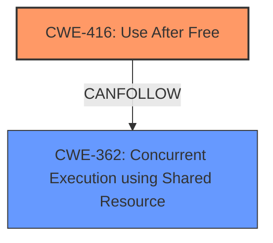

# Final Resolution for CVE-2022-2620

# Summary
| CWE ID | CWE Name | Confidence | CWE Abstraction Level | CWE Vulnerability Mapping Label | CWE-Vulnerability Mapping Notes |
|---|---|---|---|---|---|
| CWE-416 | Use After Free | 0.95 | Variant | Allowed | Primary CWE |
| CWE-362 | Concurrent Execution using Shared Resource with Improper Synchronization ('Race Condition') | 0.6 | Class | Allowed-with-Review | Secondary Candidate |

## Evidence and Confidence

*   **Confidence Score:** 0.9
*   **Evidence Strength:** MEDIUM

## Relationship Analysis
The primary relationship is that **CWE-416** (Use After Free) is a Variant-level CWE, which falls under the broader Class-level CWEs related to resource management. Although **CWE-416** does not have direct parent or child relationships listed, it can be a consequence of other weaknesses, such as race conditions. The suggestion to consider race conditions is taken into account in the secondary CWE.

## Vulnerability Chain
The vulnerability chain starts with the UI interaction. Then a concurrent execution, which leads to a race condition (**CWE-362**). This can cause premature freeing of memory, resulting in a **use-after-free vulnerability (CWE-416)**. The final impact is heap corruption.

## Summary of Analysis
The initial analysis correctly identified **CWE-416 (Use After Free)** as the primary **weakness**. The criticism suggested adding consideration for concurrency/race conditions. While the vulnerability description explicitly mentions "**use after free**," the phrase "specific UI interactions" suggests a possibility of concurrency issues that could lead to the UAF. Therefore, **CWE-362 (Concurrent Execution using Shared Resource with Improper Synchronization ('Race Condition'))** is included as a secondary candidate.

The decision is based on both the direct evidence of UAF and the related possibility of concurrency issues hinted at in the description. The selected CWEs are at an appropriate level of specificity, with **CWE-416** as a Variant representing the direct cause and **CWE-362** as a Class representing a potential contributing factor. The confidence score is slightly reduced to 0.9 to reflect the added, but less direct, consideration of concurrency.