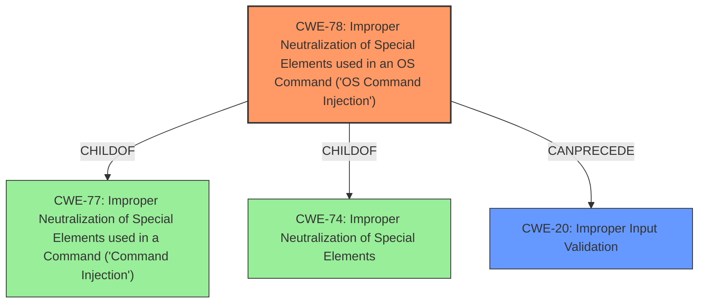

# Final Resolution for CVE-2022-26207

# Summary
| CWE ID | CWE Name | Confidence | CWE Abstraction Level | CWE Vulnerability Mapping Label | CWE-Vulnerability Mapping Notes |
|---|---|---|---|---|---|
| CWE-78 | Improper Neutralization of Special Elements used in an OS Command ('OS Command Injection') | 0.95 | Base | Primary | Allowed |
| CWE-20 | Improper Input Validation | 0.75 | Class | Secondary Candidate | Discouraged |

## Evidence and Confidence

*   **Confidence Score:** 0.90
*   **Evidence Strength:** MEDIUM

## Relationship Analysis
The primary CWE is CWE-78, which is a base-level CWE and a child of CWE-77 and CWE-74, representing a specific type of command injection focused on operating system commands. The secondary CWE is CWE-20, which represents the lack of input validation that allows CWE-78 to occur.

## Vulnerability Chain
The vulnerability chain starts with the lack of input validation (**CWE-20**) on the `ipDoamin` parameter, which allows an attacker to inject special elements into an OS command, leading to **CWE-78**, which results in arbitrary command execution.

## Summary of Analysis
The initial analysis correctly identifies **CWE-78** as the primary **weakness**, given the direct mention of command injection and OS command execution in the vulnerability description: "discovered to contain a **command injection** vulnerability in the function setDiagnosisCfg, via the ipDoamin parameter. This vulnerability allows attackers to execute arbitrary commands via a crafted request."

The criticism highlights the importance of input validation and suggests considering **CWE-20** as a contributing factor. I agree with this assessment. The root cause of the **vulnerability** is the lack of proper input validation on the `ipDoamin` parameter, which allows the **command injection** to occur. Therefore, I am adding **CWE-20** as a secondary CWE.

The graph relationships influenced my decision by showing how **CWE-78** is a specific type of **command injection**, and how it can be preceded by **CWE-20**, which represents the lack of input validation.

The selected CWEs are at the optimal level of specificity because **CWE-78** directly describes the **vulnerability** (OS **Command Injection**), and **CWE-20** represents the underlying cause (lack of input validation). While **CWE-20** is discouraged for being high-level and frequently misused, its inclusion here is justified because it accurately reflects the missing input validation that enabled the **command injection**.