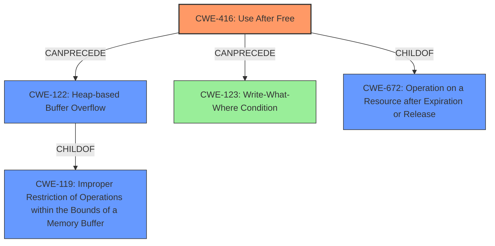

# Analysis Report for CVE-2022-2621

# Vulnerability Analysis Report: CVE-2022-2621

## Description

Use after free in Extensions in Google Chrome prior to 104.0.5112.79 allowed an attacker who convinced a user to install a malicious extension to potentially exploit heap corruption via specific UI interactions.

## Vulnerability Description Key Phrases

**Rootcause:** use after free
**Weakness:** heap corruption
**Vector:** specific UI interactions
**Attacker:** attacker
**Product:** Google Chrome
**Version:** prior to 104.0.5112.79
**Component:** Extensions

## Analysis (with Relationship Data)

# Summary
| CWE ID | CWE Name | Confidence | CWE Abstraction Level | CWE Vulnerability Mapping Label | CWE-Vulnerability Mapping Notes |
|---|---|---|---|---|---|
| CWE-416 | Use After Free | 0.95 | Variant | Allowed | Primary CWE |
| CWE-122 | Heap-based Buffer Overflow | 0.4 | Variant | Allowed | Secondary Candidate CWE |

## Evidence and Confidence

*   **Confidence Score:** 0.9
*   **Evidence Strength:** HIGH

- **Analysis and Justification:**  
  - *Explanation:* The vulnerability description explicitly states "**Use after free**" in Extensions in Google Chrome, which directly aligns with CWE-416 (Use After Free). The "**heap corruption**" mentioned further supports this, as use-after-free vulnerabilities often lead to heap corruption. The CVE Reference Links Content Summary confirms "Use after free" as the root cause. CWE-416 is a Variant level CWE, which is a preferred level of abstraction.
  
  - *Relationship Analysis:* CWE-416 is a variant of CWE-672 (Operation on a Resource after Expiry). While not directly stated, use-after-free can lead to out-of-bounds write conditions.

- **Confidence Score:**  
  - Confidence: 0.95 (Strong evidence directly from the vulnerability description and CVE reference.)

---

- **Analysis and Justification:**  
  - *Explanation:* The vulnerability description mentions "**heap corruption**" as a weakness. While the root cause is "Use after free," the **heap corruption** suggests a potential for a heap-based buffer overflow (CWE-122). However, the description does not explicitly state that an overflow occurred, only **heap corruption**, making this a secondary consideration.

  - *Relationship Analysis:* CWE-122 is a variant of CWE-119 (Improper Restriction of Operations within the Bounds of a Memory Buffer). It can result from memory corruption due to use-after-free.

- **Confidence Score:**  
  - Confidence: 0.4 (Moderate; inferred from the mention of **heap corruption**, but not definitively stated)

---

## Criticism of Analysis

Okay, here's a review of the provided CWE analysis, incorporating the full CWE specifications.

**Overall Assessment:**

The analysis is generally well-reasoned and uses the provided information effectively. The primary CWE identification of `CWE-416 (Use After Free)` is highly accurate and well-supported by the vulnerability description. The secondary candidate of `CWE-122 (Heap-based Buffer Overflow)` is plausible but has a lower confidence score, as it's based on an inference rather than explicit evidence.

**Detailed Review:**

**1. CWE-416: Use After Free (Primary CWE)**

*   **Confidence:** 0.95 - Excellent.
*   **Justification:** The analysis correctly identifies the "Use after free" root cause described in the vulnerability description and the CVE reference. The mention of "heap corruption" further supports this, as UAF vulnerabilities often lead to such corruption.
*   **Abstraction Level:** Variant - Appropriate and preferred.
*   **Mapping Guidance:**  The analysis adheres to the mapping guidance for CWE-416, which is `Allowed` because it's a Variant level CWE.
*   **Relationship Analysis:** The relationship analysis is correct in mentioning CWE-672 (Operation on a Resource after Expiry) as the parent of CWE-416. It also correctly points out that use-after-free can lead to out-of-bounds write conditions. This could be a more explicit path to CWE-787 (Out-of-bounds Write), but that would be adding more potential complexity without strong evidence in the original description.
*   **Mitigation Suggestions:** The analysis doesn't explicitly state mitigations but the CWE specifications detail the standard mitigations for CWE-416:
    *   Language selection (automatic memory management)
    *   Setting freed pointers to NULL.
    *   Using static analysis.
*   **Critique:** The analysis is very strong here. No significant improvements are needed.

**2. CWE-122: Heap-based Buffer Overflow (Secondary CWE)**

*   **Confidence:** 0.4 - Moderate.  This is a reasonable level of confidence, given the indirect evidence.
*   **Justification:** The vulnerability mentions "heap corruption," which *could* indicate a heap-based buffer overflow. However, "heap corruption" is a broader term than just a buffer overflow; it could be caused by other memory errors as well. The analysis acknowledges this uncertainty.
*   **Abstraction Level:** Variant - Appropriate if a buffer overflow truly exists.
*   **Mapping Guidance:** The analysis follows the mapping guidance; it correctly acknowledges that it's "inferred" and not definitively stated.
*   **Relationship Analysis:** The analysis correctly identifies CWE-119 (Improper Restriction of Operations within the Bounds of a Memory Buffer) as a parent of CWE-122, and the potential for it to result from use-after-free.
*   **Mitigation Suggestions:** Again, the analysis itself doesn't explicitly list mitigations, but the CWE specifications provide them. If a buffer overflow is suspected, the mitigations for CWE-122 should be considered:
    *   Using languages/compilers with automatic bounds checking.
    *   Using safe abstraction libraries.
    *   Using buffer overflow detection mechanisms (e.g., /GS flag, FORTIFY\_SOURCE).
*   **Critique:** The analysis is sound, given the limited information.  It's important to emphasize that CWE-122 is a *potential* consequence, not a guaranteed one. It might be helpful to add a brief note stating that other types of heap corruption are possible. Given the nature of Use-After-Free, it is possible, and even likely, that exploitation of this vulnerability may trigger a 'Write-What-Where' condition, also known as `CWE-123`.

**General Observations and Recommendations:**

*   **Strengths:**
    *   Clear and concise explanations.
    *   Appropriate use of CWE terminology.
    *   Realistic assessment of confidence levels.
    *   Correct relationship analysis.
*   **Potential Improvements:**
    *   While implicit, explicitly stating the mitigations in the context of the analysis would improve the utility of the analysis. This is more important for CWE-416.
    *   For the secondary CWE, slightly more discussion of alternative types of heap corruption beyond buffer overflows might be beneficial.
    *   Consideration of `CWE-123` as a potential consequence, especially if exploitation is considered.
    *   The analysis correctly suggests `CWE-672`, `Operation on a Resource after Expiration or Release`, as a parent class. However, this is a class level CWE and it is advised to select more specific CWEs. This is already done, by using `CWE-416`.

**Revised Summary Table (incorporating suggestions):**

| CWE ID | CWE Name | Confidence | CWE Abstraction Level | CWE Vulnerability Mapping Label | CWE-Vulnerability Mapping Notes |
|---|---|---|---|---|---|
| CWE-416 | Use After Free | 0.95 | Variant | Allowed | Primary CWE |
| CWE-122 | Heap-based Buffer Overflow | 0.4 | Variant | Allowed | Secondary Candidate CWE (potential consequence of heap corruption).  Other types of heap corruption are also possible. Exploitation may trigger `CWE-123`. |
| CWE-123 | Write-What-Where Condition | 0.3 | Base | Allowed | Tertiary Candidate CWE (potential exploitation consequence) |

Overall, the analysis is well-done and demonstrates a good understanding of CWEs and their application to vulnerability descriptions.

## Final Resolution

# Summary
| CWE ID | CWE Name | Confidence | CWE Abstraction Level | CWE Vulnerability Mapping Label | CWE-Vulnerability Mapping Notes |
|---|---|---|---|---|---|
| CWE-416 | Use After Free | 0.95 | Variant | Allowed | Primary CWE |
| CWE-122 | Heap-based Buffer Overflow | 0.4 | Variant | Allowed | Secondary Candidate CWE (potential consequence of **heap corruption**). Other types of **heap corruption** are also possible. Exploitation may trigger `CWE-123`. |
| CWE-123 | Write-What-Where Condition | 0.3 | Base | Allowed | Tertiary Candidate CWE (potential exploitation consequence) |

## Evidence and Confidence

*   **Confidence Score:** 0.9
*   **Evidence Strength:** HIGH

## Relationship Analysis
The primary relationship influencing the decision is the parent-child relationship between CWE-672 (Operation on a Resource after Expiration or Release) and CWE-416 (**Use After Free**). CWE-416 is a variant of CWE-672, providing a more specific classification. The possibility of a heap-based buffer overflow (CWE-122) is considered a potential consequence of the **heap corruption** resulting from the **use-after-free**, creating a chain relationship. Also, `CWE-123` is a potential consequence if exploitation is considered.

## Vulnerability Chain
The vulnerability chain starts with a **use-after-free** (CWE-416) in the Extensions component of Google Chrome. This occurs when memory is accessed after it has been freed. This **use-after-free** leads to **heap corruption**. The **heap corruption** *may* lead to a heap-based buffer overflow (CWE-122). If exploited, this may result in a 'Write-What-Where' condition, also known as `CWE-123`.

## Summary of Analysis
The initial analysis and criticism both converge on identifying **CWE-416 (Use After Free)** as the primary **rootcause**. This decision is strongly supported by the vulnerability description, which explicitly states "Use after free." The mention of "**heap corruption**" allows for the consideration of CWE-122 (Heap-based Buffer Overflow) as a secondary consequence, although with lower confidence.

The decision to classify CWE-416 as the primary weakness is based on direct evidence from the vulnerability description: "Use after free in Extensions in Google Chrome prior to 104.0.5112.79 allowed an attacker...". This statement directly aligns with the description of CWE-416.

The graph relationships confirm that CWE-416 is a variant of CWE-672, indicating an appropriate level of specificity. While other CWEs like CWE-122 (Heap-based Buffer Overflow) and `CWE-123` (Write-What-Where Condition) are potential consequences, they are not explicitly stated in the vulnerability description, making them secondary considerations.

*Report generated on 2025-03-18 12:00:40*
