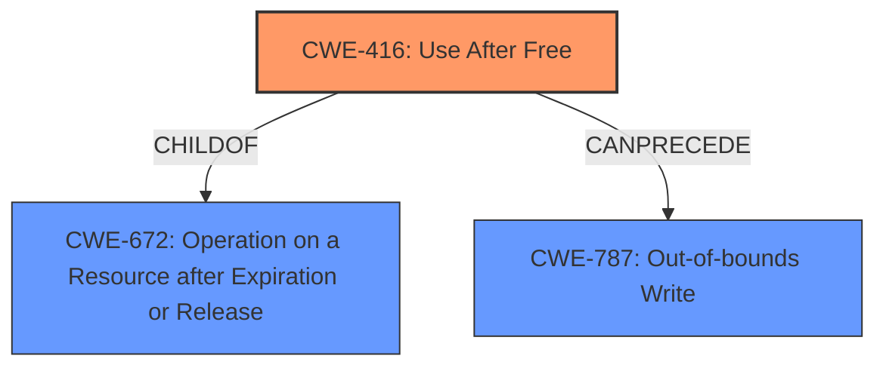

# Analysis Report for CVE-2022-2623

# Vulnerability Analysis Report: CVE-2022-2623

## Description

Use after free in Offline in Google Chrome on Android prior to 104.0.5112.79 allowed a remote attacker who convinced a user to engage in specific user interactions to potentially exploit heap corruption via specific UI interactions.

## Vulnerability Description Key Phrases

**Rootcause:** Use after free
**Weakness:** heap corruption
**Vector:** specific UI interactions
**Attacker:** remote attacker
**Product:** Google Chrome on Android
**Version:** prior to 104.0.5112.79
**Component:** Offline

## Analysis (with Relationship Data)

# Summary
| CWE ID | CWE Name | Confidence | CWE Abstraction Level | CWE Vulnerability Mapping Label | CWE-Vulnerability Mapping Notes |
|---|---|---|---|---|---|
| CWE-416 | Use After Free | 0.95 | Variant | Allowed | The vulnerability description clearly states "**Use after free**" as the root cause. The CVE Reference Links Content Summary also confirms "**Use after free**" as a weakness. The CWE-416 is at the Variant level of abstraction, which is a preferred level of abstraction for mapping to the root causes of vulnerabilities. |
| CWE-787 | Out-of-bounds Write | 0.5 | Base | Allowed | The vulnerability description indicates "**heap corruption**". Heap corruption can often lead to an out-of-bounds write scenario, where memory is overwritten beyond the allocated buffer. While the primary cause is UAF, the resulting heap corruption suggests a potential for CWE-787. |

## Evidence and Confidence

*   **Confidence Score:** 0.9
*   **Evidence Strength:** HIGH

- **Analysis and Justification:**  
  - *Explanation:* The vulnerability is clearly described as a **use-after-free** in Google Chrome on Android. The root cause is explicitly stated as "**Use after free**" and is further supported by the CVE reference. This directly aligns with CWE-416 (Use After Free), which occurs when a program attempts to access memory after it has been freed, potentially leading to **heap corruption**. CWE-416 is a Variant level CWE, making it a precise fit for the given vulnerability details. While CWE-362 (Race Condition) was also a top result, there is no explicit mention or strong implication of a race condition in the provided vulnerability details. The phrase "**heap corruption**" indicates a potential out-of-bounds write which is why CWE-787 is being included as a secondary candidate.

  - *Relationship Analysis:* CWE-416 (Use After Free) is related to memory management issues and can often lead to exploitable conditions like remote code execution. It is a variant of CWE-672 (Operation on a Resource after Expiration or Release).

- **Confidence Score:**  
  - Confidence: 0.95 (High confidence due to explicit mention of use-after-free in the vulnerability description and CVE reference links)

## Criticism of Analysis

Okay, I've reviewed the analysis and the complete CWE specifications for the referenced weaknesses. Here's a breakdown of my critique, focusing on the strengths and weaknesses of the analysis, and how it aligns with the CWE guidance.

**Overall Assessment**

The analysis is generally good, particularly in identifying and justifying CWE-416 as the primary weakness. It correctly points to the direct mention of "Use after free" in the vulnerability description and supporting CVE information. The inclusion of CWE-787 as a secondary weakness is also reasonable, given the "heap corruption" aspect. However, there are some areas where the confidence could be adjusted, and alternative CWEs could have been considered or excluded with stronger rationale.

**Detailed Critique:**

*   **CWE-416: Use After Free**

    *   **Confidence:** The assigned confidence of 0.95 is appropriate. The evidence strength is undeniably high, given the explicit mention of "use-after-free" in the original text. The provided justification is solid and aligns perfectly with the CWE's description and mapping guidance. It is correctly identified as a variant level CWE, which is preferable.
    *   **Relationships:** The analysis correctly identifies the relationship between CWE-416 and CWE-672 (Operation on a Resource after Expiration or Release) as a *ChildOf* relationship and that CWE-416 is a *variant* of CWE-672.
    *   **Mitigations:** The analysis does not include mitigations. It could be strengthened by adding a discussion of mitigation techniques from the CWE specification like using languages that provide automatic memory management or setting pointers to NULL after they are freed.
    *   **Accuracy:** Correct

*   **CWE-787: Out-of-bounds Write**

    *   **Confidence:** The confidence of 0.5 is acceptable, given that the connection is based on the *potential* consequences of heap corruption. However, it's crucial to emphasize the indirect relationship. It's not *guaranteed* that the heap corruption directly leads to an out-of-bounds write; it's a *possible* outcome.
    *   **Justification:** The justification stating that heap corruption *can often lead* to an out-of-bounds write is accurate. However, it's important to highlight the uncertainty. The analysis could benefit from mentioning that other heap corruption scenarios are possible, and CWE-787 is just one potential outcome.
    *   **Alternatives:** Other potential heap corruption related CWEs are CWE-122 (Heap-based Buffer Overflow) and CWE-415 (Double Free). However, neither of these are explicitly mentioned in the description and CWE-787 is the best candidate.
    *   **Mitigations:** The analysis does not include mitigations. It could be strengthened by adding a discussion of mitigation techniques from the CWE specification like using a language with automatic memory management or buffer overflow detection mechanisms offered by compilers.
    *   **Accuracy:** Correct but could be improved

**CWEs considered by retrievers and why they are not a good fit:**

*   **CWE-362 (and related Race Conditions):** While race conditions are possible in concurrent environments, there is nothing in the provided information to suggest a race condition is present. The vulnerability is described as a UAF, which happens regardless of concurrency.
*   **CWE-356 (Product UI does not Warn User of Unsafe Actions):** While a UI interaction is part of the attack vector, the root cause is a memory management issue, not a failure to warn the user. This CWE is a red herring.
*   **CWE-843 (Access of Resource Using Incompatible Type ('Type Confusion')):** While type confusion can lead to memory corruption, the description provided doesn't indicate a type confusion vulnerability.
*   **CWE-415 (Double Free):** No indication of a double free exists in the vulnerability description.
*   **CWE-252 (Unchecked Return Value):** There is no mention of a function whose return value is not checked.
*   **CWE-451 (User Interface (UI) Misrepresentation of Critical Information):** While UI interaction is part of the attack vector, the root cause is a memory management issue, not a UI misrepresentation issue.

**Suggestions for Improvement:**

1.  **Strengthened Justification for CWE-787:** Elaborate on the *potential* relationship between heap corruption and out-of-bounds writes. Acknowledge that other heap corruption scenarios exist and that CWE-787 is one possibility.
2.  **Discuss Mitigations:** Include a brief discussion of potential mitigations for both CWE-416 and CWE-787, drawing from the "Potential Mitigations" sections of the CWE entries.
3.  **Explicitly Exclude other top retrievers with rationale:** While not every single retriever has to be explicitly excluded, excluding CWE-362 with a stronger rationale would improve the analysis, especially since it is rated as the top retriever.

**Revised Summary Table**

| CWE ID | CWE Name | Confidence | CWE Abstraction Level | CWE Vulnerability Mapping Label | CWE-Vulnerability Mapping Notes |
|---|---|---|---|---|---|
| CWE-416 | Use After Free | 0.95 | Variant | Allowed | The vulnerability description clearly states "**Use after free**" as the root cause. The CVE Reference Links Content Summary also confirms "**Use after free**" as a weakness. The CWE-416 is at the Variant level of abstraction, which is a preferred level of abstraction for mapping to the root causes of vulnerabilities. |
| CWE-787 | Out-of-bounds Write | 0.5 | Base | Allowed | The vulnerability description indicates "**heap corruption**". Heap corruption can often lead to an out-of-bounds write scenario, where memory is overwritten beyond the allocated buffer. While the primary cause is UAF, the resulting heap corruption *potentially* suggests a CWE-787. However, other heap corruption outcomes are also possible. |

**In summary,** the analysis correctly identifies and justifies the primary weakness. It could be improved by further elaborating on the link to CWE-787, incorporating relevant mitigations, and explicitly excluding the top retrievers with rationale. These changes would increase the clarity, accuracy, and comprehensiveness of the analysis.

## Final Resolution

# Summary
| CWE ID | CWE Name | Confidence | CWE Abstraction Level | CWE Vulnerability Mapping Label | CWE-Vulnerability Mapping Notes |
|---|---|---|---|---|---|
| CWE-416 | Use After Free | 0.95 | Variant | Allowed | The vulnerability description clearly states "**Use after free**" as the root cause. The CVE Reference Links Content Summary also confirms "**Use after free**" as a weakness. The CWE-416 is at the Variant level of abstraction, which is a preferred level of abstraction for mapping to the root causes of vulnerabilities. |
| CWE-787 | Out-of-bounds Write | 0.5 | Base | Allowed | The vulnerability description indicates "**heap corruption**". Heap corruption can often lead to an out-of-bounds write scenario, where memory is overwritten beyond the allocated buffer. While the primary cause is UAF, the resulting heap corruption *potentially* suggests a CWE-787. However, other heap corruption outcomes are also possible. |

## Evidence and Confidence

*   **Confidence Score:** 0.9
*   **Evidence Strength:** HIGH

## Relationship Analysis
The primary relationship impacting the decision is the parent-child relationship between CWE-672 (Operation on a Resource after Expiration or Release) and CWE-416 (**Use After Free**). CWE-416 is a variant of CWE-672, making it more specific and appropriate for this vulnerability. CWE-787 (**Out-of-bounds Write**) is considered a potential consequence of the **heap corruption** resulting from the **use-after-free**, establishing a chain relationship where CWE-416 can precede CWE-787. The abstraction levels guided the selection, favoring the variant level CWE-416 for its precision, while acknowledging the base level CWE-787 as a possible outcome.

## Vulnerability Chain
The vulnerability chain starts with the **use-after-free** (**CWE-416**). A memory location is freed but later accessed. This invalid memory access leads to **heap corruption**. The **heap corruption** can *potentially* lead to an **out-of-bounds write** (**CWE-787**). The impact is potential exploitation of the process due to memory corruption via UI interactions.

## Summary of Analysis
The analysis is based on the vulnerability description, which explicitly states "**Use after free**" as the root cause. The CVE reference link content summary also confirms "**Use after free**" as the weakness.
The vulnerability description says: "Use after free in Offline in Google Chrome on Android prior to 104.0.5112.79 allowed a remote attacker who convinced a user to engage in specific user interactions to potentially exploit heap corruption via specific UI interactions."
The graph relationships influenced the selection by highlighting the parent-child relationship between CWE-672 and CWE-416, ensuring the most specific CWE is chosen. The potential chain relationship between CWE-416 and CWE-787 is also considered.

The selected CWEs are at the optimal level of specificity because CWE-416 is a variant that directly matches the "use-after-free" condition, while CWE-787 is a base-level CWE that represents a potential consequence. CWE-362 and the other top retrievers are not a good fit, because the vulnerability is described as a UAF, which happens regardless of concurrency.

*Report generated on 2025-03-18 12:01:40*
