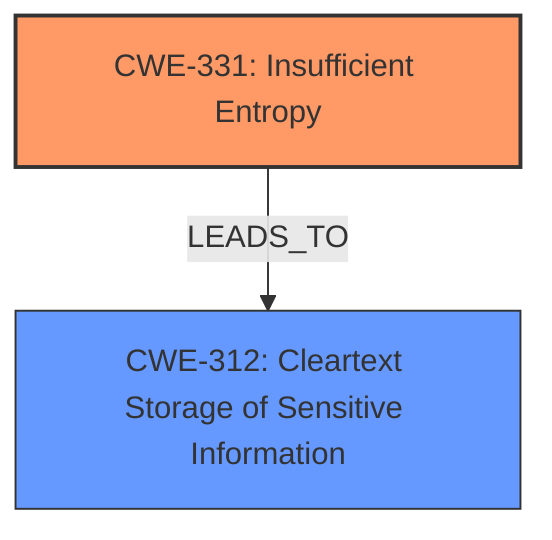

# Final Resolution for CVE-2022-26307

# Summary
| CWE ID | CWE Name | Confidence | CWE Abstraction Level | CWE Vulnerability Mapping Label | CWE-Vulnerability Mapping Notes |
|---|---|---|---|---|---|
| CWE-331 | Insufficient Entropy | 0.95 | Base | Allowed | The **master key was poorly encoded** resulting in weakening its entropy, which directly aligns with CWE-331. |
| CWE-312 | Cleartext Storage of Sensitive Information | 0.6 | Base | Allowed | The stored passwords, while encrypted, are **vulnerable to brute force attack** due to the weakened master key. This implies a failure to adequately protect sensitive information at rest. |
  - The Primary CWE should be first and noted as the Primary CWEs
  - The secondary candidate CWEs should be next and noted as secondary candidates.
  - The confidence is a confidence score 0 to 1 to rate your confidence in your assessment for that CWE.
  - The CWE Abstraction Level as one of these values: Base, Variant, Pillar, Class, Compound
  - The Mapping Notes Usage as one of these values: Allowed, Allowed-with-Review, Prohibited, Discouraged

## Evidence and Confidence

*   **Confidence Score:** 0.9
*   **Evidence Strength:** HIGH

## Relationship Analysis
The analysis correctly identifies **CWE-331 (Insufficient Entropy)** as the primary **ROOTCAUSE**. The relationship between **CWE-331** and **CWE-312 (Cleartext Storage of Sensitive Information)** is that the former can lead to the latter. The **insufficient entropy** weakens the encryption to the point where it's practically equivalent to storing data in cleartext. There aren't any direct parent-child relationships between these two, but **CWE-331** weakens the protection that should be provided and thus leads to exposure of sensitive information, similar to **CWE-312**. Both are at the Base level, which is appropriate for mapping.

## Vulnerability Chain
The vulnerability chain starts with the **ROOTCAUSE**, which is **CWE-331 (Insufficient Entropy)**. The **WEAKNESS** is the poorly encoded master key. This leads to a state where the encryption is weak. The impact is that an attacker can brute-force the encryption and access the stored passwords.
  - **ROOTCAUSE**: CWE-331 (Insufficient Entropy)
  - **WEAKNESS**: Poorly encoded master key leading to low entropy.
  - **IMPACT**: Stored passwords vulnerable to brute-force attack.

## Summary of Analysis
The initial analysis and criticism are both accurate and well-justified. The primary **WEAKNESS** is indeed **CWE-331**, as the vulnerability description states that the **master key was poorly encoded** resulting in a reduction of its entropy. This directly maps to the definition of **CWE-331**. The secondary consideration of **CWE-312** is also reasonable, as the practical effect is similar to storing data in cleartext, even though the data is technically encrypted. The fact that the entropy was weakened from 128 to 43 bits is a strong indicator of **CWE-331**. The graph relationships reinforce this by showing how **insufficient entropy** can directly lead to the exposure of sensitive information, similar to **cleartext storage**. The selected CWEs are at the optimal level of specificity (Base) and the reasoning for their selection is well-supported by the provided evidence.